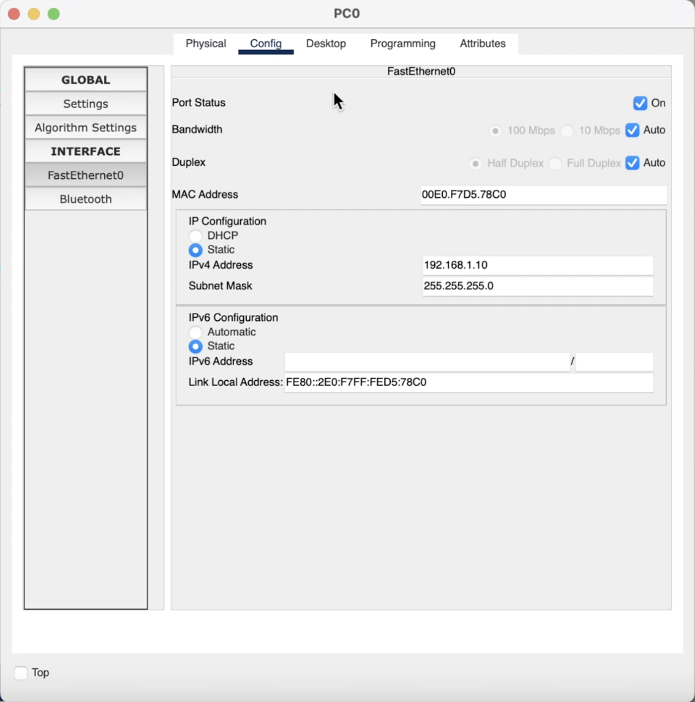
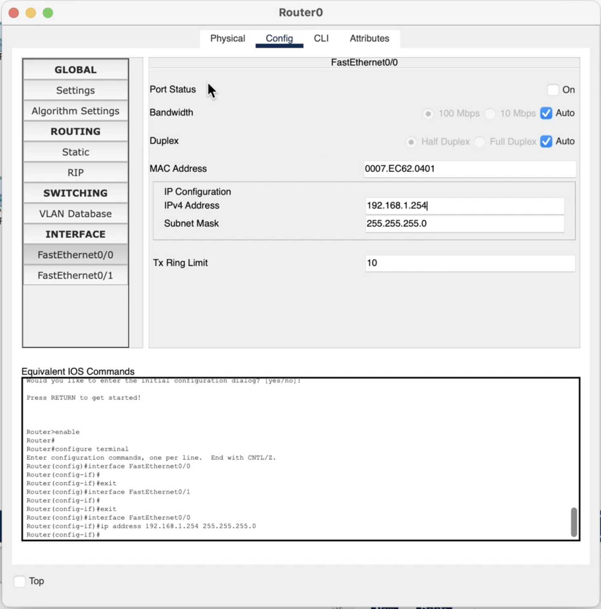
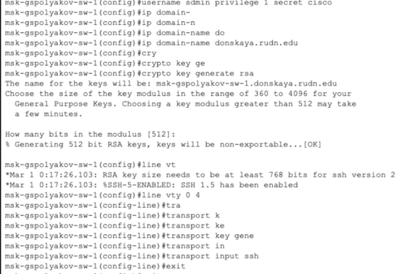
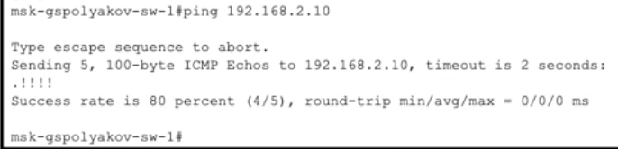
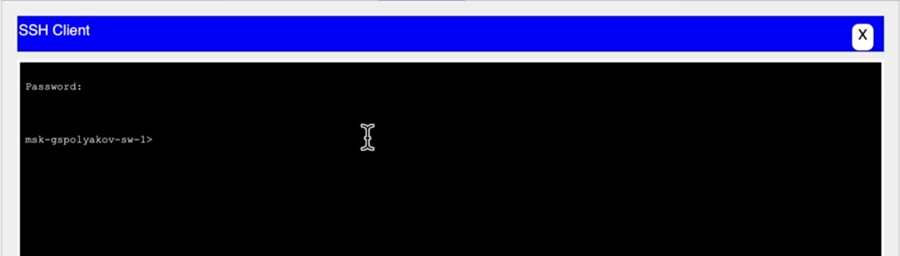
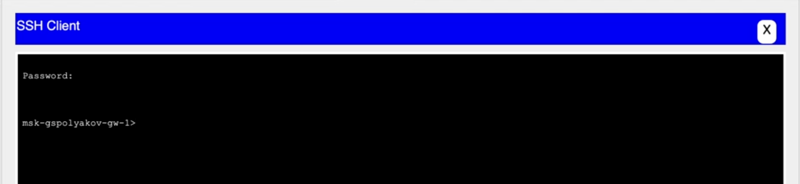

---
## Front matter
title: "Отчёт по лабораторной работе №2"
subtitle: "Предварительная настройка оборудования Cisco"
author: "Поляков Глеб Сергеевич"

## Generic otions
lang: ru-RU
toc-title: "Содержание"

## Bibliography
bibliography: bib/cite.bib
csl: pandoc/csl/gost-r-7-0-5-2008-numeric.csl

## Pdf output format
toc: true # Table of contents
toc-depth: 2
lof: true # List of figures
lot: true # List of tables
fontsize: 12pt
linestretch: 1.5
papersize: a4
documentclass: scrreprt
## I18n polyglossia
polyglossia-lang:
  name: russian
  options:
	- spelling=modern
	- babelshorthands=true
polyglossia-otherlangs:
  name: english
## I18n babel
babel-lang: russian
babel-otherlangs: english
## Fonts
mainfont: IBM Plex Serif
romanfont: IBM Plex Serif
sansfont: IBM Plex Sans
monofont: IBM Plex Mono
mathfont: STIX Two Math
mainfontoptions: Ligatures=Common,Ligatures=TeX,Scale=0.94
romanfontoptions: Ligatures=Common,Ligatures=TeX,Scale=0.94
sansfontoptions: Ligatures=Common,Ligatures=TeX,Scale=MatchLowercase,Scale=0.94
monofontoptions: Scale=MatchLowercase,Scale=0.94,FakeStretch=0.9
mathfontoptions:
## Biblatex
biblatex: true
biblio-style: "gost-numeric"
biblatexoptions:
  - parentracker=true
  - backend=biber
  - hyperref=auto
  - language=auto
  - autolang=other*
  - citestyle=gost-numeric
## Pandoc-crossref LaTeX customization
figureTitle: "Рис."
tableTitle: "Таблица"
listingTitle: "Листинг"
lofTitle: "Список иллюстраций"
lotTitle: "Список таблиц"
lolTitle: "Листинги"
## Misc options
indent: true
header-includes:
  - \usepackage{indentfirst}
  - \usepackage{float} # keep figures where there are in the text
  - \floatplacement{figure}{H} # keep figures where there are in the text
---

# Цель работы

Получить основные навыки по начальному конфигурированию оборудования
Cisco.

# Задание

1. Сделать предварительную настройку маршрутизатора:
	- задать имя в виде «город-территория-учётная_записьтип_оборудования-номер» (см. пункт 2.5), например msk-donskaya-osbender-gw-1;
	- задать интерфейсу Fast Ethernet с номером 0 ip-адрес 192.168.1.254 и маску 255.255.255.0, затем поднять интерфейс;
	- задать пароль для доступа к привилегированному режиму (сначала в открытом виде, затем — в зашифрованном);
	- настроить доступ к оборудованию сначала через telnet, затем — через ssh (используя в качестве имени домена donskaya.rudn.edu);
	- сохранить и экспортировать конфигурацию в отдельный файл.
2. Сделать предварительную настройку коммутатора:
	- задать имя в виде «город-территория-учётная_записьтип_оборудования-номер» (см. пункт 2.5), например msk-donskaya-osbender-sw-1;
	- задать интерфейсу vlan 2 ip-адрес 192.168.2.1 и маску 255.255.255.0, затем поднять интерфейс;
	- привязать интерфейс Fast Ethernet с номером 1 к vlan 2;
	- задать в качестве адреса шлюза по умолчанию адрес 192.168.2.254;
	- задать пароль для доступа к привилегированному режиму (сначала в открытом виде, затем — в зашифрованном);
	- настроить доступ к оборудованию сначала через telnet, затем — через ssh (используя в качестве имени домена donskaya.rudn.edu);
	- для пользователя admin задать доступ 1-го уровня по паролю;
	- сохранить и экспортировать конфигурацию в отдельный файл.

# Теоретическое введение

Некоторые особенности при работе с cisco IOS Command Line Interface
(CLI):

- вводимые в консоли команды воспринимаются как в полном, так и в сокращённом виде (например, для вывода содержания файла конфигурации оборудования можно использовать как show running-config, так и её сокращённую запись sh run);
- для дописывания сокращённой команды до полной формы используйте клавишу Tab ;
- для вывода списка возможных к исполнению команд и краткой информации по ним используйте знак вопроса;
- горячие клавиши:
	- Ctrl + a — переместить курсор в начало строки;
	- Ctrl + e — переместить курсор в конец строки;
	- PgUp , PgDn — отвечают за навигацию по истории команд;
	- Ctrl + w — удалить слово, расположенное до курсора;
	- Ctrl + u — удалить строку;
	- Ctrl + c — выйти из режима конфигурирования;
	- Ctrl + z — применить текущую команду и выйти из режима конфигурирования;
- доступные режимы CLI (вместо слова Router в консоли выдаётся имя устройства):
- пользовательский режим (user mode) предназначен для просмотра статистики и выполнения ограниченного числа операций, не влияющих на функционирование устройства:
	Router>
- привилегированный режим (privileged mode) предназначен для выполнения операций по настройке оборудования:
	Router#
- режим глобальной конфигурации (global configuration mode) позволяет вносить изменения в настройки устройства:
	Router(config)#
- режим специфической конфигурации:
	Router(config-*)#
	вместо звёздочки отображается название подрежима (например, Router(config-if)# указывает на переход в режим настройки интерфейса маршрутизатора);
- для перехода в привилегированный режим из пользовательского режима используется команда enable, возможно с введением пароля;
- для перехода в режим глобальной конфигурации из привилегированного режима используется команда configure terminal или её сокращённый аналог conf t;
- переход в режим специфической конфигурации всегда осуществляется из режима глобальной конфигурации после ввода соответствующей команды (например, для перехода в режим настройки интерфейса Fast Ethernet с номером 0 потребуется ввести в режиме глобальной конфигурации команду
interface FastEthernet 0/0);
- некоторые часто используемые команды:
	- exit — возвращение в привилегированный режим (аналог комбинации клавиш Ctrl + Z );
	- show running-configuration (или sh ru) — отображение текущей конфигурации устройства;
	- show stratup config — отображает содержание конфигурации оборудования, загружаемое после включения оборудования;
	- write memory — запись изменений;
	- copy running-configuration startup-configuration — сохранение текущих изменений в настройках в энергонезависимую память;
	- (no) service password-encryption — указание на отображение в конфигурационном файле введённых ранее паролей в (открытом — при использовании вначале no) зашифрованном виде;
	- show interface — отображение состояния сетевого интерфейса;
	- (no) shutdown — (включение) выключение сетевого интерфейса (поумолчанию интерфейсы находятся в выключенном состоянии);
	- show vlan — отображение имеющихся vlan с привязкой к ним физических интерфейсов (Virtual Local Area Network, VLAN — группа узлов сети, возможно подключённых к разным сетевым устройствам (коммутаторам), но при этом взаимодействующих между собой через протокол канального уровня, как если бы они были подключены к широковещательному домену);
	- no vlan n — отключить vlan с номером n;
	- show ip route — выводит таблицу маршрутизации роутера.

# Выполнение лабораторной работы

1. В логической рабочей области Packet Tracer разместите коммутатор, маршрутизатор и 2 оконечных устройства типа PC, соедините один PC с маршрутизатором, другой PC — с коммутатором (рис. [-@fig:001]).

	{#fig:001 width=70%}

2. Проведите настройку маршрутизатора в соответствии с заданием, ориентируясь на приведённую ниже часть конфигурации маршрутизатора.

	{#fig:002 width=70%}
	{#fig:003 width=70%}
	{#fig:004 width=70%}
	{#fig:005 width=70%}
	{#fig:006 width=70%}

3. Проведите настройку коммутатора в соответствии с заданием, ориентируясь на приведённую ниже часть конфигурации коммутатора.

	{#fig:007 width=70%}
	{#fig:008 width=70%}

4. Проверьте работоспособность соединений с помощью команды ping.

	{#fig:009 width=70%}
	{#fig:010 width=70%}

5. Попробуйте подключиться к коммутатору и маршрутизатору разными способами: с помощью консольного кабеля, по протоколу удалённого доступа (telnet, ssh).

	{#fig:013 width=70%}
	{#fig:014 width=70%}
	{#fig:011 width=70%}
	{#fig:012 width=70%}

# Выводы

Получил основные навыки по начальному конфигурированию оборудования Cisco.

# Контрольные вопросы

1. Возможные способы подключения к сетевому оборудованию:
	*	Консольное подключение (через COM-порт, используя консольный кабель и программу-эмулятор терминала).
	*	Подключение по SSH (безопасное шифрованное соединение через сеть).
	*	Подключение по Telnet (небезопасное, передача данных в открытом виде).
	*	Веб-интерфейс (если устройство поддерживает HTTP/HTTPS).
	*	SNMP (протокол для мониторинга и управления).
	*	Протоколы API (например, REST API для управления оборудованием).

2. Тип кабеля для подключения оконечного оборудования к маршрутизатору:
	*	Прямой (прямой обжим, Straight-Through Cable).
	*	Причина:
	*	Оконечные устройства (ПК, ноутбуки) работают на другой логике передачи сигнала, чем маршрутизаторы.
	*	Современные устройства обычно поддерживают автоопределение (Auto MDI-X), но старые требовали именно прямого кабеля.

3. Тип кабеля для подключения оконечного оборудования к коммутатору:
	*	Прямой кабель (Straight-Through Cable).
	*	Причина:
	*	Коммутатор и ПК используют разные пары для передачи и приема сигнала, поэтому требуется прямое соединение.

4. Тип кабеля для подключения коммутатора к коммутатору:
	*	Кроссоверный кабель (Crossover Cable) – для старого оборудования.
	*	Прямой кабель (Straight-Through Cable) – для современных коммутаторов с поддержкой Auto MDI-X.
	*	Причина:
	*	Старые коммутаторы передавали и принимали данные по одинаковым парам, что требовало кроссоверного кабеля.
	*	Auto MDI-X автоматически меняет роли входов/выходов, позволяя использовать прямой кабель.

5. Способы настройки доступа к сетевому оборудованию по паролю:
	*	Настройка пароля на консольный доступ (например, line console 0, password, login).
	*	Настройка пароля для Telnet/SSH-доступа (line vty, password, login).
	*	Использование локальных учетных записей (например, username admin password 1234).
	*	Использование AAA (Authentication, Authorization, Accounting) – интеграция с RADIUS/TACACS+.
	*	Настройка привилегированного режима (enable password/secret).

6. Способы настройки удаленного доступа к сетевому оборудованию:
	*	Telnet (устаревший, небезопасный, данные передаются в открытом виде).
	*	SSH (безопасное шифрованное соединение).
	*	VPN-доступ (позволяет безопасно подключаться к сети, внутри которой находится оборудование).
	*	Web-интерфейс (если поддерживается, но не всегда безопасен).
	*	SNMP и API (используются для мониторинга и управления, но не для полноценного доступа).
Предпочтительный способ: SSH
	*	Причина: использует шифрование и защищает передаваемые данные, в отличие от Telnet.

# Список литературы{.unnumbered}

::: {#refs}
:::
