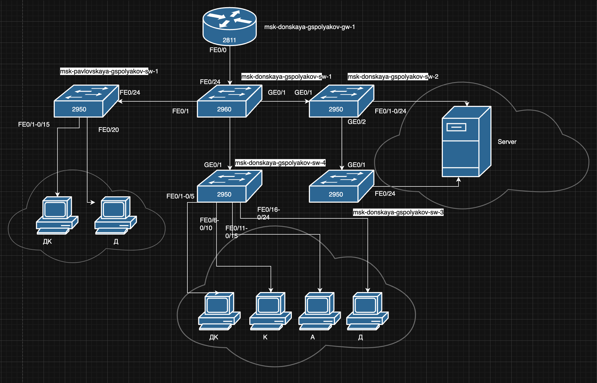
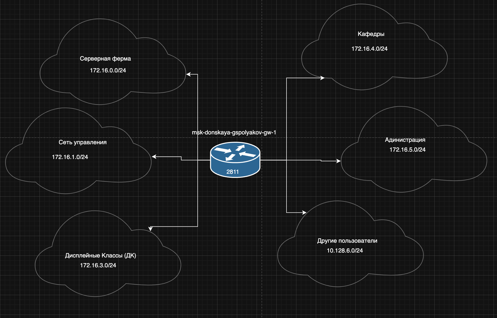
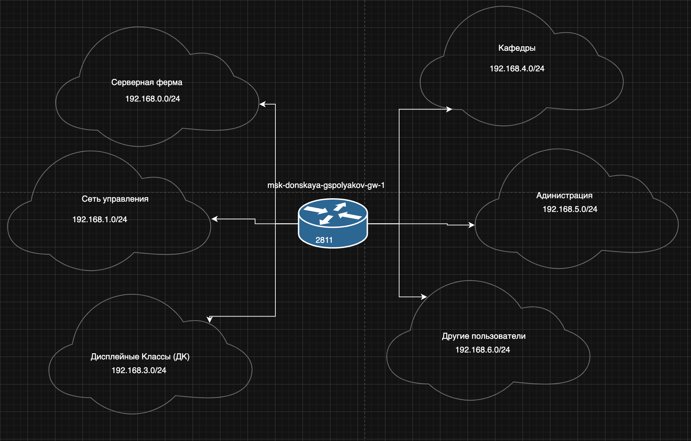
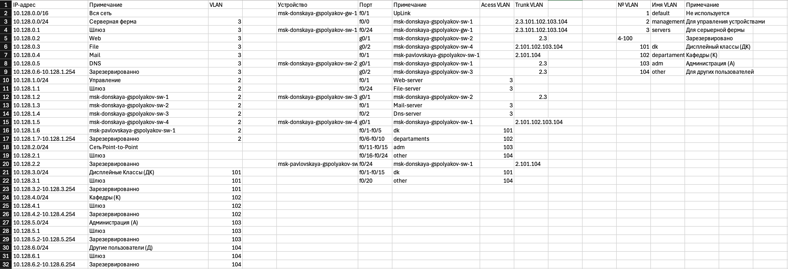
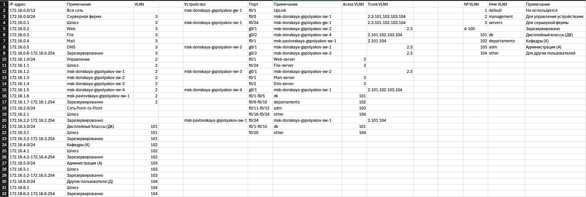

---
## Front matter
title: "Отчет по лабораторной работе №3"
subtitle: "Планирование локальной сети организации"
author: "Поляков Глеб Сергеевич"

## Generic otions
lang: ru-RU
toc-title: "Содержание"

## Bibliography
bibliography: bib/cite.bib
csl: pandoc/csl/gost-r-7-0-5-2008-numeric.csl

## Pdf output format
toc: true # Table of contents
toc-depth: 2
lof: true # List of figures
lot: true # List of tables
fontsize: 12pt
linestretch: 1.5
papersize: a4
documentclass: scrreprt
## I18n polyglossia
polyglossia-lang:
  name: russian
  options:
	- spelling=modern
	- babelshorthands=true
polyglossia-otherlangs:
  name: english
## I18n babel
babel-lang: russian
babel-otherlangs: english
## Fonts
mainfont: IBM Plex Serif
romanfont: IBM Plex Serif
sansfont: IBM Plex Sans
monofont: IBM Plex Mono
mathfont: STIX Two Math
mainfontoptions: Ligatures=Common,Ligatures=TeX,Scale=0.94
romanfontoptions: Ligatures=Common,Ligatures=TeX,Scale=0.94
sansfontoptions: Ligatures=Common,Ligatures=TeX,Scale=MatchLowercase,Scale=0.94
monofontoptions: Scale=MatchLowercase,Scale=0.94,FakeStretch=0.9
mathfontoptions:
## Biblatex
biblatex: true
biblio-style: "gost-numeric"
biblatexoptions:
  - parentracker=true
  - backend=biber
  - hyperref=auto
  - language=auto
  - autolang=other*
  - citestyle=gost-numeric
## Pandoc-crossref LaTeX customization
figureTitle: "Рис."
tableTitle: "Таблица"
listingTitle: "Листинг"
lofTitle: "Список иллюстраций"
lotTitle: "Список таблиц"
lolTitle: "Листинги"
## Misc options
indent: true
header-includes:
  - \usepackage{indentfirst}
  - \usepackage{float} # keep figures where there are in the text
  - \floatplacement{figure}{H} # keep figures where there are in the text
---

# Цель работы

Познакомится с принципами планирования локальной сети организации.

# Задание

1. Используя графический редактор (например, Dia), требуется повторить схемы L1, L2, L3, а также сопутствующие им таблицы VLAN, IP-адресов и портов подключения оборудования планируемой сети.
2. Рассмотренный выше пример планирования адресного пространства сети базируется на разбиении сети 10.128.0.0/16 на соответствующие подсети. Требуется сделать аналогичный план адресного пространства для сетей 172.16.0.0/12 и 192.168.0.0/16 с соответствующими схемами сети и сопутствующими таблицами VLAN, IP-адресов и портов подключения оборудования.
3. При выполнении работы необходимо учитывать соглашение об именовании (см. раздел 2.5).

# Теоретическое введение

Предположим, что в некоторой учебной организации требуется спланировать сетевую инфраструктуру.
Особенности организации с точки зрения планирования локальной сети:

- организация располагается в одном городе (предположим — в Москве), но на двух территориях (назовём их «Донская» и «Павловская»);
- группы пользователей организации:
- администрация (А);
- преподавательский состав кафедр (К);
- пользователи дисплейных классов общего пользования (ДК);
- другие пользователи (Д);
- предполагается, что на территории «Донская» будут располагаться:
- устройства управления сетью;
- серверная инфраструктура;
- оборудование всех групп пользователей;
- предполагается, что на территории «Павловская» будет располагаться оборудование групп пользователей «ДК» и «Д».

Сеть организации должна соответствовать так называемой «иерархической модели сети», т.е. оборудование сетевой инфраструктуры при планировании должно быть распределено по трём уровням:

1. уровень ядра (Core Layer) — высокопроизводительные сетевые устройства (коммутаторы, маршрутизаторы), обеспечивающие скоростную передачу трафика между сегментами уровня распределения;
2. уровень распределения (Distribution Layer) — устройства (коммутаторы, маршрутизаторы), обеспечивающие применение политик безопасности и качества обслуживания (QoS), агрегацию и маршрутизацию трафика посредством VLAN, определение широковещательных доменов;
3. уровень доступа (Access Layer) — устройства для подключения серверов и оконечного оборудования пользователей к сети организации.

Далее при проектировании сети необходимо:

- разработать схемы сети, соответствующие физическому, канальному и сетевому уровням эталонной модели взаимодействия открытых систем (OSI);
- составить план IP-адресация сети;
- составить план VLAN сети;
- составить план подключения интерфейсов оборудования;
- зафиксировать перечень устройств, используемых в сети организации, с указанием модели, версии операционной системы, объёма RAM/NVRAM, списка интерфейсов;
- обеспечить маркировку всех задействованных как сетевых и других типов кабелей (откуда и куда идёт), так и устройств сети;
- разработать и внедрить единый регламент эксплуатации сети.

##3.3. Схемы сети
Примерная схема планируемой сети с указанием типов и номеров портов подключения устройств, соответствующая физическому уровню модели OSI (L1), будет иметь вид, изображённый на рис. 3.1.

Рис. 3.1. Физические устройства сети с номерами портов (Layer 1)

В качестве оборудования уровня ядра будем использовать маршрутизатор Cisco 2811, на уровне распределения — коммутаторы Cisco 2960 с возможностью настройки VLAN, а на уровне доступа — коммутаторы Cisco 2950. Далее следует спланировать распределение VLAN. Рекомендуется выделять в отдельные подсети (VLAN) устройства управления сетью, а также различные
группы пользователей (см. табл. 3.1).

Далее необходимо определить адресное пространство, ассоциированное с выделенными VLAN. Примерная схема сети, соответствующая сетевому уровню модели OSI (L3), будет иметь вид, изображённый на рис. 3.3.

Рис. 3.3. Схема маршрутизации сети (Layer 3)

Более детальное распределение IP-адресов [4] в сети представлено в табл. 3.2.
При планировании IP-адресация (разбиении адресного пространства сети на подсети) следует учитывать потенциальное количество устройств подсети, а также возможность увеличения их числа. В табл. 3.3 приведён план подключения оборудования сети по портам. 

Регламент выделения ip-адресов дан в табл. 3.4.
Таблица 3.4

| IP-адреса | Назначение |
|-----------|------------|
| 1	 | Шлюз |
| 2-19 | Сетевое оборудование |
| 20-29 | Серверы |
| 30-199 | Компьютеры, DHCP|
| 200-219 | Компьютеры, Static|
| 220-229 | Принтеры |
| 230-254| Резерв|

Более подробно про Unix см. в [@tanenbaum_book_modern-os_ru; @robbins_book_bash_en; @zarrelli_book_mastering-bash_en; @newham_book_learning-bash_en].

# Выполнение лабораторной работы

1. Используя графический редактор (например, Dia), требуется повторить схемы L1, L2, L3, а также сопутствующие им таблицы VLAN, IP-адресов и портов подключения оборудования планируемой сети.
	{#fig:001 width=70%}
	{#fig:002 width=70%}
	{#fig:003 width=70%}

2. Рассмотренный выше пример планирования адресного пространства сети базируется на разбиении сети 10.128.0.0/16 на соответствующие подсети.
Требуется сделать аналогичный план адресного пространства для сетей 172.16.0.0/12 и 192.168.0.0/16 с соответствующими схемами сети и сопутствующими таблицами VLAN, IP-адресов и портов подключения оборудования.
	{#fig:004 width=70%}
	{#fig:005 width=70%}
	{#fig:006 width=70%}
	{#fig:007 width=70%}
	{#fig:008 width=70%}

	{#fig:009 width=70%}
	{#fig:010 width=70%}	{#fig:011 width=70%}
	
3. При выполнении работы необходимо учитывать соглашение об именовании (см. раздел 2.5).
(рис. [-@fig:001]).

# Выводы

Познакомился с принципами планирования локальной сети организации.

# Контрольные вопросы

## 1. Модель взаимодействия открытых систем (OSI)
Модель OSI (Open Systems Interconnection) — концептуальная модель, описывающая, как различные сетевые устройства взаимодействуют между собой. Она разделена на 7 уровней, каждый из которых выполняет определённые функции:

| Уровень | Название | Функции |
|---------|---------|---------|
| 7 | Прикладной (Application) | Обеспечивает интерфейс взаимодействия приложений с сетью (HTTP, FTP, SMTP, DNS). |
| 6 | Представительный (Presentation) | Кодирование, шифрование, сжатие данных (TLS, JPEG, ASCII). |
| 5 | Сеансовый (Session) | Управление сессиями (установление, поддержание, завершение). Протоколы: NetBIOS, RPC. |
| 4 | Транспортный (Transport) | Разбиение данных на сегменты, контроль потока, проверка целостности (TCP, UDP). |
| 3 | Сетевой (Network) | Определение маршрута и логическая адресация (IP, ICMP). |
| 2 | Канальный (Data Link) | Физическая адресация (MAC), контроль ошибок, управление доступом к среде (Ethernet, Wi-Fi). |
| 1 | Физический (Physial) | Передача битов по среде (кабели, волны, электрические сигналы). |

---

## 2. Функции коммутатора
Коммутатор (switch) работает на канальном уровне (2 уровень OSI) и выполняет следующие функции:

- Коммутация пакетов на основе MAC-адресов.
- Обучение MAC-адресов и построение таблицы коммутации.
- Сегментация сети для уменьшения коллизий.
- Поддержка VLAN (в зависимости от модели).
- Возможность работы в различных режимах (Store-and-Forward, Cut-Through и др.).

---

## 3. Функции маршрутизатора
Маршрутизатор (router) работает на сетевом уровне (3 уровень OSI) и выполняет:

- Определение оптимального маршрута передачи данных.
- Использование IP-адресов для маршрутизации.
- Разделение широковещательных доменов.
- Подключение разных сетей, включая сети с разными технологиями.
- Поддержка протоколов маршрутизации (OSPF, BGP, RIP).
- NAT (Network Address Translation) для работы с частными IP-адресами.

---

## 4. Отличия коммутаторов 3-го уровня от коммутаторов 2-го уровня

| Характеристика | Коммутатор 2 уровня | Коммутатор 3 уровня |
|---------------|--------------------|--------------------|
| Уровень OSI | 2 (канальный) | 3 (сетевой) |
| Маршрутизация |  Нет | Да (IP-адреса) |
| Работа с MAC-адресами | Да | Да |
| Работа с IP-адресами | Нет | Да |
| Таблица коммутации | МAC-адреса | MAC- и IP-адреса |
| VLAN |  Поддерживает |  Поддерживает и маршрутизирует между VLAN |
| Широковещательный домен | Один на VLAN | Может разделять |
 
Коммутаторы 3-го уровня могут выполнять функции маршрутизатора, но с большей скоростью обработки пакетов, поскольку используют аппаратную коммутацию.

# Список литературы{.unnumbered}

::: {#refs}
:::
