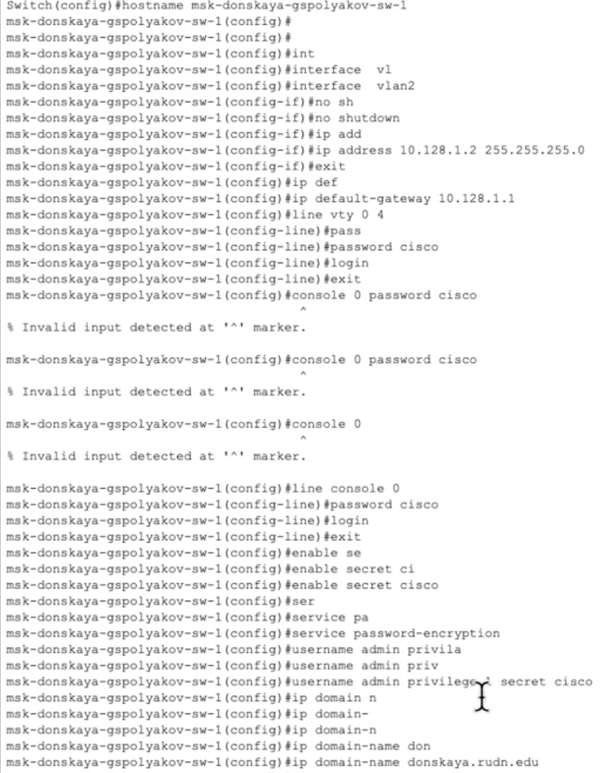
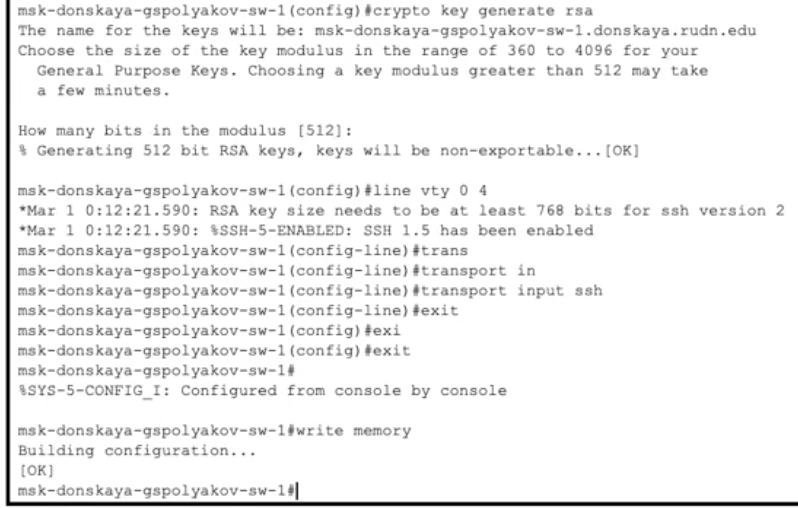
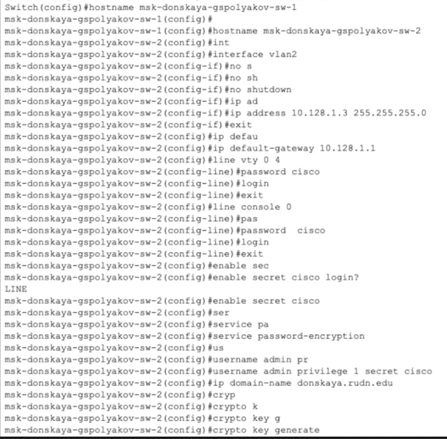
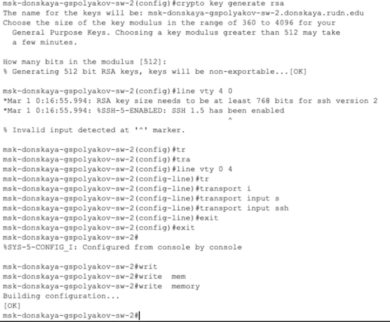
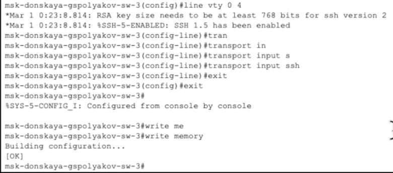
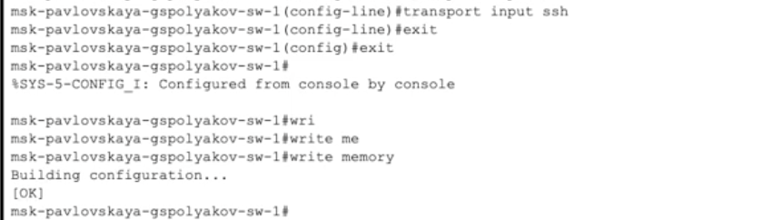

---
## Front matter
lang: ru-RU
title: Лабораторная работа №4
subtitle: Первоначальное конфигурирование сети
author:
  - Поляков Г. С.
institute:
  - Российский университет дружбы народов, Москва, Россия
date: 03 марта 2025

## i18n babel
babel-lang: russian
babel-otherlangs: english

## Formatting pdf
toc: false
toc-title: Содержание
slide_level: 2
aspectratio: 169
section-titles: true
theme: metropolis
header-includes:
 - \metroset{progressbar=frametitle,sectionpage=progressbar,numbering=fraction}
---

# Информация

## Докладчик

:::::::::::::: {.columns align=center}
::: {.column width="70%"}

  * Поляков Глеб Сергеевич
  * студент
  * Российский университет дружбы народов

:::
::: {.column width="30%"}

:::
::::::::::::::

# Выполнение работы

## Размещение устройств согласно схеме

{#fig:001 width=70%}

## Конфигурация msk-donskaya-gspolyakov-sw-1 1

{#fig:002 width=70%}

## Конфигурация msk-donskaya-gspolyakov-sw-1 2

{#fig:003 width=70%}

## Конфигурация msk-donskaya-gspolyakov-sw-2 1

{#fig:004 width=70%}

## Конфигурация msk-donskaya-gspolyakov-sw-2 2

{#fig:005 width=70%}

## Конфигурация msk-donskaya-gspolyakov-sw-3 1

{#fig:006 width=70%}

## Конфигурация msk-donskaya-gspolyakov-sw-3 2

{#fig:007 width=70%}

## Конфигурация msk-donskaya-gspolyakov-sw-4 1

{#fig:008 width=70%}

## Конфигурация msk-donskaya-gspolyakov-sw-4 2

{#fig:009 width=70%}

## Конфигурация msk-pavlovskaya-gspolyakov-sw-1 1

{#fig:010 width=70%}

## Конфигурация msk-pavlovskaya-gspolyakov-sw-1 2

{#fig:011 width=70%}
