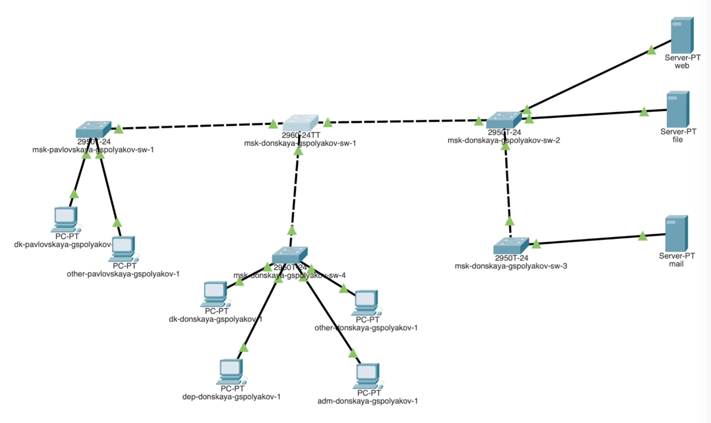
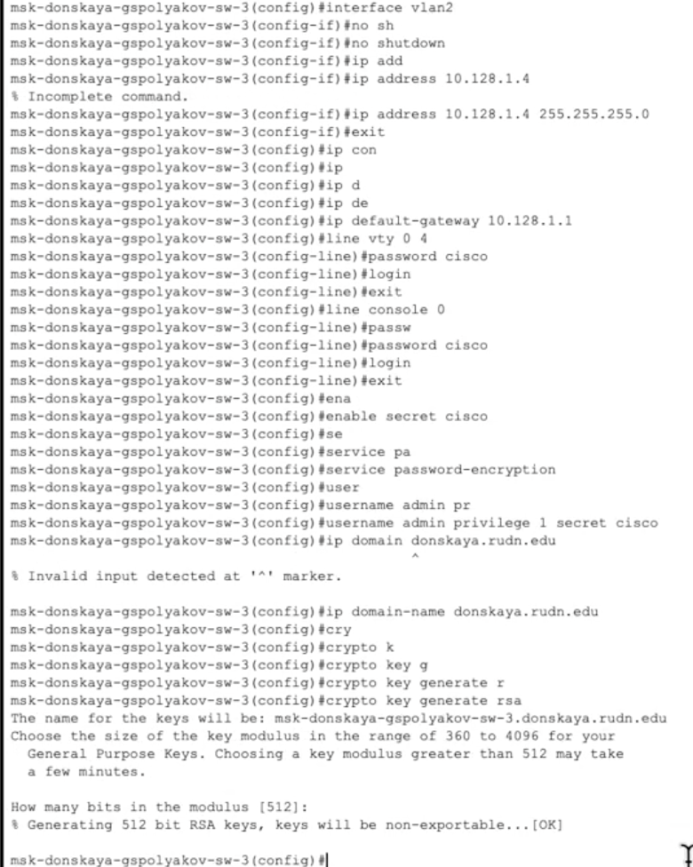
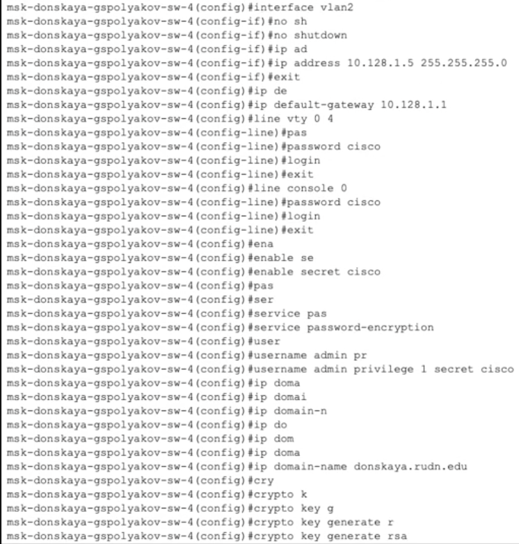
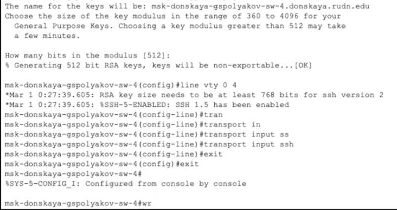
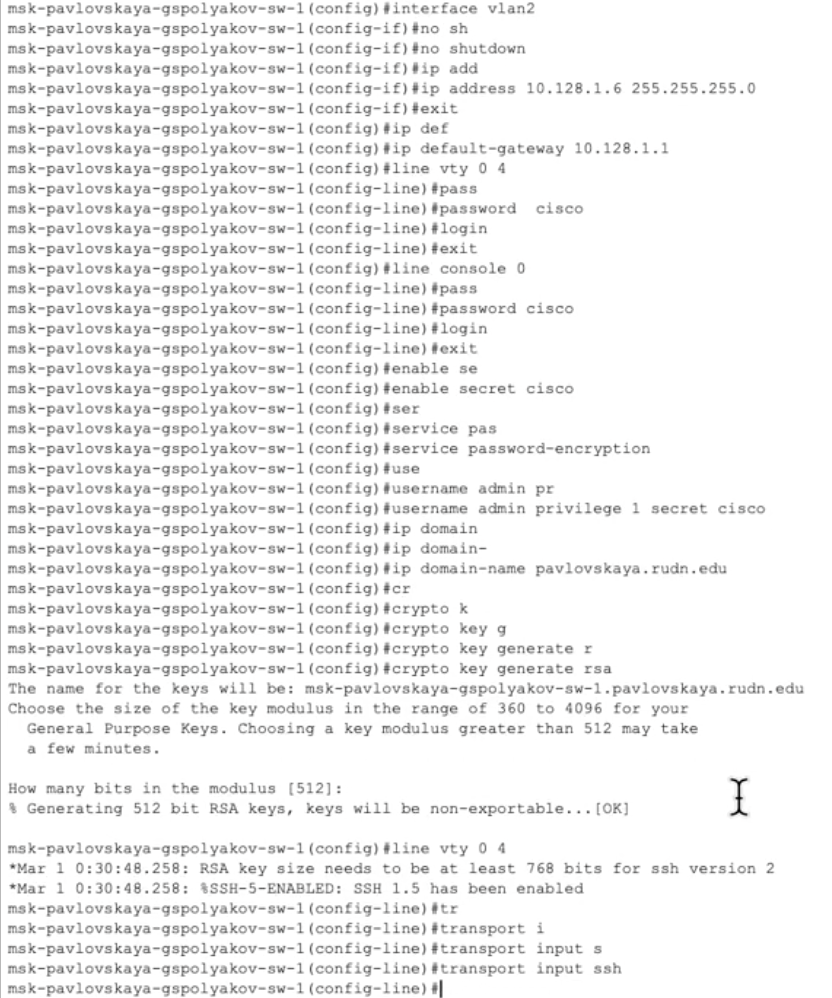

---
## Front matter
title: "Лабораторная работа №4."
subtitle: "Первоначальное конфигурирование сети"
author: "Полякоа Глеб Сергеевич"

## Generic otions
lang: ru-RU
toc-title: "Содержание"

## Bibliography
bibliography: bib/cite.bib
csl: pandoc/csl/gost-r-7-0-5-2008-numeric.csl

## Pdf output format
toc: true # Table of contents
toc-depth: 2
lof: true # List of figures
lot: true # List of tables
fontsize: 12pt
linestretch: 1.5
papersize: a4
documentclass: scrreprt
## I18n polyglossia
polyglossia-lang:
  name: russian
  options:
	- spelling=modern
	- babelshorthands=true
polyglossia-otherlangs:
  name: english
## I18n babel
babel-lang: russian
babel-otherlangs: english
## Fonts
mainfont: IBM Plex Serif
romanfont: IBM Plex Serif
sansfont: IBM Plex Sans
monofont: IBM Plex Mono
mathfont: STIX Two Math
mainfontoptions: Ligatures=Common,Ligatures=TeX,Scale=0.94
romanfontoptions: Ligatures=Common,Ligatures=TeX,Scale=0.94
sansfontoptions: Ligatures=Common,Ligatures=TeX,Scale=MatchLowercase,Scale=0.94
monofontoptions: Scale=MatchLowercase,Scale=0.94,FakeStretch=0.9
mathfontoptions:
## Biblatex
biblatex: true
biblio-style: "gost-numeric"
biblatexoptions:
  - parentracker=true
  - backend=biber
  - hyperref=auto
  - language=auto
  - autolang=other*
  - citestyle=gost-numeric
## Pandoc-crossref LaTeX customization
figureTitle: "Рис."
tableTitle: "Таблица"
listingTitle: "Листинг"
lofTitle: "Список иллюстраций"
lotTitle: "Список таблиц"
lolTitle: "Листинги"
## Misc options
indent: true
header-includes:
  - \usepackage{indentfirst}
  - \usepackage{float} # keep figures where there are in the text
  - \floatplacement{figure}{H} # keep figures where there are in the text
---

# Цель работы

Провести подготовительную работу по первоначальной настройке коммутаторов сети.

# Задание

Требуется сделать первоначальную настройку коммутаторов сети, представленной на схеме L1 (см. рис. 3.1 из раздела 3.3). Под первоначальной настройкой понимается указание имени устройства, его IP-адреса, настройка доступа по паролю к виртуальным терминалам и консоли, настройка удалённого доступа к устройству по ssh. 
При выполнении работы необходимо учитывать соглашение об именовании (см. раздел 2.5).

# Выполнение лабораторной работы

1. В логической рабочей области Packet Tracer разместите коммутаторы и оконечные устройства согласно схеме сети L1 (см. рис. 3.1 из раздела 3.3) и соедините их через соответствующие интерфейсы (рис. [-@fig:001]).
{#fig:001 width=70%}

2. Используя типовую конфигурацию коммутатора (см. пример 4.1), настройте все коммутаторы, изменяя название устройства и его IP-адрес согласно плану IP (см. табл. 3.2 из раздела 3.3).

{#fig:002 width=70%}
{#fig:003 width=70%}
{#fig:004 width=70%}
{#fig:005 width=70%}
{#fig:006 width=70%}
{#fig:007 width=70%}
{#fig:008 width=70%}
{#fig:009 width=70%}
{#fig:010 width=70%}
{#fig:011 width=70%}

# Выводы

Провел подготовительную работу по первоначальной настройке коммутаторов сети.

# Контрольные вопросы

1.	Команды для просмотра конфигурации сетевого оборудования:

	*	show running-config – показывает текущую (рабочую) конфигурацию
	*	show startup-config – показывает конфигурацию, сохраненную в NVRAM
	*	show config (на некоторых устройствах)

2.	Команды для просмотра стартового конфигурационного файла:
	*	show startup-config

3.	Команды для экспорта конфигурационного файла:
	*	copy running-config tftp – копирование текущей конфигурации на TFTP-сервер
	*	copy startup-config tftp – копирование стартовой конфигурации на TFTP-сервер
	*	copy running-config ftp – копирование текущей конфигурации на FTP-сервер
	*	copy startup-config ftp – копирование стартовой конфигурации на FTP-сервер
	*	write memory – сохранение текущей конфигурации в startup-config

4.	Команды для импорта конфигурационного файла:
	*	copy tftp running-config – загрузка конфигурации с TFTP в оперативную память
	*	copy tftp startup-config – загрузка конфигурации с TFTP в NVRAM
	*	copy ftp running-config – загрузка конфигурации с FTP в оперативную память
	*	copy ftp startup-config – загрузка конфигурации с FTP в NVRAM

# Список литературы{.unnumbered}

::: {#refs}
:::
