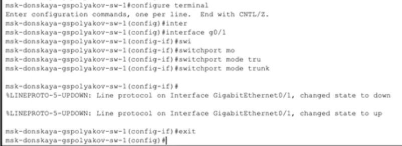
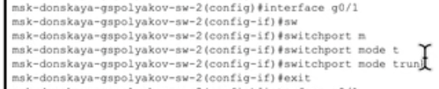
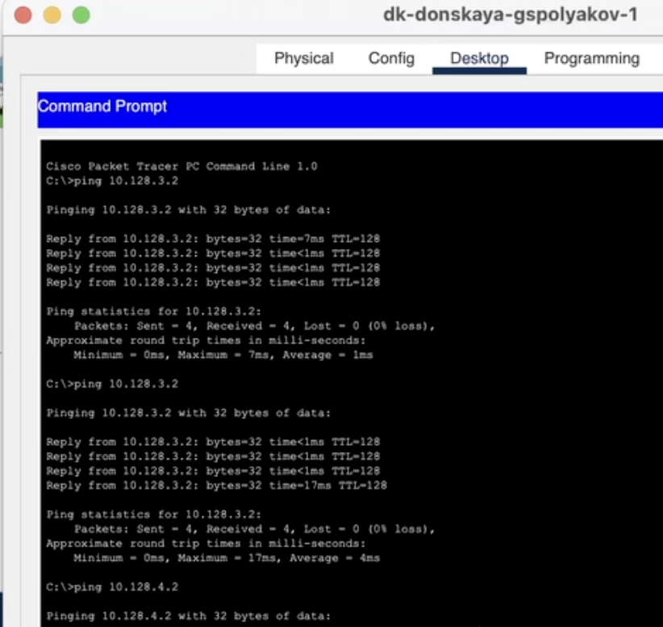
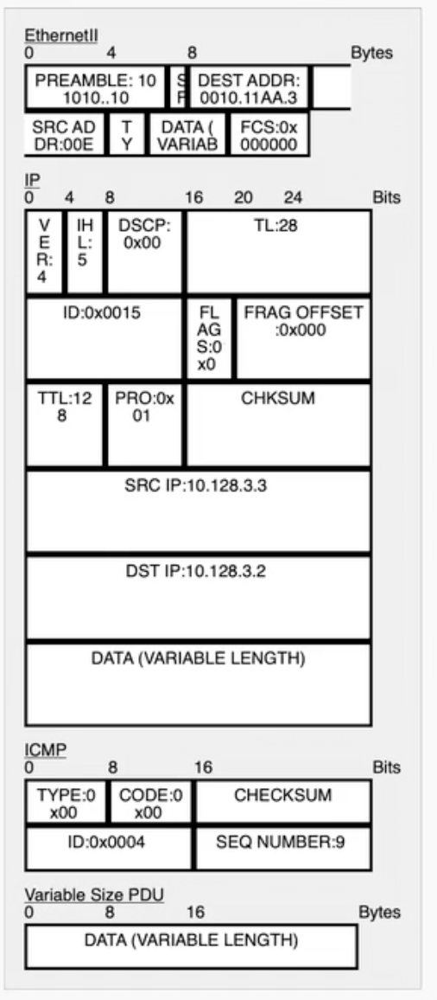

---
## Front matter
title: "Отчет о лабораторной работе №5"
subtitle: "Конфигурирование VLAN"
author: "Поляков Глеб Сергеевич"

## Generic otions
lang: ru-RU
toc-title: "Содержание"

## Bibliography
bibliography: bib/cite.bib
csl: pandoc/csl/gost-r-7-0-5-2008-numeric.csl

## Pdf output format
toc: true # Table of contents
toc-depth: 2
lof: true # List of figures
lot: true # List of tables
fontsize: 12pt
linestretch: 1.5
papersize: a4
documentclass: scrreprt
## I18n polyglossia
polyglossia-lang:
  name: russian
  options:
	- spelling=modern
	- babelshorthands=true
polyglossia-otherlangs:
  name: english
## I18n babel
babel-lang: russian
babel-otherlangs: english
## Fonts
mainfont: IBM Plex Serif
romanfont: IBM Plex Serif
sansfont: IBM Plex Sans
monofont: IBM Plex Mono
mathfont: STIX Two Math
mainfontoptions: Ligatures=Common,Ligatures=TeX,Scale=0.94
romanfontoptions: Ligatures=Common,Ligatures=TeX,Scale=0.94
sansfontoptions: Ligatures=Common,Ligatures=TeX,Scale=MatchLowercase,Scale=0.94
monofontoptions: Scale=MatchLowercase,Scale=0.94,FakeStretch=0.9
mathfontoptions:
## Biblatex
biblatex: true
biblio-style: "gost-numeric"
biblatexoptions:
  - parentracker=true
  - backend=biber
  - hyperref=auto
  - language=auto
  - autolang=other*
  - citestyle=gost-numeric
## Pandoc-crossref LaTeX customization
figureTitle: "Рис."
tableTitle: "Таблица"
listingTitle: "Листинг"
lofTitle: "Список иллюстраций"
lotTitle: "Список таблиц"
lolTitle: "Листинги"
## Misc options
indent: true
header-includes:
  - \usepackage{indentfirst}
  - \usepackage{float} # keep figures where there are in the text
  - \floatplacement{figure}{H} # keep figures where there are in the text
---

# Цель работы

Получить основные навыки по настройке VLAN на коммутаторах сети.

# Задание

1. На коммутаторах сети настроить Trunk-порты на соответствующих интерфейсах (см. табл. 3.2 из раздела 3.3), связывающих коммутаторы между собой.
2. Коммутатор msk-donskaya-sw-1 настроить как VTP-сервер и прописать на нём номера и названия VLAN согласно табл. 3.1 из раздела 3.3.
3. Коммутаторы msk-donskaya-sw-2 — msk-donskaya-sw-4, mskpavlovskaya-sw-1 настроить как VTP-клиенты, на интерфейсах указать принадлежность к соответствующему VLAN (см. табл. 3.3 из раздела 3.3).
4. На серверах прописать IP-адреса, как указано в табл. 3.2 из раздела 3.3.
5. На оконечных устройствах указать соответствующий адрес шлюза и прописать статические IP-адреса из диапазона соответствующей сети, следуя регламенту выделения ip-адресов (см. табл. 3.4 из раздела 3.3).
6. Проверить доступность устройств, принадлежащих одному VLAN, и недоступность устройств, принадлежащих разным VLAN.
7. При выполнении работы необходимо учитывать соглашение об именовании (см. раздел 2.5).

# Теоретическое введение

##5.3.1. Конфигурация Trunk-порта
	
	msk−donskaya −sw−1>enable
	msk−donskaya −sw −1#configure terminal
	msk−donskaya −sw −1(config)#interface g0/1
	msk−donskaya −sw −1(config −if)#switchport mode trunk

##5.3.2. Конфигурация VTP
	
	msk−donskaya −sw−1>enable
	msk−donskaya −sw −1#configure terminal
	msk−donskaya −sw −1(config)#vtp mode server
	msk−donskaya −sw −1(config)#vtp domain donskaya
	msk−donskaya −sw −1(config)#vtp password cisco
	msk−donskaya −sw −1(config −vlan)#vlan 2
	msk−donskaya −sw −1(config −vlan)#name management
	msk−donskaya −sw −1(config −vlan)#vlan 3
	msk−donskaya −sw −1(config −vlan)#name servers
	msk−donskaya −sw −1(config −vlan)#vlan 101
	msk−donskaya −sw −1(config −vlan)#name dk
	msk−donskaya −sw −1(config −vlan)#vlan 102
	msk−donskaya −sw −1(config −vlan)#name departaments
	msk−donskaya −sw −1(config −vlan)#vlan 103
	msk−donskaya −sw −1(config −vlan)#name adm
	msk−donskaya −sw −1(config −vlan)#vlan 104
	msk−donskaya −sw −1(config −vlan)#name other

##5.3.3. Конфигурация диапазона портов

	msk−donskaya −sw −4#conf terminal
	msk−donskaya −sw −4(config)#vtp mode client
	msk−donskaya −sw −4(config)#interface range f0/1 − 5
	msk−donskaya −sw −4(config −if−range)#switchport mode access
	msk−donskaya −sw −4(config −if−range)#switchport access vlan 101

# Выполнение лабораторной работы

1. Используя приведённую ниже последовательность команд из примера по конфигурации Trunk-порта на интерфейсе g0/1 коммутатора mskdonskaya-sw-1, настройте Trunk-порты на соответствующих интерфейсах всех коммутаторов.
{#fig:001 width=70%}
{#fig:002 width=70%}
{#fig:003 width=70%}
{#fig:004 width=70%}
{#fig:005 width=70%}
{#fig:006 width=70%}
{#fig:007 width=70%}
{#fig:008 width=70%}
{#fig:009 width=70%}

2. Используя приведённую ниже последовательность команд по конфигурации VTP, настройте коммутатор msk-donskaya-sw-1 как VTP-сервер и пропишите на нём номера и названия VLAN (см. табл. 3.1 из раздела 3.3).
{#fig:010 width=70%}

3. Используя приведённую ниже последовательность команд по конфигурации диапазонов портов, настройте коммутаторы msk-donskaya-sw-2 — mskdonskaya-sw-4, msk-pavlovskaya-sw-1 как VTP-клиенты и на интерфейсах укажите принадлежность к VLAN (см. табл. 3.3 из раздела 3.3).
{#fig:011 width=70%}
{#fig:012 width=70%}
{#fig:013 width=70%}
{#fig:014 width=70%}
{#fig:015 width=70%}

4. После указания статических IP-адресов на оконечных устройствах проверьте с помощью команды ping доступность устройств, принадлежащих одному VLAN, и недоступность устройств, принадлежащих разным VLAN.
{#fig:016 width=70%}
{#fig:017 width=70%}

5. Используя режим симуляции в Packet Tracer, изучите процесс передвижения пакета ICMP по сети. Изучите содержимое передаваемого пакета и заголовки задействованных протоколов.

{#fig:018 width=70%}
{#fig:019 width=70%}

# Выводы

Получил основные навыки по настройке VLAN на коммутаторах сети.

# Контрольные вопросы

1. Команда для просмотра списка VLAN

На сетевых устройствах Cisco для просмотра списка VLAN используется команда:

	show vlan brief

Эта команда отображает список VLAN, их идентификаторы (VLAN ID), имена и порты, назначенные каждой VLAN.

2. VLAN Trunking Protocol (VTP)

VTP (VLAN Trunking Protocol) — это проприетарный протокол Cisco, предназначенный для управления VLAN в сети. Он позволяет автоматически распространять информацию о VLAN между коммутаторами, упрощая администрирование.

Режимы работы VTP
	
*	Server — позволяет добавлять, изменять и удалять VLAN, распространяя эту информацию на другие коммутаторы.
*	Client — получает и применяет информацию о VLAN, но не может вносить изменения.
*	Transparent — игнорирует VTP-обновления, но пропускает их дальше.

Основные команды настройки VTP

vtp domain <имя_домена>  # Устанавливает домен VTP
vtp mode <режим>         # Устанавливает режим (server, client, transparent)
vtp password <пароль>    # Устанавливает пароль для аутентификации VTP
show vtp status          # Отображает текущий статус VTP

3. Internet Control Message Protocol (ICMP)

ICMP (Internet Control Message Protocol) — это вспомогательный протокол IP, используемый для диагностики сети и уведомления об ошибках. Он применяется в таких утилитах, как ping и traceroute.

Формат пакета ICMP

Поле	Размер (бит)	Описание
Тип	8	Определяет тип ICMP-сообщения (например, 8 — Echo Request, 0 — Echo Reply)
Код	8	Дополнительная информация о типе ICMP-сообщения
Контрольная сумма	16	Проверка целостности пакета
Остальные данные	Зависит от типа	Может включать идентификатор, последовательный номер, полезную нагрузку и др.

4. Address Resolution Protocol (ARP)

ARP (Address Resolution Protocol) — это протокол, используемый для преобразования IP-адресов в MAC-адреса в локальной сети.

Формат пакета ARP

Поле	Размер (бит)	Описание
Тип аппаратного адреса	16	Определяет тип MAC-адреса (Ethernet — 1)
Тип протокола	16	Определяет используемый протокол (IPv4 — 0x0800)
Длина MAC-адреса	8	Длина аппаратного адреса (обычно 6 байт)
Длина IP-адреса	8	Длина протокольного адреса (обычно 4 байта)
Код операции	16	1 — запрос ARP, 2 — ответ ARP
MAC-адрес отправителя	48	MAC-адрес устройства, отправившего запрос
IP-адрес отправителя	32	IP-адрес устройства, отправившего запрос
MAC-адрес получателя	48	MAC-адрес целевого устройства (нулевой в запросе)
IP-адрес получателя	32	IP-адрес целевого устройства

5. MAC-адрес и его структура

MAC-адрес (Media Access Control Address) — это уникальный аппаратный адрес сетевого интерфейса, используемый для идентификации устройств в локальной сети.

Структура MAC-адреса

MAC-адрес состоит из 48 бит (6 байт) и записывается в шестнадцатеричном формате, например:

00:1A:2B:3C:4D:5E

Он делится на две части:

*	Первые 24 бита (OUI — Organizationally Unique Identifier) — определяют производителя устройства.
*	Последние 24 бита (NIC — Network Interface Controller Identifier) — уникальный идентификатор устройства у данного производителя.

# Список литературы{.unnumbered}

::: {#refs}
:::
