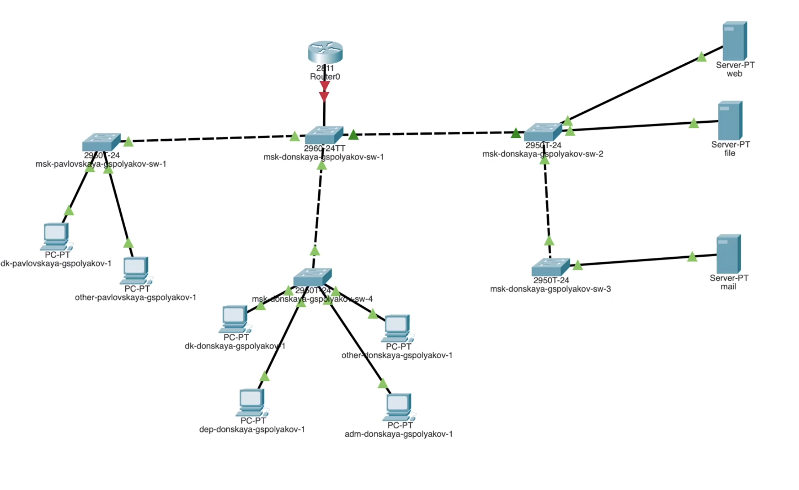
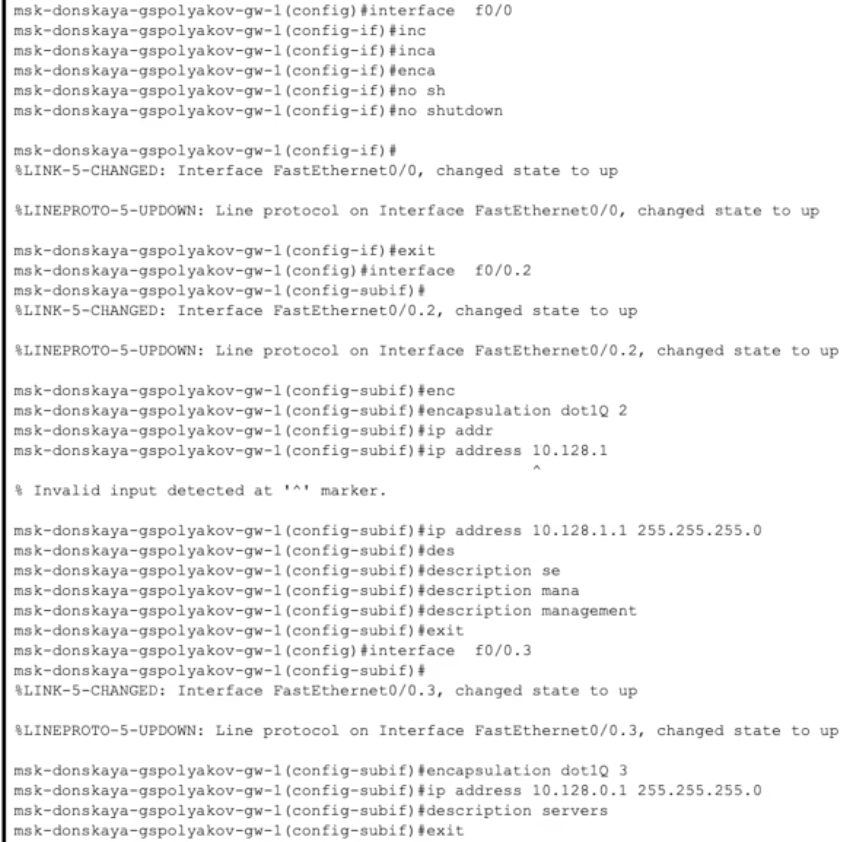
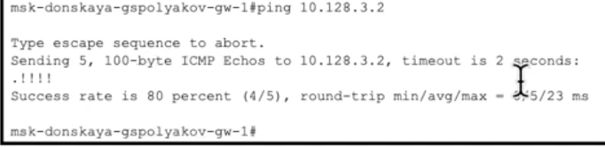
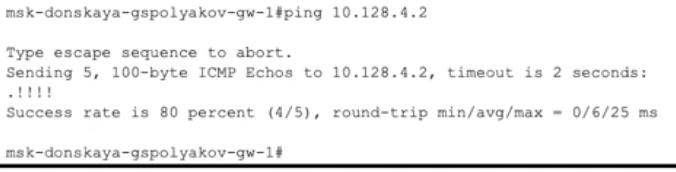
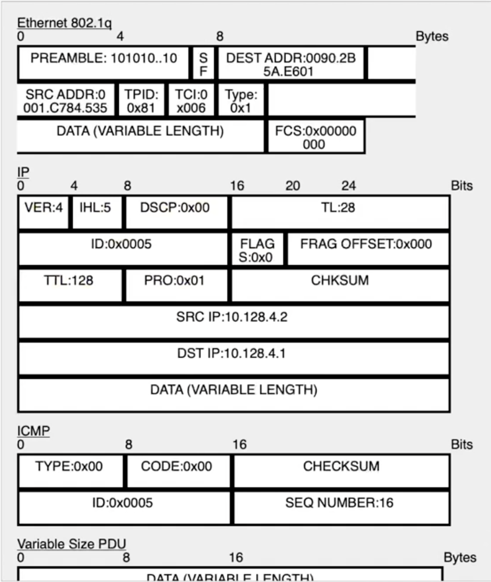

---
## Front matter
title: "Отчет о лабоаторной работе №6"
subtitle: "Статическая маршрутизация VLAN"
author: "Поляков Глеб Сергеевич"

## Generic otions
lang: ru-RU
toc-title: "Содержание"

## Bibliography
bibliography: bib/cite.bib
csl: pandoc/csl/gost-r-7-0-5-2008-numeric.csl

## Pdf output format
toc: true # Table of contents
toc-depth: 2
lof: true # List of figures
lot: true # List of tables
fontsize: 12pt
linestretch: 1.5
papersize: a4
documentclass: scrreprt
## I18n polyglossia
polyglossia-lang:
  name: russian
  options:
	- spelling=modern
	- babelshorthands=true
polyglossia-otherlangs:
  name: english
## I18n babel
babel-lang: russian
babel-otherlangs: english
## Fonts
mainfont: IBM Plex Serif
romanfont: IBM Plex Serif
sansfont: IBM Plex Sans
monofont: IBM Plex Mono
mathfont: STIX Two Math
mainfontoptions: Ligatures=Common,Ligatures=TeX,Scale=0.94
romanfontoptions: Ligatures=Common,Ligatures=TeX,Scale=0.94
sansfontoptions: Ligatures=Common,Ligatures=TeX,Scale=MatchLowercase,Scale=0.94
monofontoptions: Scale=MatchLowercase,Scale=0.94,FakeStretch=0.9
mathfontoptions:
## Biblatex
biblatex: true
biblio-style: "gost-numeric"
biblatexoptions:
  - parentracker=true
  - backend=biber
  - hyperref=auto
  - language=auto
  - autolang=other*
  - citestyle=gost-numeric
## Pandoc-crossref LaTeX customization
figureTitle: "Рис."
tableTitle: "Таблица"
listingTitle: "Листинг"
lofTitle: "Список иллюстраций"
lotTitle: "Список таблиц"
lolTitle: "Листинги"
## Misc options
indent: true
header-includes:
  - \usepackage{indentfirst}
  - \usepackage{float} # keep figures where there are in the text
  - \floatplacement{figure}{H} # keep figures where there are in the text
---

# Цель работы

Настроить статическую маршрутизацию VLAN в сети.

# Задание

1. Добавить в локальную сеть маршрутизатор, провести его первоначальную настройку.
2. Настроить статическую маршрутизацию VLAN.
3. При выполнении работы необходимо учитывать соглашение об именовании (см. раздел 2.5).

# Теоретическое введение

##6.3.1. Первичная конфигурация маршрутизатора

	Router >enable
	Router#configure terminal
	Router(config)#hostname msk−donskaya −gw−1
	msk−donskaya −gw −1(config)#line vty 0 4
	msk−donskaya −gw −1(config −line)#password cisco
	msk−donskaya −gw −1(config −line)#login
	msk−donskaya −gw −1(config)#line console 0
	msk−donskaya −gw −1(config −line)#password cisco
	msk−donskaya −gw −1(config −line)#login
	msk−donskaya −gw −1(config)#enable secret cisco
	msk−donskaya −gw −1(config)#service password −encryption
	msk−donskaya −gw −1(config)#username admin privilege 1 secret cisco
	msk−donskaya −gw −1(config)#ip domain −name donskaya.rudn.edu
	msk−donskaya −gw −1(config)#crypto key generate rsa
	msk−donskaya −gw −1(config)#line vty 0 4
	msk−donskaya −gw −1(config −line)#transport input ssh

###6.3.2. Конфигурация VLAN-интерфейсов маршрутизатора
	
	msk−donskaya −gw−1>enable
	msk−donskaya −gw −1#configure terminal
	msk−donskaya −gw −1(config)#interface f0/0
	msk−donskaya −gw −1(config −if)#no shutdown
	msk−donskaya −gw −1(config)#interface f0/0.2
	msk−donskaya −gw −1(config −subif)#encapsulation dot1Q 2
	msk−donskaya −gw −1(config −subif)#ip address 10.128.1.1 255.255.255.0
	msk−donskaya −gw −1(config −subif)#description management
	msk−donskaya −gw −1(config)#interface f0/0.3
	msk−donskaya −gw −1(config −subif)#encapsulation dot1Q 3
	msk−donskaya −gw −1(config −subif)#ip address 10.128.0.1 255.255.255.0
	msk−donskaya −gw −1(config −subif)#description servers
	msk−donskaya −gw −1(config −subif)#interface f0/0.101
	msk−donskaya −gw −1(config −subif)#encapsulation dot1Q 101
	msk−donskaya −gw −1(config −subif)#ip address 10.128.3.1 255.255.255.0
	msk−donskaya −gw −1(config −subif)#description dk
	msk−donskaya −gw −1(config −subif)#interface f0/0.102
	msk−donskaya −gw −1(config −subif)#encapsulation dot1Q 102
	msk−donskaya −gw −1(config −subif)#ip address 10.128.4.1 255.255.255.0
	msk−donskaya −gw −1(config −subif)#description departments
	msk−donskaya −gw −1(config −subif)#interface f0/0.103
	msk−donskaya −gw −1(config −subif)#encapsulation dot1Q 103
	msk−donskaya −gw −1(config −subif)#ip address 10.128.5.1 255.255.255.0
	msk−donskaya −gw −1(config −subif)#description adm
	msk−donskaya −gw −1(config −subif)#interface f0/0.104
	msk−donskaya −gw −1(config −subif)#encapsulation dot1Q 104
	msk−donskaya −gw −1(config −subif)#ip address 10.128.6.1 255.255.255.0
	msk−donskaya −gw −1(config −subif)#description other

# Выполнение лабораторной работы

1. В логической области проекта разместить маршрутизатор Cisco 2811, подключить его к порту 24 коммутатора msk-donskaya-sw-1 в соответствии с таблицей портов (см. табл. 3.3 из раздела 3.3).
{#fig:001 width=70%}
2. Используя приведённую ниже последовательность команд по первоначальной настройке маршрутизатора, сконфигурируйте маршрутизатор, задав на нём имя, пароль для доступа к консоли, настройте удалённое подключение к нему по ssh.
{#fig:002 width=70%}

3. Настройте порт 24 коммутатора msk-donskaya-sw-1 как trunk-порт.
{#fig:003 width=70%}

4. На интерфейсе f0/0 маршрутизатора msk-donskaya-gw-1 настройте виртуальные интерфейсы, соответствующие номерам VLAN. Согласно таблице IP-адресов (см. табл. 3.2 из раздела 3.3) задайте соответствующие IP-адреса на виртуальных интерфейсах. Для этого используйте приведённую ниже последовательность команд по конфигурации VLAN-интерфейсов маршрутизатора.
{#fig:004 width=70%}
{#fig:005 width=70%}
{#fig:006 width=70%}
5. Проверьте доступность оконечных устройств из разных VLAN.
{#fig:007 width=70%}
{#fig:008 width=70%}

6. Используя режим симуляции в Packet Tracer, изучите процесс передвижения пакета ICMP по сети. Изучите содержимое передаваемого пакета и заголовки задействованных протоколов.
{#fig:009 width=70%}
{#fig:010 width=70%}

# Выводы

Настроил статическую маршрутизацию VLAN в сети.

# Контрольные вопросы

1. Характеристика стандарта IEEE 802.1Q

IEEE 802.1Q — это стандарт, определяющий механизм виртуальных локальных сетей (VLAN) в Ethernet-сетях. Он описывает способ маркировки (тегирования) кадров, позволяющий различным VLAN существовать в одной физической сети.

Основные характеристики IEEE 802.1Q:

*	Внедрение VLAN: стандарт позволяет разделять трафик между различными VLAN, обеспечивая логическую сегментацию сети.
*	Тегирование кадров: добавляет специальное поле в заголовок Ethernet-кадра, содержащее идентификатор VLAN (VID).
*	Удаление тега: на конечных устройствах или не-VLAN-совместимых устройствах тег удаляется, чтобы кадры воспринимались как обычные Ethernet-пакеты.
*	Поддержка приоритетов (QoS): тег IEEE 802.1Q включает поле Priority Code Point (PCP), которое позволяет назначать приоритет кадру.

Стандарт IEEE 802.1Q необходим для построения управляемых сетей, так как обеспечивает изоляцию трафика, повышает безопасность и оптимизирует маршрутизацию пакетов в больших сетях.

2. Формат кадра IEEE 802.1Q

IEEE 802.1Q добавляет в стандартный Ethernet-кадр дополнительное поле VLAN Tag размером 4 байта (32 бита). Формат кадра выглядит так:

Поле	Размер (байты)	Описание
Преамбула	7	Синхронизация приема кадров
SFD (Start Frame Delimiter)	1	Начало кадра
MAC-адрес получателя	6	MAC-адрес назначения
MAC-адрес отправителя	6	MAC-адрес источника
TPID (Tag Protocol Identifier)	2	Значение 0x8100, указывающее на наличие VLAN-тега
TCI (Tag Control Information)	2	Информация о VLAN
Тип/Длина	2	Указывает тип протокола (например, IPv4 = 0x0800)
Полезная нагрузка (Data)	46–1500	Данные
FCS (Frame Check Sequence)	4	Контрольная сумма кадра

Расшифровка поля Tag Control Information (TCI):

*	PCP (Priority Code Point, 3 бита) – приоритет кадра (QoS).
*	DEI (Drop Eligible Indicator, 1 бит) – индикатор возможности отбрасывания пакета при перегрузке.
*	VID (VLAN Identifier, 12 бит) – номер VLAN (0–4095, но 0 и 4095 зарезервированы).

В результате тегированный кадр IEEE 802.1Q становится на 4 байта длиннее, что влияет на максимальный размер Ethernet-кадра (он увеличивается с 1518 до 1522 байт).

Этот формат позволяет VLAN-совместимым коммутаторам правильно маршрутизировать трафик внутри соответствующих VLAN, сохраняя логическое разделение сетей на уровне 2 (канального) модели OSI.

# Список литературы{.unnumbered}

::: {#refs}
:::
