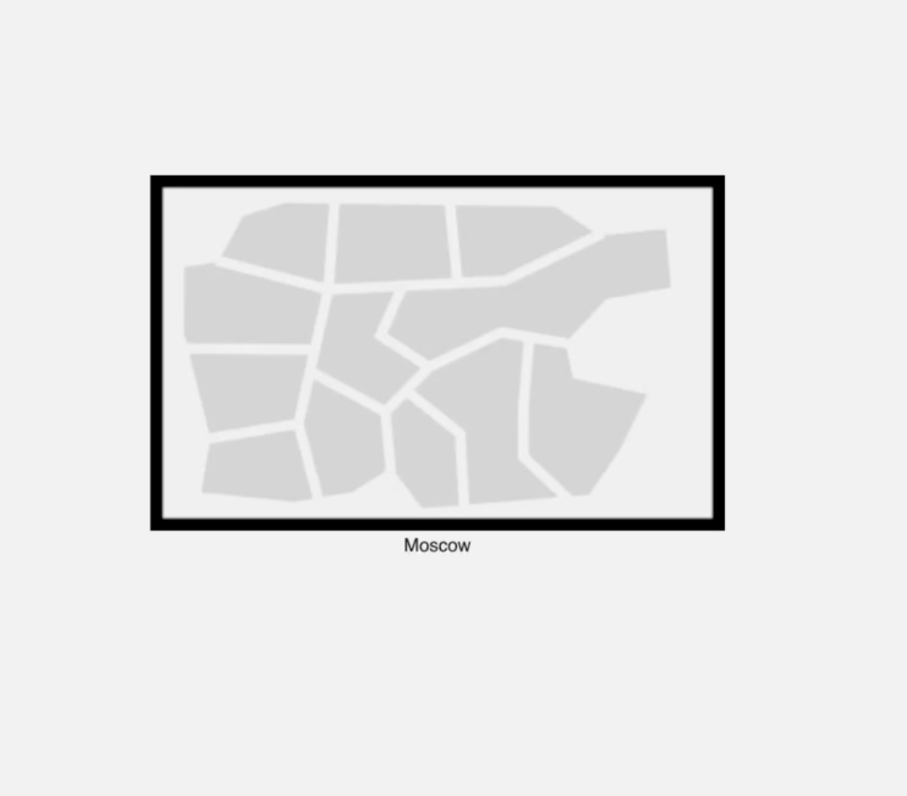
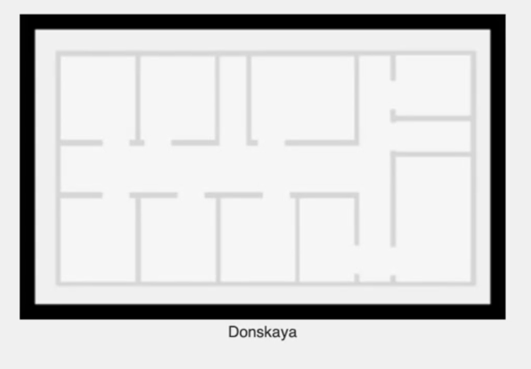
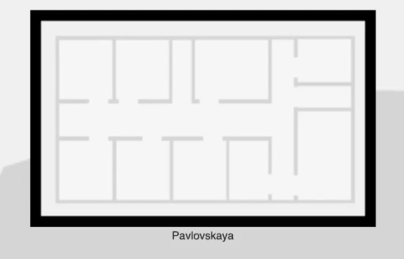
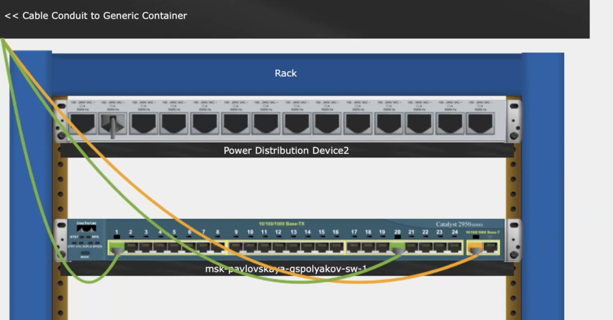
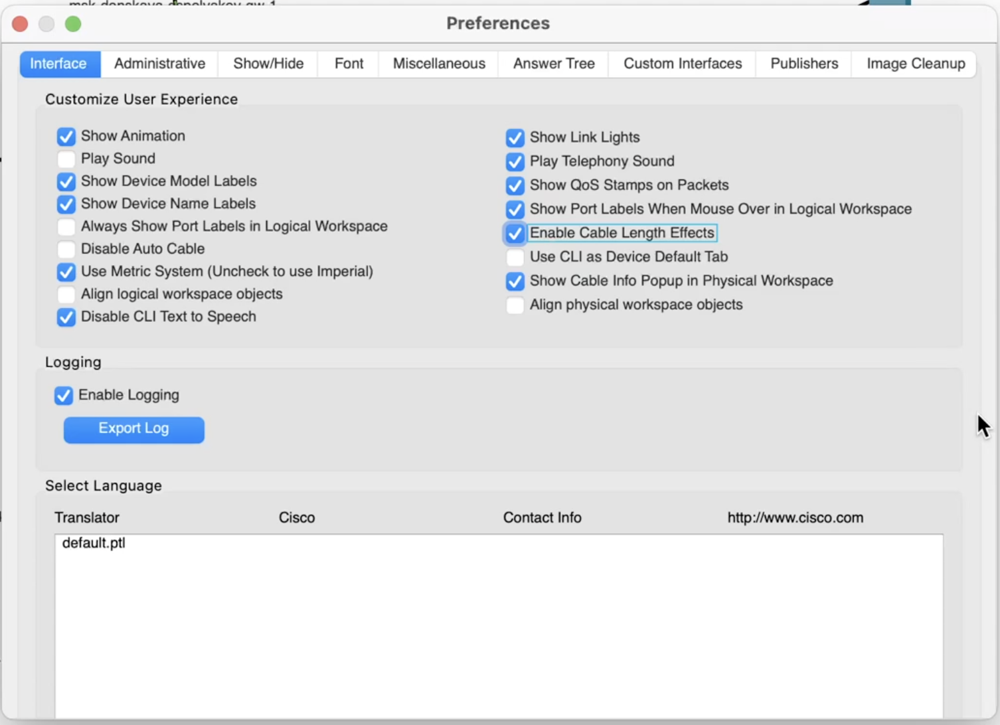
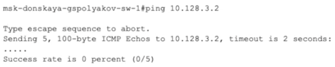
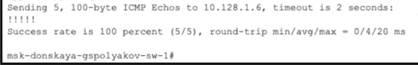

---
## Front matter
lang: ru-RU
title: Лабораторная работа №7
subtitle: Учет физических параметров сети
author:
  - Поляков Г. С.
institute:
  - Российский университет дружбы народов, Москва, Россия
date: 12 марта 2025

## i18n babel
babel-lang: russian
babel-otherlangs: english

## Formatting pdf
toc: false
toc-title: Содержание
slide_level: 2
aspectratio: 169
section-titles: true
theme: metropolis
header-includes:
 - \metroset{progressbar=frametitle,sectionpage=progressbar,numbering=fraction}
---

# Информация

## Докладчик

:::::::::::::: {.columns align=center}
::: {.column width="70%"}

  * Поляков Глеб Сергеевич
  * Студент
  * Российский университет дружбы народов

:::
::: {.column width="30%"}

:::
::::::::::::::

# Выполнение работы

## Схема сети

## Физическа область. Город

## Физическая область. Донская

## Физическая область. Павловская

## Серверные стойки

## Перенос оборудования в Павловская

## Проверка соединения

## Включение учета физ. параметров

## Размещение рабочих областей

## Проверка соединения

## Репитеры

## Подключение через репитеры

## Проверка соединения

