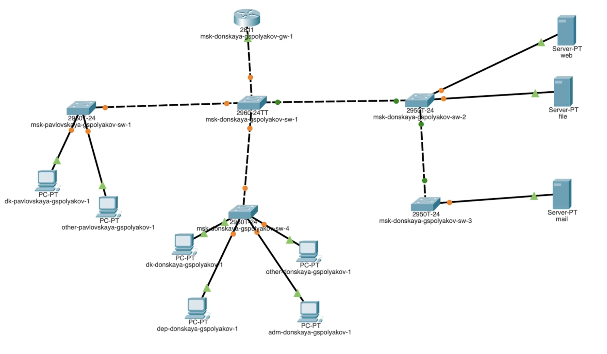
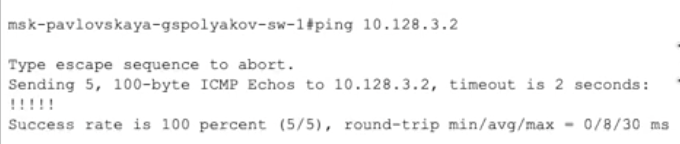
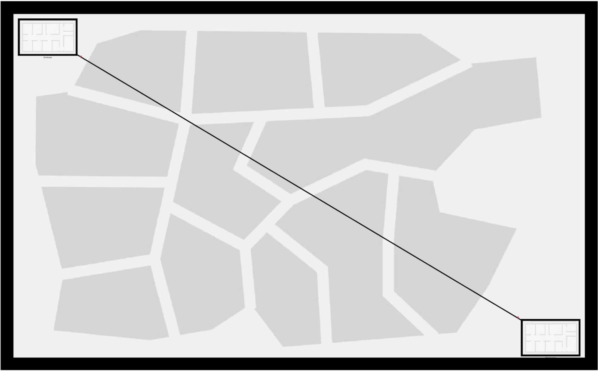
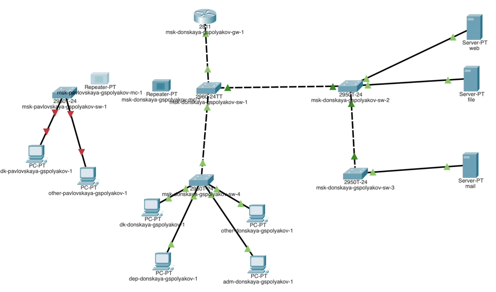
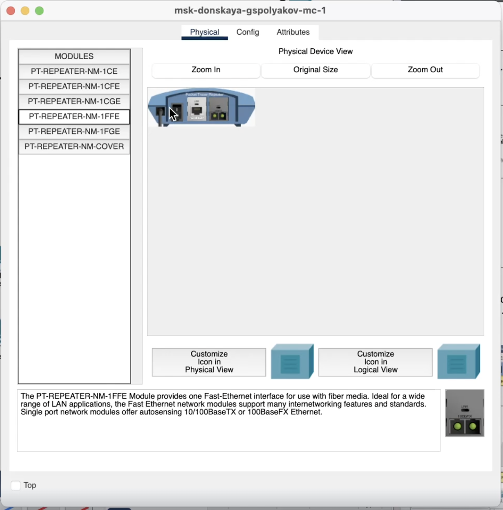
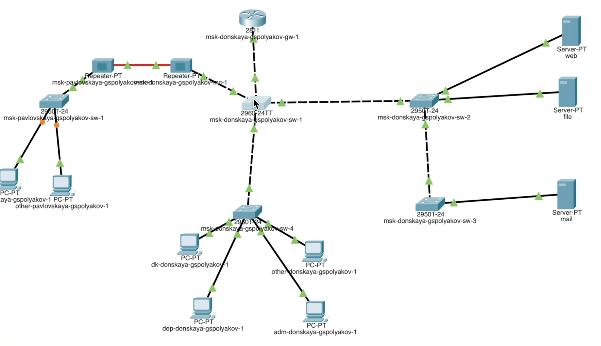

---
## Front matter
title: "Лабораторная работа №7"
subtitle: "Учет физических параметров сети"
author: "Поляков Глеб Сергеевич"

## Generic otions
lang: ru-RU
toc-title: "Содержание"

## Bibliography
bibliography: bib/cite.bib
csl: pandoc/csl/gost-r-7-0-5-2008-numeric.csl

## Pdf output format
toc: true # Table of contents
toc-depth: 2
lof: true # List of figures
lot: true # List of tables
fontsize: 12pt
linestretch: 1.5
papersize: a4
documentclass: scrreprt
## I18n polyglossia
polyglossia-lang:
  name: russian
  options:
	- spelling=modern
	- babelshorthands=true
polyglossia-otherlangs:
  name: english
## I18n babel
babel-lang: russian
babel-otherlangs: english
## Fonts
mainfont: IBM Plex Serif
romanfont: IBM Plex Serif
sansfont: IBM Plex Sans
monofont: IBM Plex Mono
mathfont: STIX Two Math
mainfontoptions: Ligatures=Common,Ligatures=TeX,Scale=0.94
romanfontoptions: Ligatures=Common,Ligatures=TeX,Scale=0.94
sansfontoptions: Ligatures=Common,Ligatures=TeX,Scale=MatchLowercase,Scale=0.94
monofontoptions: Scale=MatchLowercase,Scale=0.94,FakeStretch=0.9
mathfontoptions:
## Biblatex
biblatex: true
biblio-style: "gost-numeric"
biblatexoptions:
  - parentracker=true
  - backend=biber
  - hyperref=auto
  - language=auto
  - autolang=other*
  - citestyle=gost-numeric
## Pandoc-crossref LaTeX customization
figureTitle: "Рис."
tableTitle: "Таблица"
listingTitle: "Листинг"
lofTitle: "Список иллюстраций"
lotTitle: "Список таблиц"
lolTitle: "Листинги"
## Misc options
indent: true
header-includes:
  - \usepackage{indentfirst}
  - \usepackage{float} # keep figures where there are in the text
  - \floatplacement{figure}{H} # keep figures where there are in the text
---

# Цель работы

Получить навыки работы с физической рабочей областью Packet Tracer,
а также учесть физические параметры сети.

# Задание

Требуется заменить соединение между коммутаторами двух территорий msk-donskaya-sw-1 и msk-pavlovskaya-sw-1 (рис. 7.1) на соединение, учитывающее физические параметры сети, а именно — расстояние между двумя территориями.
При выполнении работы необходимо учитывать соглашение об именовании (см. раздел 2.5).

# Выполнение лабораторной работы

1. Откройте проект предыдущей лабораторной работы.
{#fig:001 width=70%}
2. Перейдите в физическую рабочую область Packet Tracer. Присвойте название городу — Moscow.
{#fig:002 width=70%}
3. Щёлкнув на изображении города, Вы увидите изображение здания (рис. 7.3). Присвойте ему название Donskaya. Добавьте здание для территории Pavlovskaya.
{#fig:003 width=70%}
{#fig:004 width=70%}
4. Щёлкнув на изображении здания Donskaya, переместите изображение, обозначающее серверное помещение, в него.

5. Щёлкнув на изображении серверной, Вы увидите отображение серверных стоек.

6. Переместите коммутатор msk-pavlovskaya-sw-1 и два оконечных устройства dk-pavlovskaya-1 и other-pavlovskaya-1 на территорию Pavlovskaya, используя меню Move физической рабочей области Packet Tracer.
{#fig:005 width=70%}

7. Вернувшись в логическую рабочую область Packet Tracer, пропингуйте с коммутатора msk-donskaya-sw-1 коммутатор msk-pavlovskaya-sw-1.
Убедитесь в работоспособности соединения.
{#fig:006 width=70%}

8. В меню Options, Preferences во вкладке Interface активируйте разрешение на учёт физических характеристик среды передачи (Enable Cable Length Effects).
{#fig:007 width=70%}

9. В физической рабочей области Packet Tracer разместите две территории на расстоянии более 100 м друг от друга (рекомендуемое расстояние — около 1000 м или более).
{#fig:008 width=70%}

10. Вернувшись в логическую рабочую область Packet Tracer, пропингуйте с коммутатора msk-donskaya-sw-1 коммутатор msk-pavlovskaya-sw-1.
Убедитесь в неработоспособности соединения.
{#fig:009 width=70%}

11. Удалите соединение между msk-donskaya-sw-1 и msk-pavlovskaya-sw-1.
Добавьте в логическую рабочую область два повторителя (RepeaterPT). Присвойте им соответствующие названия msk-donskaya-mc-1
и msk-pavlovskaya-mc-1. Замените имеющиеся модули на PT-REPEATERNM-1FFE и PT-REPEATER-NM-1CFE для подключения оптоволокна
и витой пары по технологии Fast Ethernet
{#fig:010 width=70%}
{#fig:011 width=70%}

12. Переместите msk-pavlovskaya-mc-1 на территорию Pavlovskaya (в физической рабочей области Packet Tracer).

13. Подключите коммутатор msk-donskaya-sw-1 к msk-donskaya-mc-1 по витой паре, msk-donskaya-mc-1 и msk-pavlovskaya-mc-1 — по оптоволокну, msk-pavlovskaya-sw-1 к msk-pavlovskaya-mc-1 — по витой паре
{#fig:001 width=70%}
14. Убедитесь в работоспособности соединения между msk-donskaya-sw-1 и msk-pavlovskaya-sw-1.
{#fig:013 width=70%}

# Выводы

Получил навыки работы с физической рабочей областью Packet Tracer, а также учел физические параметры сети.

# Список литературы{.unnumbered}

::: {#refs}
:::
