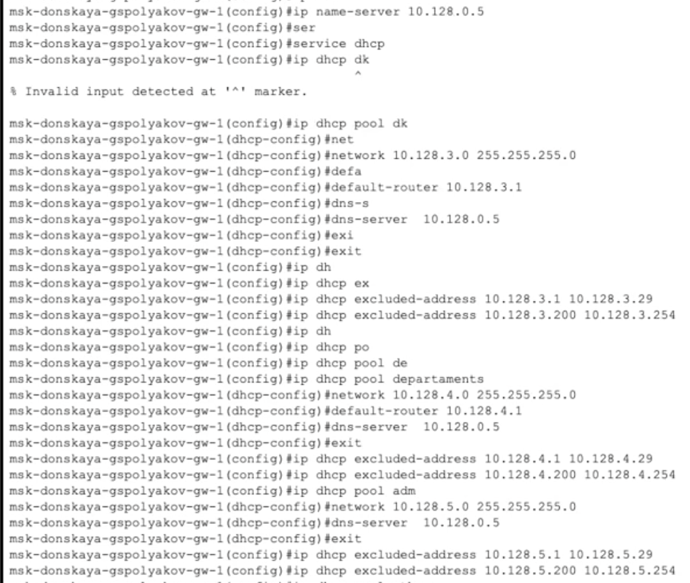
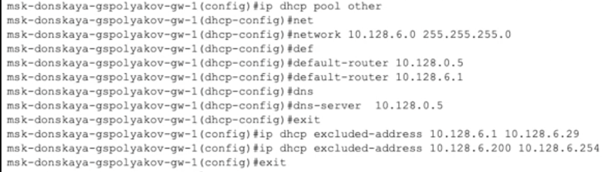
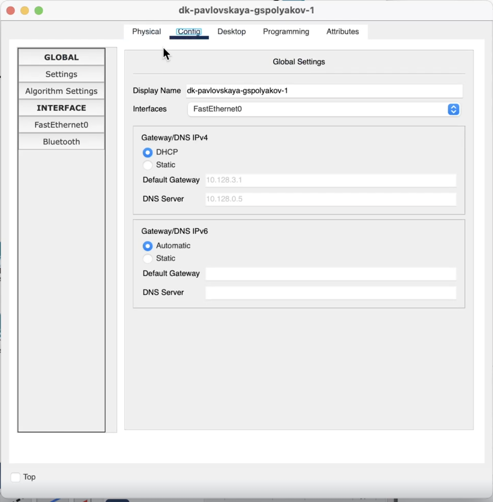
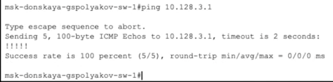
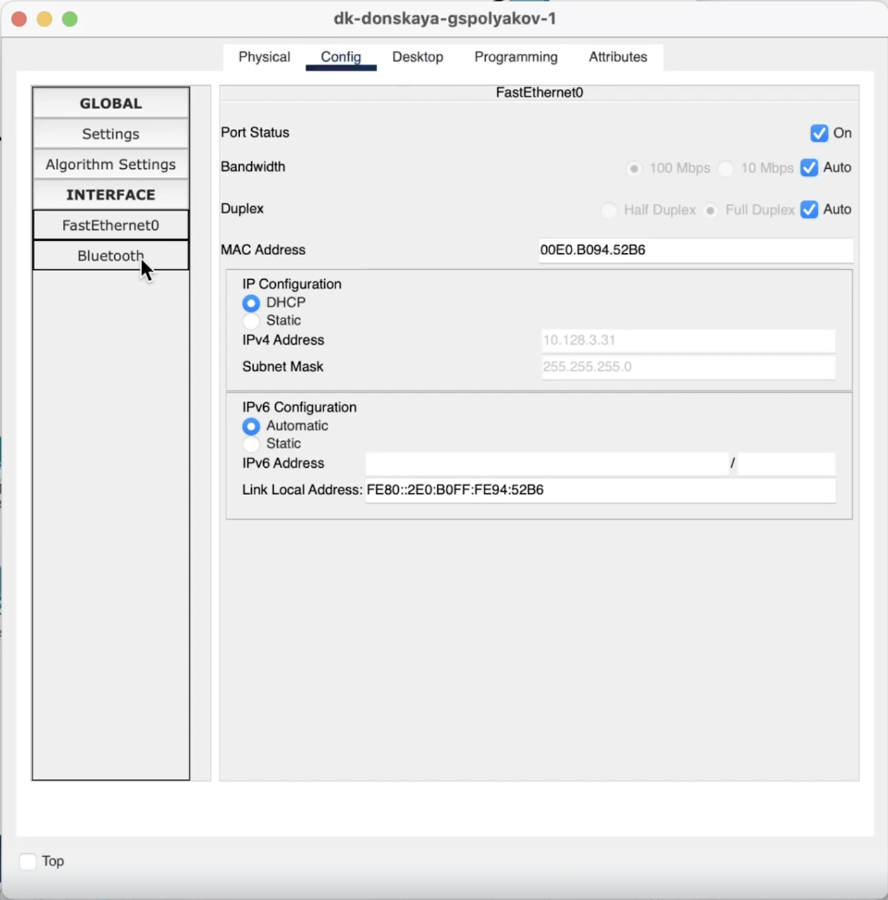

---
## Front matter
title: "Лабораторная работа №8"
subtitle: "Настройка сетевых сервисов. DHCP"
author: "Поляков Глеб Сергеевич"

## Generic otions
lang: ru-RU
toc-title: "Содержание"

## Bibliography
bibliography: bib/cite.bib
csl: pandoc/csl/gost-r-7-0-5-2008-numeric.csl

## Pdf output format
toc: true # Table of contents
toc-depth: 2
lof: true # List of figures
lot: true # List of tables
fontsize: 12pt
linestretch: 1.5
papersize: a4
documentclass: scrreprt
## I18n polyglossia
polyglossia-lang:
  name: russian
  options:
	- spelling=modern
	- babelshorthands=true
polyglossia-otherlangs:
  name: english
## I18n babel
babel-lang: russian
babel-otherlangs: english
## Fonts
mainfont: IBM Plex Serif
romanfont: IBM Plex Serif
sansfont: IBM Plex Sans
monofont: IBM Plex Mono
mathfont: STIX Two Math
mainfontoptions: Ligatures=Common,Ligatures=TeX,Scale=0.94
romanfontoptions: Ligatures=Common,Ligatures=TeX,Scale=0.94
sansfontoptions: Ligatures=Common,Ligatures=TeX,Scale=MatchLowercase,Scale=0.94
monofontoptions: Scale=MatchLowercase,Scale=0.94,FakeStretch=0.9
mathfontoptions:
## Biblatex
biblatex: true
biblio-style: "gost-numeric"
biblatexoptions:
  - parentracker=true
  - backend=biber
  - hyperref=auto
  - language=auto
  - autolang=other*
  - citestyle=gost-numeric
## Pandoc-crossref LaTeX customization
figureTitle: "Рис."
tableTitle: "Таблица"
listingTitle: "Листинг"
lofTitle: "Список иллюстраций"
lotTitle: "Список таблиц"
lolTitle: "Листинги"
## Misc options
indent: true
header-includes:
  - \usepackage{indentfirst}
  - \usepackage{float} # keep figures where there are in the text
  - \floatplacement{figure}{H} # keep figures where there are in the text
---

# Цель работы

Приобретение практических навыков по настройке динамического распределения IP-адресов посредством протокола DHCP (Dynamic Host Configuration Protocol) [5] в локальной сети.

# Задание

1. Добавить DNS-записи для домена donskaya.rudn.ru на сервер dns.
2. Настроить DHCP-сервис на маршрутизаторе.
3. Заменить в конфигурации оконечных устройствах статическое распределение адресов на динамическое.
4. При выполнении работы необходимо учитывать соглашение об именовании (см. раздел 2.5).

# Выполнение лабораторной работы

1. В логическую рабочую область проекта добавьте сервер dns и подключите его к коммутатору msk-donskaya-sw-3 через порт Fa0/2 (рис. 8.1), не забыв активировать порт при помощи соответствующих команд на коммутаторе. В конфигурации сервера укажите в качестве адреса шлюза 10.128.0.1, а в качестве адреса самого сервера — 10.128.0.5 с соответствующей маской 255.255.255.0.
{#fig:001 width=70%}
{#fig:002 width=70%}

2. Настройте сервис DNS (рис. 8.2):
- в конфигурации сервера выберите службу DNS, активируйте её (выбрав флаг On);
- в поле Type в качестве типа записи DNS выберите записи типа A (A Record);
- в поле Name укажите доменное имя, по которому можно обратиться, например, к web-серверу — www.donskaya.rudn.ru, затем укажите его IP-адрес в соответствующем поле 10.128.0.2;
- нажав на кнопку Add , добавьте DNS-запись на сервер;
- аналогичным образом добавьте DNS-записи для серверов mail, file, dns согласно распределению адресов из табл. 3.2;
- сохраните конфигурацию сервера.
{#fig:003 width=70%}

3. Настройте DHCP-сервис на маршрутизаторе, используя приведённые ниже команды для каждой выделенной сети: укажите IP-адрес DNS-сервера; затем перейдите к настройке DHCP; задайте название конфигурируемому диапазону адресов (пулу адресов), укажите адрес сети, а также адреса шлюза и DNS-сервера; задайте пулы адресов, исключаемых из динамического распределения (см. табл. 3.2).

– Настройка DHCP:

	msk−donskaya −gw−1>enable
	msk−donskaya −gw −1#configure terminal
	msk−donskaya −gw −1(config)#ip name −server 10.128.0.5
	msk−donskaya −gw −1(config)#service dhcp
	msk−donskaya −gw −1(config)#ip dhcp pool dk
	msk−donskaya −gw −1(dhcp −config)#network 10.128.3.0 255.255.255.0
	msk−donskaya −gw −1(dhcp −config)#default −router 10.128.3.1
	msk−donskaya −gw −1(dhcp −config)#dns−server 10.128.0.5
	msk−donskaya −gw −1(dhcp −config)#exit
	msk−donskaya −gw −1(config)#ip dhcp excluded −address 10.128.3.1 10.128.3.29
	msk−donskaya −gw −1(config)#ip dhcp excluded −address 10.128.3.200 10.128.3.254
	msk−donskaya −gw −1(config)#ip dhcp pool departments
	msk−donskaya −gw −1(dhcp −config)#network 10.128.4.0 255.255.255.0
	msk−donskaya −gw −1(dhcp −config)#default −router 10.128.4.1
	msk−donskaya −gw −1(dhcp −config)#dns−server 10.128.0.5
	msk−donskaya −gw −1(dhcp −config)#exit
	msk−donskaya −gw −1(config)#ip dhcp excluded −address 10.128.4.1 10.128.4.29
	msk−donskaya −gw −1(config)#ip dhcp excluded −address 10.128.4.200 10.128.4.254
	msk−donskaya −gw −1(config)#ip dhcp pool adm
	msk−donskaya −gw −1(dhcp −config)#network 10.128.5.0 255.255.255.0
	msk−donskaya −gw −1(dhcp −config)#default −router 10.128.5.1
	msk−donskaya −gw −1(dhcp −config)#dns−server 10.128.0.5
	msk−donskaya −gw −1(dhcp −config)#exit
	msk−donskaya −gw −1(config)#ip dhcp excluded −address 10.128.5.1 10.128.5.29
	msk−donskaya −gw −1(config)#ip dhcp excluded −address 10.128.5.200 10.128.5.254
	msk−donskaya −gw −1(config)#ip dhcp pool other
	msk−donskaya −gw −1(dhcp −config)#network 10.128.6.0 255.255.255.0
	msk−donskaya −gw −1(dhcp −config)#default −router 10.128.6.1
	msk−donskaya −gw −1(dhcp −config)#dns−server 10.128.0.5
	msk−donskaya −gw −1(dhcp −config)#exit
	msk−donskaya −gw −1(config)#ip dhcp excluded −address 10.128.6.1 10.128.6.29
	msk−donskaya −gw −1(config)#ip dhcp excluded −address 10.128.6.200 10.128.6.254

{#fig:004 width=70%}
{#fig:005 width=70%}

– Информация о пулах DHCP:

	msk−donskaya −gw −1#sh ip dhcp pool
{#fig:006 width=70%}
– Информация об привязках выданных адресов:

	msk−donskaya −gw −1#sh ip dhcp binding
{#fig:007 width=70%}

4. На оконечных устройствах замените в настройках статическое распределение адресов на динамическое.
{#fig:008 width=70%}

5. Проверьте, какие адреса выделяются оконечным устройствам, а также доступность устройств из разных подсетей.
{#fig:009 width=70%}

6. В режиме симуляции изучите, каким образом происходит запрос адреса по протоколу DHCP (какие сообщения и какие отклики передаются по сети).
{#fig:010 width=70%}
# Выводы

Приобрел практических навыков по настройке динамического распределения IP-адресов посредством протокола DHCP (Dynamic Host Configuration Protocol) [5] в локальной сети.

# Контрольные вопросы

1. За что отвечает протокол DHCP?

DHCP (Dynamic Host Configuration Protocol) — это сетевой протокол, предназначенный для автоматического назначения IP-адресов и других сетевых параметров устройствам в сети. Он позволяет клиентским устройствам получать IP-адрес, маску подсети, шлюз и другие настройки без ручной конфигурации.

2. Какие типы DHCP-сообщений передаются по сети?

Основные типы DHCP-сообщений:

 * DHCPDISCOVER – запрос клиента на поиск DHCP-сервера.
 * DHCPOFFER – предложение IP-адреса и параметров от сервера.
 * DHCPREQUEST – запрос клиента на аренду предложенного IP-адреса.
 * DHCPACK – подтверждение аренды IP-адреса сервером.
 * DHCPNAK – отказ от аренды (например, если IP уже занят или срок истёк).
 * DHCPRELEASE – освобождение IP-адреса клиентом.
 * DHCPINFORM – запрос дополнительных параметров у DHCP-сервера (без аренды IP).

3. Какие параметры могут быть переданы в сообщениях DHCP?

DHCP может передавать множество параметров, включая:

 * IP-адрес клиента
 * Маску подсети
 * Основной шлюз (Gateway)
 * DNS-серверы
 * WINS-серверы
 * Доменное имя
 * Серверы времени (NTP)
 * Срок аренды IP-адреса

4. Что такое DNS?

DNS (Domain Name System) — это система, которая преобразует доменные имена (например, example.com) в IP-адреса (например, 192.168.1.1). Это позволяет пользователям обращаться к сайтам по удобным именам, а не по цифровым адресам.

5. Какие типы записи описания ресурсов есть в DNS и для чего они используются?

Некоторые ключевые типы DNS-записей:

 * A (Address) – сопоставляет доменное имя с IPv4-адресом.
 * AAAA (IPv6 Address) – сопоставляет доменное имя с IPv6-адресом.
 * CNAME (Canonical Name) – создаёт псевдоним (алиас) для другого домена.
 * MX (Mail Exchange) – указывает почтовый сервер для домена.
 * NS (Name Server) – указывает DNS-серверы, отвечающие за домен.
 * TXT (Text Record) – хранит произвольные текстовые данные, например SPF-записи.
 * PTR (Pointer) – используется для обратного DNS (IP → домен).
 * SRV (Service Locator) – определяет местоположение определённых сервисов, например, SIP или LDAP.

Эти записи используются для управления маршрутизацией трафика, почтой, безопасностью и другими функциями DNS.

# Список литературы{.unnumbered}

::: {#refs}
:::
