---
## Front matter
title: "Лабораторная работа №9"
subtitle: "Использование протокола STP. Аггрегирование каналов"
author: "Поляков Глеб Сергеевич"

## Generic otions
lang: ru-RU
toc-title: "Содержание"

## Bibliography
bibliography: bib/cite.bib
csl: pandoc/csl/gost-r-7-0-5-2008-numeric.csl

## Pdf output format
toc: true # Table of contents
toc-depth: 2
lof: true # List of figures
lot: true # List of tables
fontsize: 12pt
linestretch: 1.5
papersize: a4
documentclass: scrreprt
## I18n polyglossia
polyglossia-lang:
  name: russian
  options:
	- spelling=modern
	- babelshorthands=true
polyglossia-otherlangs:
  name: english
## I18n babel
babel-lang: russian
babel-otherlangs: english
## Fonts
mainfont: IBM Plex Serif
romanfont: IBM Plex Serif
sansfont: IBM Plex Sans
monofont: IBM Plex Mono
mathfont: STIX Two Math
mainfontoptions: Ligatures=Common,Ligatures=TeX,Scale=0.94
romanfontoptions: Ligatures=Common,Ligatures=TeX,Scale=0.94
sansfontoptions: Ligatures=Common,Ligatures=TeX,Scale=MatchLowercase,Scale=0.94
monofontoptions: Scale=MatchLowercase,Scale=0.94,FakeStretch=0.9
mathfontoptions:
## Biblatex
biblatex: true
biblio-style: "gost-numeric"
biblatexoptions:
  - parentracker=true
  - backend=biber
  - hyperref=auto
  - language=auto
  - autolang=other*
  - citestyle=gost-numeric
## Pandoc-crossref LaTeX customization
figureTitle: "Рис."
tableTitle: "Таблица"
listingTitle: "Листинг"
lofTitle: "Список иллюстраций"
lotTitle: "Список таблиц"
lolTitle: "Листинги"
## Misc options
indent: true
header-includes:
  - \usepackage{indentfirst}
  - \usepackage{float} # keep figures where there are in the text
  - \floatplacement{figure}{H} # keep figures where there are in the text
---

# Цель работы

Изучение возможностей протокола STP и его модификаций по обеспечению
отказоустойчивости сети, агрегированию интерфейсов и перераспределению
нагрузки между ними.

# Задание

1. Сформируйте резервное соединение между коммутаторами msk-donskayasw-1 и msk-donskaya-sw-3.
2. Настройте балансировку нагрузки между резервными соединениями.
3. Настройте режим Portfast на тех интерфейсах коммутаторов, к которым подключены серверы.
4. Изучите отказоустойчивость резервного соединения.
5. Сформируйте и настройте агрегированное соединение интерфейсов Fa0/20 – Fa0/23 между коммутаторами msk-donskaya-sw-1 и msk-donskaya-sw-4.
6. При выполнении работы необходимо учитывать соглашение об именовании (см. раздел 2.5).

# Теоретическое введение

## 9.2.1. Протокол STP
Основное назначение протокола STP (Spanning Tree Protocol, протокол остовного дерева) — устранение петель в топологии сети на базе технологии Ethernet при наличии избыточных соединений. Протокол STP функционирует на канальном уровне модели OSI, его описание приведено в стандарте IEEE 802.1d [1]. В основе работы протокола лежит одноимённый алгоритм — Spanning Tree Algorithm (STA, алгоритм остовного дерева).

Принцип работы протокола STP заключается в следующем:

- одно из коммутационных устройств сети, являющееся частью топологии сети с избыточными соединениями, выбирается в качестве корневого устройства (Root Bridge);
- на основе алгоритма остовного дерева остальные коммутаторы сети определяют для себя так называемые «корневые порты» (Root Port)
- порты, считающиеся по определённой метрике ближайшими относительно корневого устройства;
- остальные сетевые порты, имеющие соединение с корневым устройством, блокируются.

## 9.2.2. Bridge Protocol Data Unit

Во время функционирования протокола STP устройства сети обмениваются
сообщения BPDU (Bridge Protocol Data Unit), определёнными в стандарте
IEEE 802.1d.
BPDU содержит следующие поля:

- идентификатор версии протокола STP (Protocol Identifier, 2 байта);
- номер версии протокола STP (Version, 1 байт);
- тип BPDU (Message Type, 1 байт) — конфигурационный (Configuration BPDU) или уведомляющий об изменении топологии (Topology Change Notification BPDU);
- флаги (Flags, 1 байт):
- TC (Topology Change) — 1-й по порядку бит в поле флагов — указание на изменение топологии;
- TCA (Topology Change Acknowledgment) — 8-й по порядку бит в поле флагов — подтверждение получения пакета BPDU с установленным битом TC;
- идентификатор корневого устройства (Root Bridge ID или Root ID, 8 байт);
- расстояние до корневого устройства (Root Path Cost, 4 байта);
- идентификатор отправителя (Bridge ID или Switch ID, 8 байт);
- идентификатор порта (Port ID, 2 байта);
- время жизни сообщения (Message Age, 2 байта);
- максимальное время жизни сообщения (Maximum Age, 2 байта);
- интервал hello (Hello Time, 2 байта) — интервал, через который посылаются пакеты BPDU;
- задержка смены состояний (Forward Delay, 2 байта) — минимальное время перехода коммутатора из активного в пассивное состояние, и наоборот.

## 9.2.3. Типы состояний портов, работающих по протоколу STP

Определены 4 типа состояний портов, работающих по протоколу STP:

- порт блокирован (Blocking State) — порт не участвует в обмене сообщениями;
- порт в состоянии прослушивания (Listening State) — осуществляется приём BPDU, но не происходит определения места назначения, операций фильтрации и передачи пользовательской информации; возможен переход порта в состояние блокировки или обучения;
- порт в состоянии обучения (Learning State) — состояние, предшествующее переходу в состояние передачи (при этом запоминается расположение ближайших устройств и обновление адресной таблицы);
- порт в состоянии передачи (Forwarding State) — порт участвует в обмене сообщениями, определении расположения станций в сети, фильтрации данных и передаче пользовательского трафика.

## 9.2.4. Модификации STP

Протокол Rapid Spanning Tree Protocol (RSTP) описан в документах IEEE 802.1w-2001 и IEEE 802.1D-2004. По сравнению с STP реализует ускоренную реконфигурацию дерева для исключения петель, т.е. уменьшилось время построения топологии, а также время восстановления работоспособности сети при смене маршрута следования пакетов. Порт может находиться в одном из
трёх состояний: Discarding, Learning, Forwarding. Per-VLAN Spanning Tree Protocol (PVSTP) — проприетарное расширение протокола STP, разработанное компанией Cisco. Позволяет использовать отдельные настройки (экземпляры) протокола STP для разных VLAN. Работает только при использовании портов в режиме ISL-транк (проприетарный протокол компании Cisco для передачи информации о принадлежности трафика к определённому VLAN). PVSTP+ — модификация PVSTP, работающая при использовании портов в режиме 802.1Q-транк (тегирование трафика для передачи информации о принадлежности к VLAN). Rapid PVST+ — модификация, объединяющая свойства PVST+ и RSTP за счёт использования мультикастовых фреймов. Multiple Spanning Tree Protocol (MSTP) — используется один экземпляр
протокола для нескольких VLAN при условии идентичности их топологий. Протокол MSTP описан в документах IEEE 802.1s и 802.1Q-2003.

# Выполнение лабораторной работы

1. Сформируйте резервное соединение между коммутаторами msk-donskayasw-1 и msk-donskaya-sw-3 (рис. 9.1). Для этого:
{#fig:001 width=70%}

- замените соединение между коммутаторами msk-donskaya-sw-1 (Gig0/2) и msk-donskaya-sw-4 (Gig0/1) на соединение между коммутаторами msk-donskaya-sw-1 (Gig0/2) и msk-donskaya-sw-3 (Gig0/2);
{#fig:002 width=70%}
- сделайте порт на интерфейсе Gig0/2 коммутатора msk-donskaya-sw-3 транковым:
	
		msk−donskaya−sw−3(config)#int g0/2
		msk−donskaya−sw−3(config−if)#switchport mode trunk

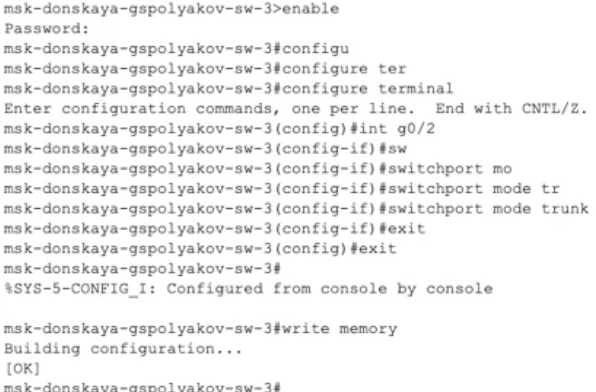{#fig:003 width=70%}

- соединение между коммутаторами msk-donskaya-sw-1 и msk-donskayasw-4 сделайте через интерфейсы Fa0/23, не забыв активировать их
в транковом режиме.

2. С оконечного устройства dk-donskaya-1 пропингуйте серверы mail и web. В режиме симуляции проследите движение пакетов ICMP. Убедитесь, что движение пакетов происходит через коммутатор msk-donskaya-sw-2.

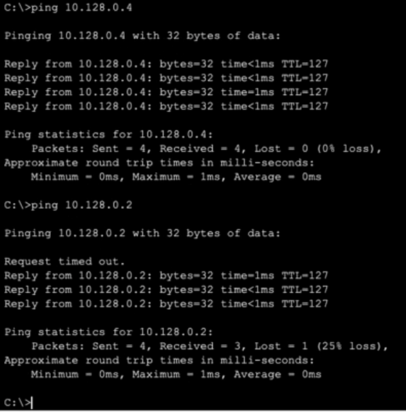{#fig:004 width=70%}
{#fig:005 width=70%}

3. На коммутаторе msk-donskaya-sw-2 посмотрите состояние протокола STP для vlan 3:

		msk−donskaya −sw −2#show spanning −tree vlan 3

В результате будет выведена примерно следующая информация, связанная с протоколом STP:

VLAN0003
	Spanning tree enabled protocol ieee
	Root ID 	Priority	 32771
				Address	 0001.9698.29B8
	This bridge is the root
				Hello Time 2 sec Max Age 20 sec   Forward Delay 15 sec
	Bridge ID Priority 32771 (priority 32768 sys-id-ext 3)
				Address 0001.9698.29B8
				Hello Time 2 sec Max Age 20 sec Forward Delay 15 sec
				Aging Time 20
Interface        Role Sts Cost 	   Prio.Nbr Type
---------------- ---- --- --------- -------- -----------------------
Fa0/1 				Desg FWD 	19 			128.1   P2p
Gi0/1				Desg FWD  4 			128.25  P2p
Fa0/2 				Desg FWD  19 			128.2   P2p
Gi0/2 				Desg FWD  4 			128.26  P2p

Здесь, в частности, указывается, что данное устройство является корневым
(строка This bridge is the root).

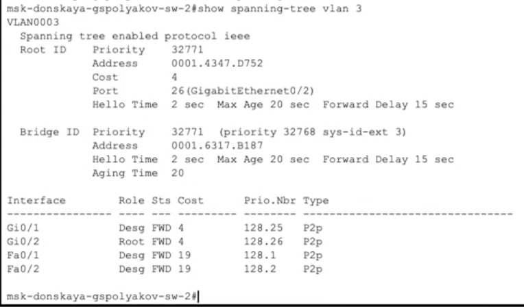{#fig:006 width=70%}

4. В качестве корневого коммутатора STP настройте коммутатор mskdonskaya-sw-1:

		msk−donskaya −sw −1#configure terminal
		msk−donskaya −sw −1(config)#spanning −tree vlan 3 root primary

{#fig:007 width=70%}

5. Используя режим симуляции, убедитесь, что пакеты ICMP пойдут от хоста dk-donskaya-1 до mail через коммутаторы msk-donskaya-sw-1 и mskdonskaya-sw-3, а от хоста dk-donskaya-1 до web через коммутаторы msk-donskaya-sw-1 и msk-donskaya-sw-2.

6. Настройте режим Portfast на тех интерфейсах коммутаторов, к которым подключены серверы:

		msk−donskaya −sw −2(config)#interface f0/1
		msk−donskaya −sw −2(config −if)#spanning −tree portfast
		msk−donskaya −sw −2(config)#interface f0/2
		msk−donskaya −sw −2(config −if)#spanning −tree portfast
		msk−donskaya −sw −3(config)#interface f0/1
		msk−donskaya −sw −3(config −if)#spanning −tree portfast
		msk−donskaya −sw −3(config)#interface f0/2
		msk−donskaya −sw −3(config −if)#spanning −tree portfast

{#fig:008 width=70%}
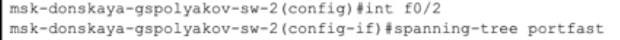{#fig:009 width=70%}
{#fig:010 width=70%}
{#fig:011 width=70%}

7. Изучите отказоустойчивость протокола STP и время восстановления соединения при переключении на резервное соединение. Для этого используйте команду ping -n 1000 mail.donskaya.rudn.ru на хосте dk-donskaya-1, а разрыв соединения обеспечьте переводом соответствующего интерфейса коммутатора в состояние shutdown.

{#fig:012 width=70%}

8. Переключите коммутаторы режим работы по протоколу Rapid PVST+:

		msk−donskaya −sw −1(config)#spanning −tree mode rapid −pvst
		msk−donskaya −sw −2(config)#spanning −tree mode rapid −pvst
		msk−donskaya −sw −3(config)#spanning −tree mode rapid −pvst
		msk−donskaya −sw −4(config)#spanning −tree mode rapid −pvst
		msk−pavlovskaya −sw −1(config)#spanning −tree mode rapid −pvst

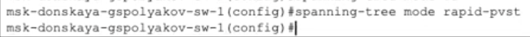{#fig:013 width=70%}
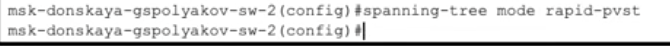{#fig:014 width=70%}
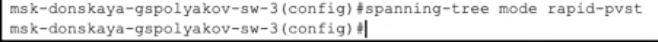{#fig:015 width=70%}
{#fig:016 width=70%}
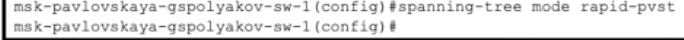{#fig:017 width=70%}

9. Изучите отказоустойчивость протокола Rapid PVST+ и время восстановления соединения при переключении на резервное соединение.
{#fig:018 width=70%}

10. Сформируйте агрегированное соединение интерфейсов Fa0/20 – Fa0/23 между коммутаторами msk-donskaya-sw-1 и msk-donskaya-sw-4.
{#fig:019 width=70%}
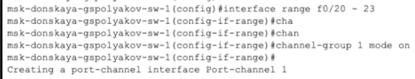{#fig:020 width=70%}
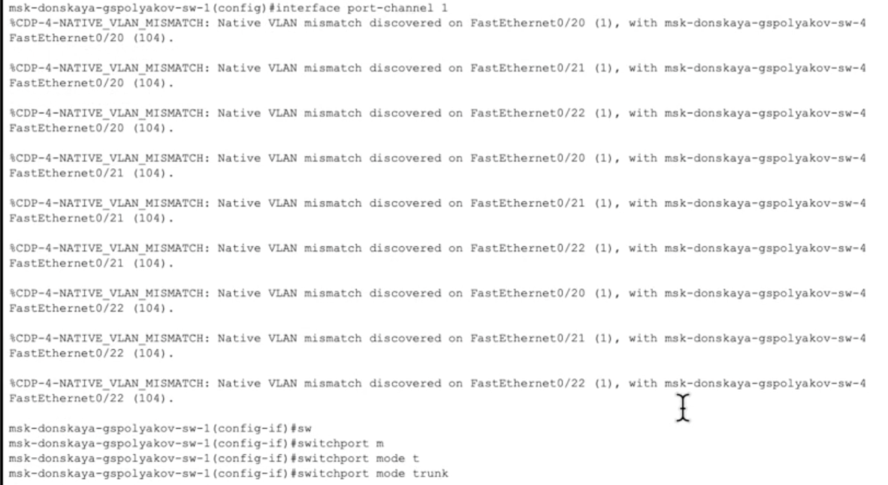{#fig:020 width=70%}

11. Настройте агрегирование каналов (режим EtherChannel):

		msk−donskaya−sw−1(config)#interface range f0/20 − 23
		msk−donskaya−sw−1(config −if−range)#channel −group 1 mode on
		msk−donskaya−sw−1(config −if−range)#exit
		msk−donskaya−sw−1(config)#interface port −channel 1
		msk−donskaya−sw−1(config −if)#switchport mode trunk
		msk−donskaya−sw−4(config)#int range f0/20 − 23
		msk−donskaya−sw−4(config −if−range)#no switchport access vlan 104
		msk−donskaya−sw−4(config −if−range)#exit
		msk−donskaya−sw−4(config)#interface range f0/20 − 23
		msk−donskaya−sw−4(config −if−range)#channel −group 1 mode on
		msk−donskaya−sw−4(config −if−range)#exit
		msk−donskaya−sw−4(config)#interface port −channel 1
		msk−donskaya−sw−4(config −if)#switchport mode trunk

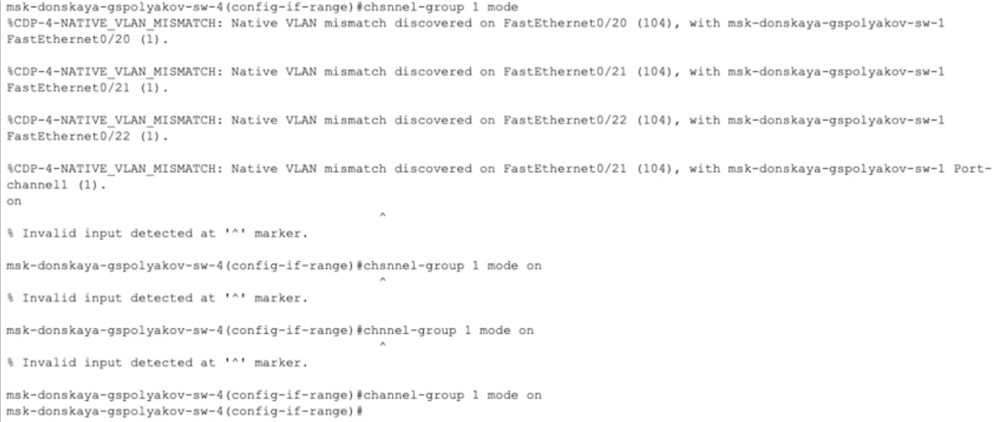{#fig:022 width=70%}
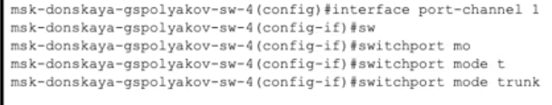{#fig:023 width=70%}

Здесь использована следующая терминология Cisco:

- EtherChannel — технология агрегирования каналов;
- port-channel — логический интерфейс, который объединяет физические интерфейсы;
- channel-group — команда, которая указывает, какому логическому интерфейсу принадлежит физический интерфейс и какой режим используется для агрегирования;
- возможные параметры channel-group:
- active — включить LACP;
- passive — включить LACP, только если придёт сообщение LACP;
- desirable — включить PAgP;
- auto — включить PAgP, только если придёт сообщение PAgP;
- on — включить только EtherChannel.

# Выводы

Изучил возможности протокола STP и его модификаций по обеспечению
отказоустойчивости сети, агрегированию интерфейсов и перераспределению
нагрузки между ними.

# Контрольные вопросы

1. Определение состояния протокола STP для VLAN

Для проверки состояния STP на корневом и не корневом коммутаторе можно использовать команду:

		show spanning-tree vlan <VLAN_ID>

Пример вывода на корневом коммутаторе:

VLAN0001
Spanning tree enabled protocol ieee
Root ID    Priority 32769
           Address  0011.2233.4455
           This bridge is the root
           Hello Time 2 sec  Max Age 20 sec  Forward Delay 15 sec
Bridge ID  Priority 32769  (priority 32768 sys-id-ext 1)
           Address 0011.2233.4455

Пример вывода на некорневом коммутаторе:

VLAN0001
Spanning tree enabled protocol ieee
Root ID    Priority 32769
           Address  0011.2233.4455
           Cost 4
           Port 1 (FastEthernet0/1) 
           Hello Time 2 sec  Max Age 20 sec  Forward Delay 15 sec
Bridge ID  Priority 32770  (priority 32768 sys-id-ext 2)
           Address 0011.2233.5566

Здесь видно, что корневой коммутатор указывается в поле “Root ID”, а на не-корневом указана стоимость пути до него.

2. Определение режима работы STP

Для проверки, в каком режиме работает устройство (STP, PVST+, Rapid PVST+), используется команда:

		show spanning-tree summary

Пример вывода:

		Switch is in rapid-pvst mode  
		Root bridge for: none
		EtherChannel misconfig guard is enabled
		BPDU guard is enabled
		BPDU filter is disabled

Если устройство работает в стандартном STP, вывод будет примерно таким:

		Switch is in ieee mode  

3. Настройка режима Portfast

PortFast используется для ускоренного перехода порта в состояние Forwarding, минуя стадии Listening и Learning. Применяется на портах, подключенных к конечным устройствам (например, ПК или серверам), чтобы уменьшить время ожидания.
Используется в случаях:

 * Для подключения конечных устройств, чтобы избежать задержки 30-50 секунд при подключении.
 * В виртуализированных средах, где требуется быстрое поднятие сетевых интерфейсов.
 * В Data Center при быстром подключении серверов.

Команда включения PortFast:

	interface FastEthernet0/1
		spanning-tree portfast

4. Принцип работы агрегированного интерфейса

Агрегированный интерфейс объединяет несколько физических каналов в один логический интерфейс для увеличения пропускной способности и отказоустойчивости.
Используется для:

 * Увеличения пропускной способности между устройствами.
 * Балансировки нагрузки между каналами.
 * Повышения отказоустойчивости, так как при выходе из строя одного линка трафик будет проходить через оставшиеся.

5. Отличия LACP, PAgP и статического агрегирования

Протокол Тип Описание Способы установления
LACP (Link Aggregation Control Protocol) Стандарт IEEE 802.3ad Динамическое объединение портов. Позволяет автоматически согласовывать каналы. Active, Passive
PAgP (Port Aggregation Protocol) Протокол Cisco Аналог LACP, но проприетарный. Автоматически согласует порты в EtherChannel. Auto, Desirable
Статическое объединение Без протокола Ручное объединение каналов без согласования. Необходимо вручную настраивать одинаковые параметры. -

Пример настройки LACP:

	interface range GigabitEthernet0/1 - 2
		channel-group 1 mode active

Пример настройки PAgP:

	interface range FastEthernet0/1 - 2
		channel-group 1 mode desirable

Пример статического агрегирования:

	interface range FastEthernet0/1 - 2
		channel-group 1 mode on

6. Проверка состояния агрегированного канала EtherChannel

Для проверки состояния EtherChannel можно использовать команды:

* Основная команда для просмотра состояния каналов:

		show etherchannel summary

Пример вывода:

Group  Port-channel  Protocol    Ports
------+-------------+----------+-------------------
1      Po1(SU)      LACP       Gi0/1(P) Gi0/2(P)

Расшифровка:

 • SU – Suspended (SU), означает, что канал активен.
 • P – Порт является частью канала.

* Просмотр детальной информации о конкретном агрегированном интерфейсе:

		show etherchannel port-channel

* Проверка состояния отдельных интерфейсов в агрегированном канале:

		show interfaces port-channel 1

Эти команды помогут определить, корректно ли работает EtherChannel и какие порты в него входят.

# Список литературы{.unnumbered}

::: {#refs}
:::
