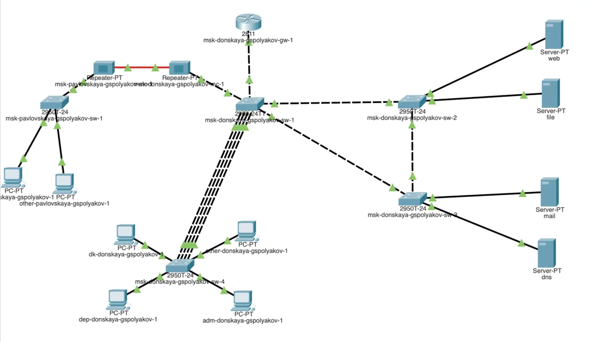
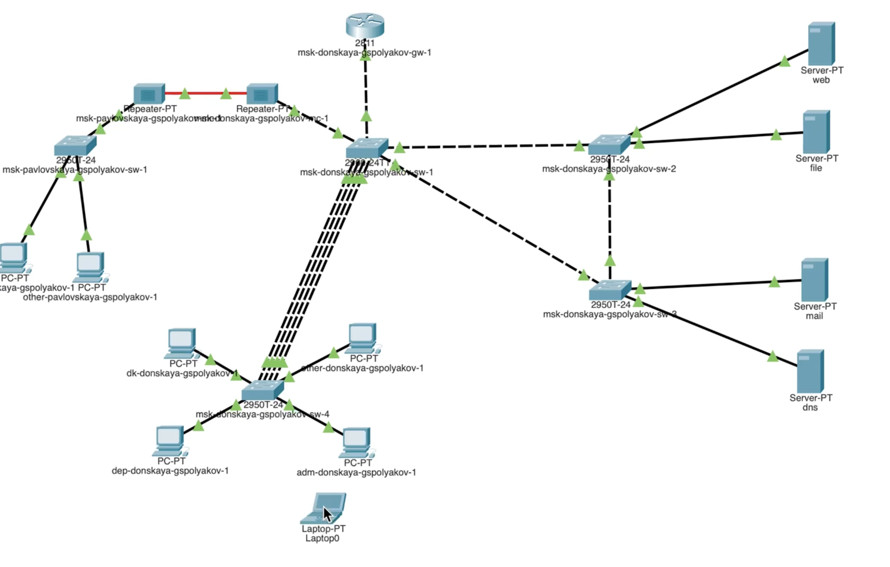
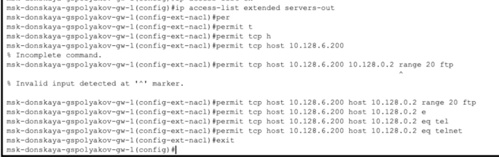
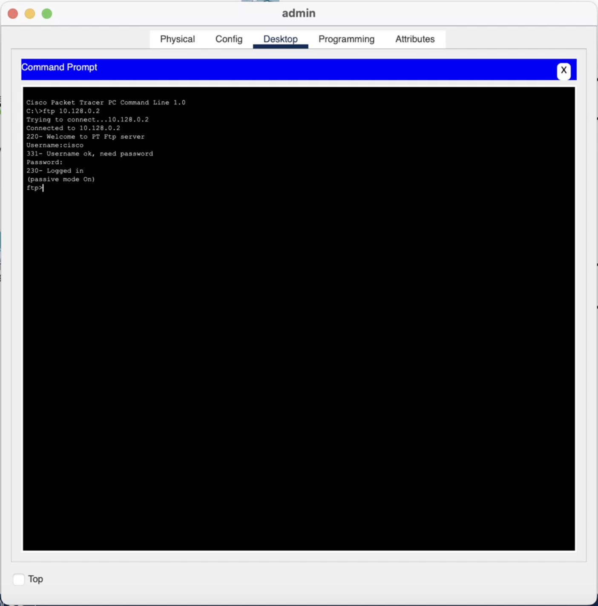
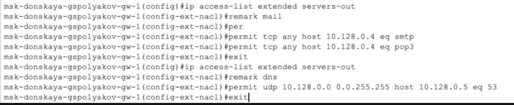
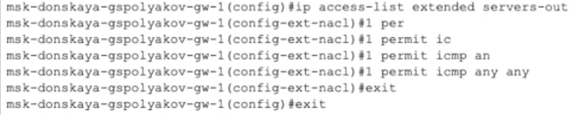
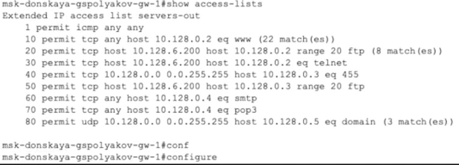
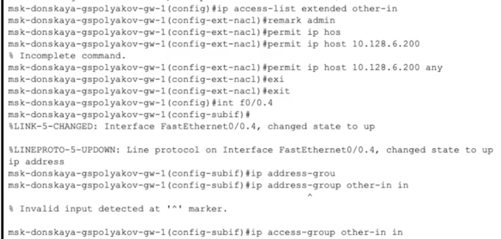

---
## Front matter
title: "Лабораторная работа №10"
subtitle: "Настройка списков управления доступом (ACL)"
author: "Поляков Глеб Сергеевич"

## Generic otions
lang: ru-RU
toc-title: "Содержание"

## Bibliography
bibliography: bib/cite.bib
csl: pandoc/csl/gost-r-7-0-5-2008-numeric.csl

## Pdf output format
toc: true # Table of contents
toc-depth: 2
lof: true # List of figures
lot: true # List of tables
fontsize: 12pt
linestretch: 1.5
papersize: a4
documentclass: scrreprt
## I18n polyglossia
polyglossia-lang:
  name: russian
  options:
	- spelling=modern
	- babelshorthands=true
polyglossia-otherlangs:
  name: english
## I18n babel
babel-lang: russian
babel-otherlangs: english
## Fonts
mainfont: IBM Plex Serif
romanfont: IBM Plex Serif
sansfont: IBM Plex Sans
monofont: IBM Plex Mono
mathfont: STIX Two Math
mainfontoptions: Ligatures=Common,Ligatures=TeX,Scale=0.94
romanfontoptions: Ligatures=Common,Ligatures=TeX,Scale=0.94
sansfontoptions: Ligatures=Common,Ligatures=TeX,Scale=MatchLowercase,Scale=0.94
monofontoptions: Scale=MatchLowercase,Scale=0.94,FakeStretch=0.9
mathfontoptions:
## Biblatex
biblatex: true
biblio-style: "gost-numeric"
biblatexoptions:
  - parentracker=true
  - backend=biber
  - hyperref=auto
  - language=auto
  - autolang=other*
  - citestyle=gost-numeric
## Pandoc-crossref LaTeX customization
figureTitle: "Рис."
tableTitle: "Таблица"
listingTitle: "Листинг"
lofTitle: "Список иллюстраций"
lotTitle: "Список таблиц"
lolTitle: "Листинги"
## Misc options
indent: true
header-includes:
  - \usepackage{indentfirst}
  - \usepackage{float} # keep figures where there are in the text
  - \floatplacement{figure}{H} # keep figures where there are in the text
---

# Цель работы

Освоить настройку прав доступа пользователей к ресурсам сети.

# Задание

1. Требуется настроить следующие правила доступа:
	
	1. web-сервер: разрешить доступ всем пользователям по протоколу HTTP через порт 80 протокола TCP, а для администратора открыть доступ по протоколам Telnet и FTP;
	2. файловый сервер: с внутренних адресов сети доступ открыт по портам для общедоступных каталогов, с внешних — доступ по протоколу FTP;
	3. почтовый сервер: разрешить пользователям работать по протоколам SMTP и POP3 (соответственно через порты 25 и 110 протокола TCP), а для администратора — открыть доступ по протоколам Telnet и FTP;
	4. DNS-сервер: открыть порт 53 протокола UDP для доступа из внутренней сети;
	5. разрешить icmp-сообщения, направленные в сеть серверов;
	6. запретить для сети Other любые запросы за пределы сети, за исключением администратора;
	7. разрешить доступ в сеть управления сетевым оборудованием только администратору сети.

2. Требуется проверить правильность действия установленных правил доступа.
3. Требуется выполнить задание для самостоятельной работы по настройке прав доступа администратора сети на Павловской.
4. При выполнении работы необходимо учитывать соглашение об именовании (см. раздел 2.5).

# Выполнение лабораторной работы

В рабочей области проекта подключите ноутбук администратора с именем admin к сети к other-donskaya-1 с тем, чтобы разрешить ему потом любые действия, связанные с управлением сетью. Для этого подсоедините ноутбук к порту 24 коммутатора msk-donskaya-sw-4 и присвойте ему статический адрес 10.128.6.200, указав в качестве gateway-адреса 10.128.6.1 и адреса
DNS-сервера 10.128.0.5 (рис. 10.1).
Права доступа пользователей сети (см. рис. 9.2) будем настраивать на маршрутизаторе msk-donskaya-gw-1, поскольку именно через него проходит весь трафик сети. Ограничения можно накладывать как на входящий (in), так и на исходящий (out) трафик. По отношению к маршрутизатору накладываемые ограничения будут касаться в основном исходящего трафика.
Различают стандартные (standard) и расширенные (extended) списки контроля доступа (Access Control List, ACL). Стандартные ACL проверяют только адрес источника трафика, расширенные — адрес как источника, так и получателя, тип протокола и TCP/UDP порты. Следует помнить, что на оборудовании Cisco правила в списке доступа проверяются по порядку сверху вниз до первого совпадения — как только одно из правил сработало, проверка списка правил прекращается и обработка трафика происходит на основе сработавшего правила. Поэтому рекомендуется сначала дать разрешение (permit) на какое-то действие, а уже потом накладывать ограничения (deny). Кроме того, после всех правил в конце дописывается неявное запрещение на всё, что не разрешено: deny ip any any (implicit deny).

{#fig:001 width=70%}
{#fig:002 width=70%}

1. Настройка доступа к web-серверу по порту tcp 80:

		msk−donskaya −gw −1#configure terminal
		msk−donskaya −gw −1(config)#ip access −list extended servers −out
		msk−donskaya −gw −1(config −ext−nacl)#remark web
		msk−donskaya −gw −1(config −ext−nacl)#permit tcp any host 10.128.0.2 eq 80

Здесь: создан список контроля доступа с названием servers-out (так как
предполагается ограничить доступ в конкретные подсети и по отношению к маршрутизатору это будет исходящий трафик); указано (в качестве комментария-напоминания remark web), что ограничения предназначены для работы с web-сервером; дано разрешение доступа (permit) по протоколу TCP всем (any) пользователям сети (host) на доступ к web-серверу, имеющему адрес 10.128.0.2, через порт 80. 

{#fig:003 width=70%}

2. Добавление списка управления доступом к интерфейсу:

		msk−donskaya −gw −1#configure terminal
		msk−donskaya −gw −1(config)#interface f0/0.3
		msk−donskaya −gw −1(config −subif)#ip access −group servers −out out

Здесь: к интерфейсу f0/0.3 подключается список прав доступа serversout и применяется к исходящему трафику (out).
Можно проверить, что доступ к web-серверу есть через протокол HTTP (введя в строке браузера хоста ip-адрес web-сервера). При этом команда ping будет демонстрировать недоступность web-сервера как по имени, так и по ip-адресу web-сервера.

{#fig:004 width=70%}

3. Дополнительный доступ для администратора по протоколам Telnet и FTP:

		msk−donskaya −gw −1#configure terminal
		msk−donskaya −gw −1(config)#ip access −list extended servers −out
		msk−donskaya −gw −1(config −ext−nacl)#permit tcp host 10.128.6.200 host 10.128.0.2 range 20 ftp
		msk−donskaya −gw −1(config −ext−nacl)#permit tcp host 10.128.6.200 host 10.128.0.2 eq telnet

Здесь: в список контроля доступа servers-out добавлено правило, разрешающее устройству администратора с ip-адресом 10.128.6.200 доступ на web-сервер (10.128.0.2) по протоколам FTP и telnet. Убедитесь, что с узла с ip-адресом 10.128.6.200 есть доступ по протоколу FTP. Для этого в командной строке устройства администратора введите ftp 10.128.0.2, а затем по запросу имя пользователя cisco и пароль cisco (рис. 10.2). Рис. 10.2. Проверка доступа к web-серверу по протоколу FTP с устройства администратора. Попробуйте провести аналогичную процедуру с другого устройства сети. Убедитесь, что доступ будет запрещён.

{#fig:005 width=70%}

4. Настройка доступа к файловому серверу:

		msk−donskaya −gw −1#configure terminal
		msk−donskaya −gw −1(config)#ip access −list extended servers −out
		msk−donskaya −gw −1(config −ext−nacl)#remark file
		msk−donskaya −gw −1(config −ext−nacl)#permit tcp 10.128.0.0 0.0.255.255 host 10.128.0.3 eq 445
		msk−donskaya −gw −1(config −ext−nacl)#permit tcp any host 10.128.0.3 range 20 ftp

Здесь: в списке контроля доступа servers-out указано (в качестве комментария-напоминания remark file), что следующие ограничения предназначены для работы с file-сервером; всем узлам внутренней сети (10.128.0.0) разрешён доступ по протоколу SMB (работает через порт 445 протокола TCP) к каталогам общего пользования; любым узлам разрешён доступ к file-серверу по протоколу FTP. Запись 0.0.255.255 — обратная маска (wildcard mask).

{#fig:006 width=70%}

5. Настройка доступа к почтовому серверу:

		msk−donskaya −gw −1#configure terminal
		msk−donskaya −gw −1(config)#ip access −list extended servers −out
		msk−donskaya −gw −1(config −ext−nacl)#remark mail
		msk−donskaya −gw −1(config −ext−nacl)#permit tcp any host 10.128.0.4 eq smtp
		msk−donskaya −gw −1(config −ext−nacl)#permit tcp any host 10.128.0.4 eq pop3

Здесь: в списке контроля доступа servers-out указано (в качестве комментария-напоминания remark mail), что следующие ограничения предназначены для работы с почтовым сервером; всем разрешён доступ к почтовому серверу по протоколам POP3 и SMTP.

{#fig:007 width=70%}

6. Настройка доступа к DNS-серверу:
		msk−donskaya −gw −1#configure terminal
		msk−donskaya −gw −1(config)#ip access −list extended servers −out
		msk−donskaya −gw −1(config −ext−nacl)#remark dns
		msk−donskaya −gw −1(config −ext−nacl)#permit udp 10.128.0.0 0.0.255.255 host 10.128.0.5 eq 53

Здесь: в списке контроля доступа servers-out указано (в качестве комментария-напоминания remark dns), что следующие ограничения предназначены для работы с DNS-сервером; всем узлам внутренней сети разрешён доступ к DNS-серверу через UDP-порт 53. Проверьте доступность web-сервера (через браузер) не только по ip-адресу, но и по имени.

{#fig:008 width=70%}

7. Разрешение icmp-запросов:

		msk−donskaya −gw −1#configure terminal
		msk−donskaya −gw −1(config)#ip access −list extended servers −out
		msk−donskaya −gw −1(config −ext−nacl)#1 permit icmp any any

Здесь демонстрируется явное управление порядком размещения правил — правило разрешения для icmp-запросов добавляется в начало списка контроля доступа. Номера строк правил в списке контроля доступа можно посмотреть с помощью команды

		msk−donskaya −gw −1#show access −lists

{#fig:009 width=70%}

8. Настройка доступа для сети Other (требуется наложить ограничение на исходящий из сети Other трафик, который по отношению к маршрутизатору msk-donskaya-gw-1 является входящим трафиком):

		msk−donskaya −gw −1#configure terminal
		msk−donskaya −gw −1(config)#ip access −list extended other −in
		msk−donskaya −gw −1(config −ext−nacl)#remark admin
		msk−donskaya −gw −1(config −ext−nacl)#permit ip host 10.128.6.200 any
		msk−donskaya −gw −1(config −ext−nacl)#exit
		msk−donskaya −gw −1(config −subif)#interface f0/0.104
		msk−donskaya −gw −1(config −subif)#ip access −group other −in in

Здесь: в списке контроля доступа other-in указано, что следующие правила относятся к администратору сети; даётся разрешение устройству с адресом 10.128.6.200 на любые действия (any); к интерфейсу f0/0.104 подключается список прав доступа other-in и применяется к входящему трафику (in).

{#fig:010 width=70%}

9. Настройка доступа администратора к сети сетевого оборудования:

		msk−donskaya −gw −1#configure terminal
		msk−donskaya −gw −1(config)#ip access −list extended management −out
		msk−donskaya −gw −1(config −ext−nacl)#remark admin
		msk−donskaya −gw −1(config −ext−nacl)#permit ip host 10.128.6.200 10.128.1.0 0.0.0.255
		msk−donskaya −gw −1(config −ext−nacl)#exit
		msk−donskaya −gw −1(config)#interface f0/0.2
		msk−donskaya −gw −1(config −subif)#ip access −group management −out out

Здесь: в списке контроля доступа management-out указано (в качестве комментария-напоминания remark admin), что устройству администратора с адресом 10.128.6.200 разрешён доступ к сети сетевого оборудования (10.128.1.0);  к интерфейсу f0/0.2 подключается список прав доступа management-out и применяется к исходящему трафику (out).

{#fig:011 width=70%}

## Самостоятельная работа
1. Проверьте корректность установленных правил доступа, попытавшись получить доступ по различным протоколам с разных устройств сети к подсети серверов и подсети сетевого оборудования.
2. Разрешите администратору из сети Other на Павловской действия, аналогичные действиям администратора сети Other на Донской.

# Выводы

Освоил настройку прав доступа пользователей к ресурсам сети.

##Контрольные вопросы:

1. Как задать действие правила для конкретного протокола?

Чтобы задать действие правила для конкретного протокола в списке контроля доступа (ACL), нужно указать протокол в строке правила. Например, в Cisco ACL используется следующий синтаксис:

	access-list 100 permit tcp any any

Здесь:
	•	100 — номер ACL,
	•	permit — действие (разрешить),
	•	tcp — протокол.

Вместо tcp можно указать udp, icmp или ip (для всех IP-протоколов).

2. Как задать действие правила сразу для нескольких портов?
access-list 100 permit tcp any any eq 80
access-list 100 permit tcp any any eq 443

Если нужно задать диапазон:

access-list 100 permit tcp any any range 1024 2048

Или использовать объектные группы:

	object-group service WEB-PORTS tcp
	  port-object eq 80
	  port-object eq 443

	access-list outside_access_in extended permit tcp any any object-group WEB-PORTS

3. Как узнать номер правила в списке прав доступа?

Номера правил указываются вручную при создании (номера ACL, например, 100, 101 и т. д. для расширенных ACL).
	•	Для нумерованных ACL: каждая строка добавляется последовательно, но точный “номер строки” не всегда выводится.
Можно использовать команды вроде:

	show access-lists
или

	show running-config
чтобы увидеть порядок правил.

4. Каким образом можно изменить порядок применения правил в списке контроля доступа?

Порядок имеет значение: правила проверяются сверху вниз. Чтобы изменить порядок:
	•	Для нумерованных ACL — удалить и создать заново (переписать список).
	•	Для именованных ACL — можно использовать команду no для удаления конкретного правила, а затем добавить новое в нужное место.
# Список литературы{.unnumbered}

::: {#refs}
:::
