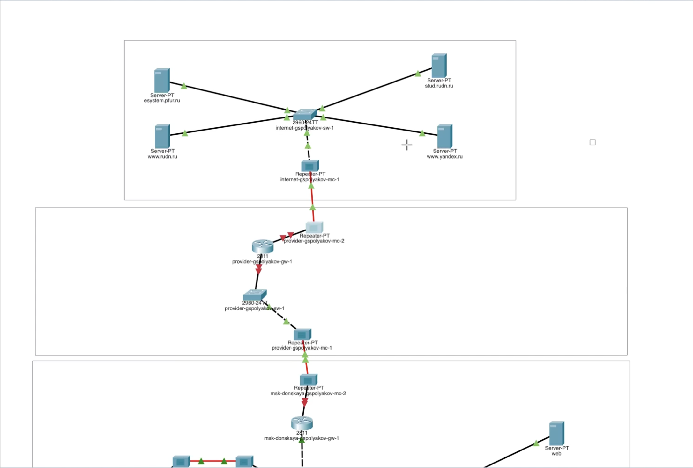

---
## Front matter
title: "Лабораторная работа №11"
subtitle: "Настройка NAT. Планирование"
author: "Поляков Глеб Сергеевич"

## Generic otions
lang: ru-RU
toc-title: "Содержание"

## Bibliography
bibliography: bib/cite.bib
csl: pandoc/csl/gost-r-7-0-5-2008-numeric.csl

## Pdf output format
toc: true # Table of contents
toc-depth: 2
lof: true # List of figures
lot: true # List of tables
fontsize: 12pt
linestretch: 1.5
papersize: a4
documentclass: scrreprt
## I18n polyglossia
polyglossia-lang:
  name: russian
  options:
	- spelling=modern
	- babelshorthands=true
polyglossia-otherlangs:
  name: english
## I18n babel
babel-lang: russian
babel-otherlangs: english
## Fonts
mainfont: IBM Plex Serif
romanfont: IBM Plex Serif
sansfont: IBM Plex Sans
monofont: IBM Plex Mono
mathfont: STIX Two Math
mainfontoptions: Ligatures=Common,Ligatures=TeX,Scale=0.94
romanfontoptions: Ligatures=Common,Ligatures=TeX,Scale=0.94
sansfontoptions: Ligatures=Common,Ligatures=TeX,Scale=MatchLowercase,Scale=0.94
monofontoptions: Scale=MatchLowercase,Scale=0.94,FakeStretch=0.9
mathfontoptions:
## Biblatex
biblatex: true
biblio-style: "gost-numeric"
biblatexoptions:
  - parentracker=true
  - backend=biber
  - hyperref=auto
  - language=auto
  - autolang=other*
  - citestyle=gost-numeric
## Pandoc-crossref LaTeX customization
figureTitle: "Рис."
tableTitle: "Таблица"
listingTitle: "Листинг"
lofTitle: "Список иллюстраций"
lotTitle: "Список таблиц"
lolTitle: "Листинги"
## Misc options
indent: true
header-includes:
  - \usepackage{indentfirst}
  - \usepackage{float} # keep figures where there are in the text
  - \floatplacement{figure}{H} # keep figures where there are in the text
---

# Цель работы

Провести подготовительные мероприятия по подключению локальной сети организации к Интернету.

# Задание

1. Построить схему подсоединения локальной сети к Интернету.
2. Построить модельные сети провайдера и сети Интернет (рис. 11.2).
3. Построить схемы сетей L1, L2, L3.
4. При выполнении работы необходимо учитывать соглашение об именовании

# Теоретическое введение

Network Address Translation (NAT) — механизм преобразования IP-адресов транзитных пакетов.
В частности, механизм NAT используется для обеспечения доступа устройств локальных сетей с внутренними IP-адресами к сети Интернет (рис. 11.1).

Типы NAT:

- статический NAT (Static NAT, SNAT) — осуществляет преобразование адресов по принципу 1:1 (в частности, один локальный IP-адрес преобразуется
во внешний адрес, выделенный, например, провайдером);

- динамический NAT (Dynamic NAT, DNAT) — осуществляет преобразование
адресов по принципу 1:N (например, один адрес устройства локальной сети
преобразуется в один из адресов диапазона внешних адресов);

- NAT Overload (или NAT Masquerading, или Port Address Translation, PAT) —
осуществляет преобразование адресов по принципу N:1 (например, адреса
группы устройств локальной подсети преобразуются в один внешний адрес,
при этом дополнительно используется механизм адресации через номера
портов).

# Выполнение лабораторной работы

1. Внесите изменения в схему L1 сети, добавив в неё сеть провайдера и сеть модельного Интернета с указанием названий оборудования и портов подключения.
{#fig:001 width=70%}
2. Внесите изменения в схемы L2 и L3 сети, указав адреса и VLAN сети провайдера и модельной сети Интернета. Скорректируйте таблицы распределения IP-адресов и портов.
3. На схеме предыдущего вашего проекта разместите согласно рис. 11.2 необходимое оборудование для сети провайдера и сети модельного Интернета:
	4 медиаконвертера (Repeater-PT), 2 коммутатора типа Cisco 2960-24TT, маршрутизатор типа Cisco 2811, 4 сервера.
	{#fig:002 width=70%}
4. Присвойте названия размещённым в сети провайдера и в сети модельного Интернета объектам согласно модельным предположениям и схеме L1.{#fig:003 width=70%}
5. В физической рабочей области добавьте здание провайдера и здание, имитирующее расположение серверов модельного Интернета (рис. 11.3).{#fig:004 width=70%}
Присвойте им соответствующие названия.
6. Перенесите из сети «Донская» оборудование провайдера (рис. 11.4) и модельной сети Интернета (рис. 11.5) в соответствующие здания.
7. На медиаконвертерах замените имеющиеся модули на PT-REPEATERNM-1FFE и PT-REPEATER-NM-1CFE для подключения витой пары по технологии Fast Ethernet и оптоволокна соответственно (рис. 11.6).
8. Проведите соединение объектов согласно скорректированной Вами схеме L1.
9. Пропишите IP-адреса серверам согласно табл. 11.1.
10. Пропишите сведения о серверах на DNS-сервере сети «Донская» (рис. 11.7).

# Выводы

Провел подготовительные мероприятия по подключению локальной сети организации к Интернету.

# Контрольные вопросы

1. Что такое Network Address Translation (NAT)?

Network Address Translation (NAT) — это технология, позволяющая преобразовывать IP-адреса пакетов, проходящих через маршрутизатор или брандмауэр. Основная цель NAT — обеспечить доступ устройств с частными (внутренними) IP-адресами к внешним сетям, таким как Интернет, с использованием одного или нескольких общедоступных IP-адресов.

NAT помогает экономить публичные IP-адреса и повышает безопасность, скрывая внутреннюю структуру сети от внешнего мира.

2. Как определить, находится ли узел сети за NAT?

Чтобы определить, находится ли устройство за NAT, можно выполнить следующие действия:
	
1.	Перейдите на сайт checkip.dyndns.org, чтобы узнать ваш публичный IP-адрес.
2.	Откройте командную строку и выполните команду tracert [ваш публичный IP] (в Windows) или traceroute [ваш публичный IP] (в Linux/Mac).
3.	Если в результате трассировки отображается более одного перехода (hop), это указывает на то, что вы находитесь за NAT.  
Также можно использовать специализированные инструменты, такие как AutoNAT в libp2p, для автоматического определения наличия NAT.  

3. Какое оборудование отвечает за преобразование адреса методом NAT?

Функции NAT обычно выполняются следующими устройствами:

*	Маршрутизаторы (роутеры)
*	Брандмауэры (файрволы)
*	Прокси-серверы
*	Балансировщики нагрузки (load balancers)
*	Интегрированные устройства доступа (IADs)  

Эти устройства могут быть как аппаратными, так и программными решениями, обеспечивая трансляцию адресов между внутренними и внешними сетями.  

4. В чём отличие статического, динамического и перегруженного NAT?
*	Статический NAT (Static NAT): Устанавливает постоянное соответствие между внутренним и внешним IP-адресом. Используется, когда необходимо обеспечить постоянный доступ к внутреннему устройству из внешней сети.
*	Динамический NAT (Dynamic NAT): Назначает внешний IP-адрес из заранее определённого пула при установлении соединения. После завершения сеанса соответствие удаляется.
*	Перегруженный NAT (NAT Overload или PAT): Позволяет множеству внутренних устройств использовать один внешний IP-адрес, различая соединения по номерам портов. Это наиболее распространённый тип NAT в домашних и офисных сетях.

5. Охарактеризуйте типы NAT.

Основные типы NAT включают:

*	Статический NAT: Постоянное соответствие между внутренним и внешним IP-адресом.
*	Динамический NAT: Временное соответствие, назначаемое из пула внешних IP-адресов.
*	PAT (Port Address Translation): Множественные внутренние адреса используют один внешний IP-адрес с различием по портам.
*	Source NAT (SNAT): Изменяет исходный IP-адрес пакета при выходе из сети.
*	Destination NAT (DNAT): Изменяет целевой IP-адрес пакета при входе в сеть.
*	U-Turn NAT: Позволяет внутренним пользователям обращаться к внутренним серверам через внешний IP-адрес.

Эти типы NAT используются в зависимости от конкретных требований сети и обеспечивают гибкость в управлении трафиком между внутренними и внешними сетями.

# Список литературы{.unnumbered}

::: {#refs}
:::
