---
## Front matter
lang: ru-RU
title: Лабораторная работа №12
subtitle: Настройка NAT
author:
  - Поляков Г. С.
institute:
  - Российский университет дружбы народов, Москва, Россия
date: 28 апркля 2025

## i18n babel
babel-lang: russian
babel-otherlangs: english

## Formatting pdf
toc: false
toc-title: Содержание
slide_level: 2
aspectratio: 169
section-titles: true
theme: metropolis
header-includes:
 - \metroset{progressbar=frametitle,sectionpage=progressbar,numbering=fraction}
---

# Информация

## Докладчик

:::::::::::::: {.columns align=center}
::: {.column width="70%"}

  * Поляков Глеб Сергеевич
  * студент
  * Российский университет дружбы народов

:::
::: {.column width="30%"}

:::
::::::::::::::

# Выполнение работы

## Настройка

## Настройка

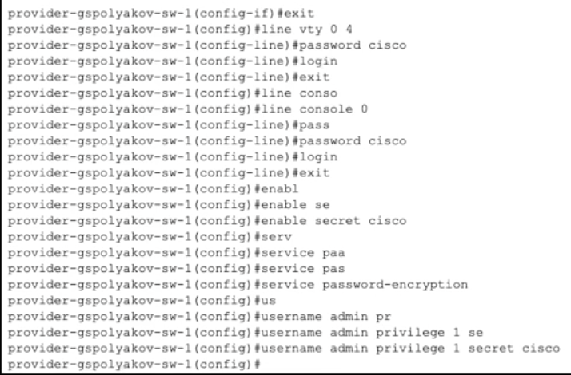

## Настройка

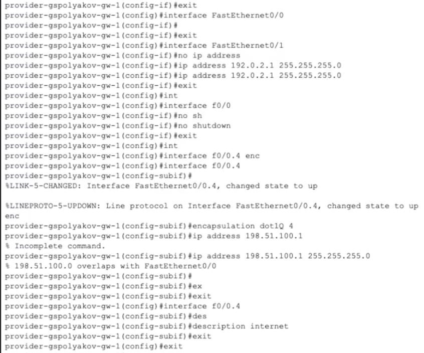

## Настройка

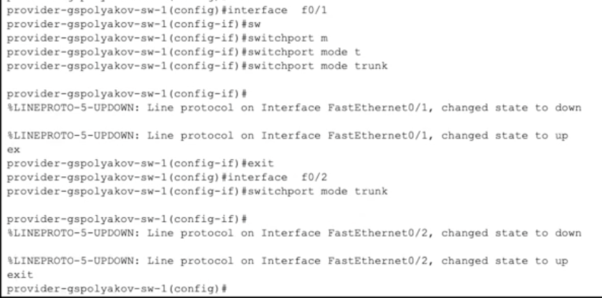

## Настройка

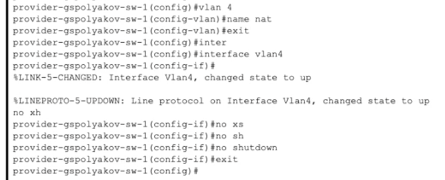

## Настройка

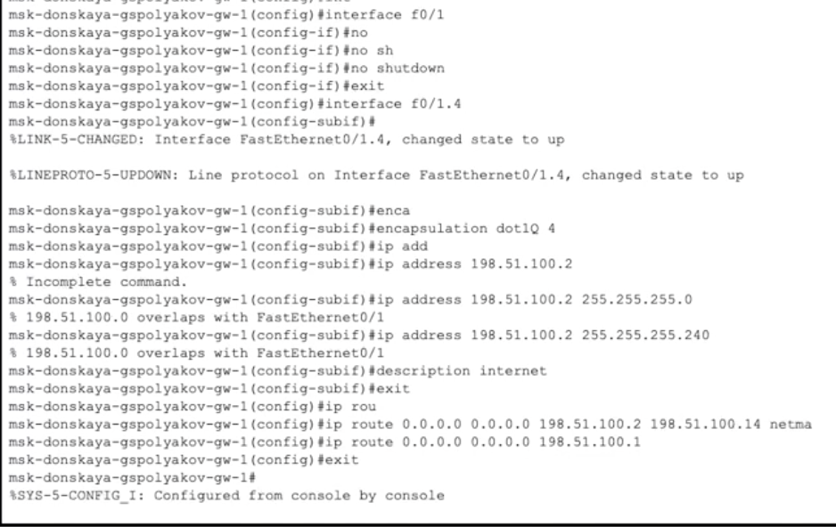

## Настройка

## Настройка

## Настройка

## Настройка

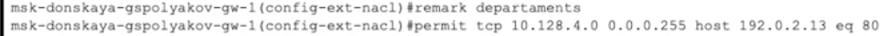

## Настройка

## Настройка

## Настройка

## Настройка

## Настройка

## Настройка

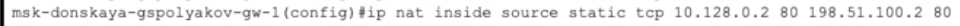

## Настройка

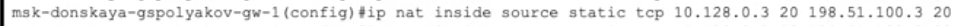

## Настройка

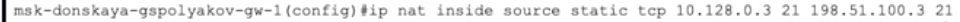

## Настройка

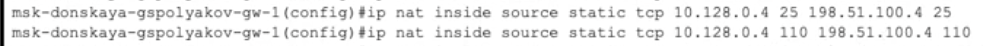

## Настройка

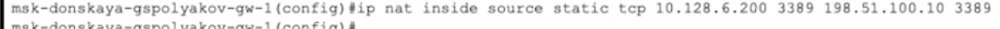
