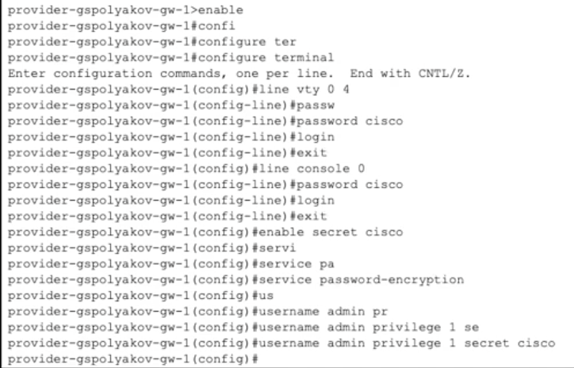
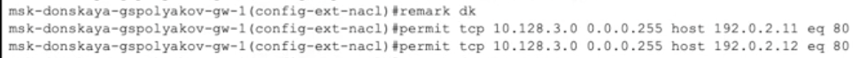
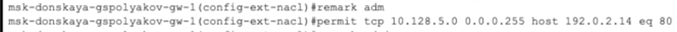
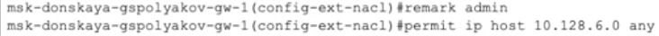
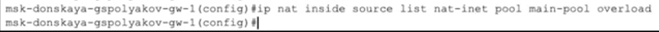
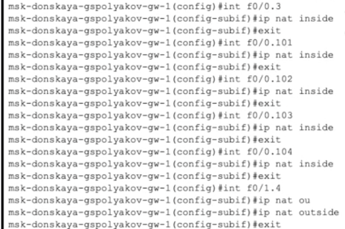

---
## Front matter
title: "Лабораторная работа № 12"
subtitle: "Настройка NAT"
author: "Поляков Глеб Сергеевич"

## Generic otions
lang: ru-RU
toc-title: "Содержание"

## Bibliography
bibliography: bib/cite.bib
csl: pandoc/csl/gost-r-7-0-5-2008-numeric.csl

## Pdf output format
toc: true # Table of contents
toc-depth: 2
lof: true # List of figures
lot: true # List of tables
fontsize: 12pt
linestretch: 1.5
papersize: a4
documentclass: scrreprt
## I18n polyglossia
polyglossia-lang:
  name: russian
  options:
	- spelling=modern
	- babelshorthands=true
polyglossia-otherlangs:
  name: english
## I18n babel
babel-lang: russian
babel-otherlangs: english
## Fonts
mainfont: IBM Plex Serif
romanfont: IBM Plex Serif
sansfont: IBM Plex Sans
monofont: IBM Plex Mono
mathfont: STIX Two Math
mainfontoptions: Ligatures=Common,Ligatures=TeX,Scale=0.94
romanfontoptions: Ligatures=Common,Ligatures=TeX,Scale=0.94
sansfontoptions: Ligatures=Common,Ligatures=TeX,Scale=MatchLowercase,Scale=0.94
monofontoptions: Scale=MatchLowercase,Scale=0.94,FakeStretch=0.9
mathfontoptions:
## Biblatex
biblatex: true
biblio-style: "gost-numeric"
biblatexoptions:
  - parentracker=true
  - backend=biber
  - hyperref=auto
  - language=auto
  - autolang=other*
  - citestyle=gost-numeric
## Pandoc-crossref LaTeX customization
figureTitle: "Рис."
tableTitle: "Таблица"
listingTitle: "Листинг"
lofTitle: "Список иллюстраций"
lotTitle: "Список таблиц"
lolTitle: "Листинги"
## Misc options
indent: true
header-includes:
  - \usepackage{indentfirst}
  - \usepackage{float} # keep figures where there are in the text
  - \floatplacement{figure}{H} # keep figures where there are in the text
---

# Цель работы

Приобретение практических навыков по настройке доступа локальной сети
к внешней сети посредством NAT.

# Задание

1. Сделать первоначальную настройку маршрутизатора provider-gw-1 и коммутатора provider-sw-1 провайдера: задать имя, настроить доступ по паролю и т.п. (см. разделы 12.4.1, 12.4.2).
2. Настроить интерфейсы маршрутизатора provider-gw-1 и коммутатора provider-sw-1 провайдера: (см. разделы 12.4.3, 12.4.4).
3. Настроить интерфейсы маршрутизатора сети «Донская» для доступа к сети провайдера (cм. раздел 12.4.5).
4. Настроить на маршрутизаторе сети «Донская» NAT с правилами, указанными в разделе 12.2 (см. разделы 12.4.6–12.4.8).
5. Настроить доступ из внешней сети в локальную сеть организации, как указано в разделе 12.2 (см. раздел 12.4.9).
6. Проверить работоспособность заданных настроек.
7. При выполнении работы необходимо учитывать соглашение об именовании (см. раздел 2.5).

# Выполнение лабораторной работы

12.4.1. Первоначальная настройка маршрутизатора

	provider-gw-1
	provider −gw−1>enable
	provider −gw −1#configure terminal
	provider −gw −1(config)#line vty 0 4
	provider −gw −1(config −line)#password cisco
	provider −gw −1(config −line)#login
	provider −gw −1(config −line)#exit
	provider −gw −1(config)#line console 0
	provider −gw −1(config −line)#password cisco
	provider −gw −1(config −line)#login
	provider −gw −1(config −line)#exit
	provider −gw −1(config)#enable secret cisco
	provider −gw −1(config)#service password −encryption
	provider −gw −1(config)#username admin privilege 1 secret cisco

{#fig:001 width=70%}

12.4.2. Первоначальная настройка коммутатора provider-sw-1

	provider −sw−1>enable
	provider −sw −1#configure terminal
	provider −sw −1(config)#line vty 0 4
	provider −sw −1(config −line)#password cisco
	provider −sw −1(config −line)#login
	provider −sw −1(config −line)#exit
	provider −sw −1(config)#line console 0
	provider −sw −1(config −line)#password cisco
	provider −sw −1(config −line)#login
	provider −sw −1(config −line)#exit
	provider −sw −1(config)#enable secret cisco
	provider −sw −1(config)#service password −encryption
	provider −sw −1(config)#username admin privilege 1 secret cisco

{#fig:002 width=70%}

12.4.3. Настройка интерфейсов маршрутизатора provider-gw-1

	provider −gw−1>enable
	provider −gw −1#configure terminal
	provider −gw −1(config)#interface f0/0
	provider −gw −1(config −if)#no shutdown
	provider −gw −1(config −if)#exit
	provider −gw −1(config)#interface f0/0.4
	provider −gw −1(config −subif)#encapsulation dot1Q 4
	provider −gw −1(config −subif)#ip address 198.51.100.1 255.255.255.240
	provider −gw −1(config −subif)#description mks−donskaya
	provider −gw −1(config −subif)#exit
	provider −gw −1(config)#interface f0/1
	provider −gw −1(config −if)#no shutdown
	provider −gw −1(config −if)#ip address 192.0.2.1 255.255.255.0
	provider −gw −1(config −if)#description internet
	provider −gw −1(config −if)#exit
	provider −gw −1(config)#exit

{#fig:003 width=70%}

12.4.4. Настройка интерфейсов коммутатора provider-sw-1

	provider −sw−1>enable
	provider −sw −1#configure terminal
	provider −sw −1(config)#interface f0/1
	provider −sw −1(config −if)#switchport mode trunk
	provider −sw −1(config −if)#exit
	provider −sw −1(config)#interface f0/2
	provider −sw −1(config −if)#switchport mode trunk
	provider −sw −1(config −if)#exit
	provider −sw −1(config)#vlan 4
	provider −sw −1(config −vlan)#name nat
	provider −sw −1(config −vlan)#exit
	provider −sw −1(config)#interface vlan4
	provider −sw −1(config −if)#no shutdown
	provider −sw −1(config −if)#exit

{#fig:004 width=70%}

В этой лабораторной работе можно использовать подключение маршрутизатора provider-gw-1 напрямую к медиаконвертеру provider-mc-1.

12.4.5. Настройка интерфейсов маршрутизатора

	msk-donskaya-gw-1
	msk−donskaya −gw−1>enable
	msk−donskaya −gw −1#configure terminal
	msk−donskaya −gw −1(config)#interface f0/1
	msk−donskaya −gw −1(config −if)#no shutdown
	msk−donskaya −gw −1(config −if)#exit
	msk−donskaya −gw −1(config)#interface f0/1.4
	msk−donskaya −gw −1(config −subif)#encapsulation dot1Q 4
	msk−donskaya −gw −1(config −subif)#ip address 198.51.100.2 255.255.255.240
	msk−donskaya −gw −1(config −subif)#description internet
	msk−donskaya −gw −1(config −subif)#exit
	msk−donskaya −gw −1(config)#exit
	msk−donskaya −gw−1>enable
	msk−donskaya −gw −1#configure terminal
	msk−donskaya −gw −1(config)#ip route 0.0.0.0 0.0.0.0 198.51.100.1
	msk−donskaya −gw −1(config)#exit

{#fig:005 width=70%}

12.4.6. Настройка пула адресов для NAT

	msk−donskaya −gw−1>enable
	msk−donskaya −gw −1#configure terminal
	msk−donskaya −gw −1(config)#ip nat pool main −pool 198.51.100.2 198.51.100.14 netmask 255.255.255.240

{#fig:006 width=70%}

12.4.7. Настройка списка доступа для NAT

	msk−donskaya −gw−1>enable
	msk−donskaya −gw −1#configure terminal
	msk−donskaya −gw −1(config)#ip access −list extended nat−inet

{#fig:007 width=70%}

12.4.7.1. Сеть дисплейных классов

Хосты из сети дисплейных классов имеют доступ только к сайтам, необходимым для учёбы (www.yandex.ru (192.0.2.11), stud.rudn.university (192.0.2.12)).

	msk−donskaya −gw −1(config −ext−nacl)#remark dk
	msk−donskaya −gw −1(config −ext−nacl)#permit tcp 10.128.3.0 0.0.0.255 host 192.0.2.11 eq 80
	msk−donskaya −gw −1(config −ext−nacl)#permit tcp 10.128.3.0 0.0.0.255 host 192.0.2.12 eq 80

{#fig:008 width=70%}

12.4.7.2. Сеть кафедр
Сеть кафедр работает только с образовательными сайтами (esystem.pfur.ru (192.0.2.13)).

	msk−donskaya −gw −1(config −ext−nacl)#remark departments
	msk−donskaya −gw −1(config −ext−nacl)#permit tcp 10.128.4.0 0.0.0.255 host 192.0.2.13 eq 80

{#fig:009 width=70%}

12.4.7.3. Сеть администрации

Сеть администрации имеет возможность работать только с сайтом университета (www.rudn.ru (192.0.2.14)).

	msk−donskaya −gw −1(config −ext−nacl)#remark adm
	msk−donskaya −gw −1(config −ext−nacl)#permit tcp 10.128.5.0 0.0.0.255 host 192.0.2.14 eq 80

{#fig:010 width=70%}

12.4.7.4. Доступ для компьютера администратора

В сети для других пользователей компьютер администратора имеет полный доступ в Интернет. Другие не имеют доступа.

	msk−donskaya −gw −1(config −ext−nacl)#remark admin
	msk−donskaya −gw −1(config −ext−nacl)#permit ip host 10.128.6.200 any

{#fig:011 width=70%}

12.4.8. Настройка NAT
Настроить Port Address Translation (PAT)1:

	msk−donskaya −gw−1>enable
	msk−donskaya −gw −1#configure terminal
	msk−donskaya −gw −1(config)#ip nat inside source list nat−inet pool main −pool overload

{#fig:012 width=70%}

Настройка интерфейсов для NAT:
Другие названия: NAT Overload, IP Masquerading, Many-to-One NAT, Network Address Port Translation (NAPT).

	msk−donskaya −gw −1(config)#int f0/0.3
	msk−donskaya −gw −1(config −subif)#ip nat inside
	msk−donskaya −gw −1(config)#interface f0/0.101
	msk−donskaya −gw −1(config −subif)#ip nat inside
	msk−donskaya −gw −1(config −subif)#exit
	msk−donskaya −gw −1(config)#interface f0/0.102
	msk−donskaya −gw −1(config −subif)#ip nat inside
	msk−donskaya −gw −1(config −subif)#exit
	msk−donskaya −gw −1(config)#interface f0/0.103
	msk−donskaya −gw −1(config −subif)#ip nat inside
	msk−donskaya −gw −1(config −subif)#exit
	msk−donskaya −gw −1(config)#interface f0/0.104
	msk−donskaya −gw −1(config −subif)#ip nat inside
	msk−donskaya −gw −1(config −subif)#exit
	msk−donskaya −gw −1(config)#interface f0/1.4
	msk−donskaya −gw −1(config −subif)#ip nat outside
	msk−donskaya −gw −1(config −subif)#exit

{#fig:013 width=70%}

12.4.9. Настройка доступа из Интернета

12.4.9.1. WWW-сервер
	
	msk−donskaya −gw −1(config)#ip nat inside source static tcp 10.128.0.2 80 198.51.100.2 80

{#fig:014 width=70%}

12.4.9.2. Файловый сервер
	
	msk−donskaya −gw −1(config)#ip nat inside source static tcp 10.128.0.3 20 198.51.100.3 20
	msk−donskaya −gw −1(config)#ip nat inside source static tcp 10.128.0.3 21 198.51.100.3 21

{#fig:015 width=70%}

12.4.9.3. Почтовый сервер

	msk−donskaya −gw −1(config)#ip nat inside source static tcp 10.128.0.4 25 198.51.100.4 25
	msk−donskaya −gw −1(config)#ip nat inside source static tcp 10.128.0.4 110 198.51.100.4 110

{#fig:016 width=70%}

12.4.9.4. Доступ по RDP
Компьютер администратора доступен из Интернета по RDP.

	msk−donskaya −gw −1(config)#ip nat inside source static tcp 10.128.6.200 3389 198.51.100.10 3389

{#fig:017 width=70%}

# Выводы

Приобрел практические навыки по настройке доступа локальной сети к внешней сети посредством NAT.

# Контрольные вопросы

1. В чём состоит основной принцип работы NAT (что даёт наличие NAT в сети организации)?

Принцип работы NAT (Network Address Translation) — это преобразование частных (локальных) IP-адресов внутренних устройств в публичные IP-адреса при выходе во внешнюю сеть (например, в Интернет) и наоборот.
Что даёт наличие NAT:

*	Экономию публичных IP-адресов: множество устройств могут использовать один или несколько общих внешних IP-адресов.
*	Скрытие внутренней сети от внешнего мира, что повышает безопасность.
*	Гибкость в управлении внутренними адресами без влияния на внешние подключения.

2. В чём состоит принцип настройки NAT (на каком оборудовании и что нужно настроить для выхода из локальной сети во внешнюю сеть через NAT)?

Принцип настройки:

*	NAT настраивается на пограничном маршрутизаторе (например, Cisco Router), который соединяет внутреннюю сеть и внешнюю (обычно Интернет).

Нужно определить:

*	Какие интерфейсы являются “внутренними” (ip nat inside) и “внешними” (ip nat outside).
*	Каким образом будут преобразовываться адреса: статически, динамически или через PAT (Port Address Translation, когда все используют один внешний IP, но разные порты).

*	Основные шаги настройки:
	1.	Назначить роли интерфейсов (inside/outside).
	2.	Создать правила сопоставления локальных адресов с внешними (пулы IP, статические сопоставления или PAT).
	3.	Включить преобразование трафика на маршрутизаторе.

3. Можно ли применить Cisco IOS NAT к субинтерфейсам?

Да, можно.
В Cisco IOS NAT может применяться к субинтерфейсам (например, GigabitEthernet0/0.10, GigabitEthernet0/0.20).
На субинтерфейсе так же, как и на обычном интерфейсе, можно настроить ip nat inside или ip nat outside.
Это особенно полезно при работе с VLAN’ами на одном физическом интерфейсе.

4. Что такое пулы IP NAT?

Пул IP-адресов NAT — это набор (диапазон) публичных IP-адресов, из которого маршрутизатор выбирает адрес для трансляции внутренних адресов при выходе во внешнюю сеть.
Пулы используются в динамическом NAT.

Пример:

	ip nat pool MYPOOL 203.0.113.10 203.0.113.20 netmask 255.255.255.0

Здесь настроен пул из IP-адресов от 203.0.113.10 до 203.0.113.20.

5. Что такое статические преобразования NAT?

Статическое преобразование NAT — это ручное сопоставление одного внутреннего IP-адреса с одним внешним IP-адресом.
Такой NAT всегда сохраняет одно и то же соответствие: один внутренний адрес ↔ один внешний адрес.

Когда используется:
	
*	Для серверов, которые должны быть постоянно доступны извне (например, веб-серверы, почтовые серверы).

Пример настройки статического NAT на Cisco:

	ip nat inside source static 192.168.1.10 203.0.113.10
(трафик для 203.0.113.10 будет направляться к внутреннему 192.168.1.10)

# Список литературы{.unnumbered}

::: {#refs}
:::
