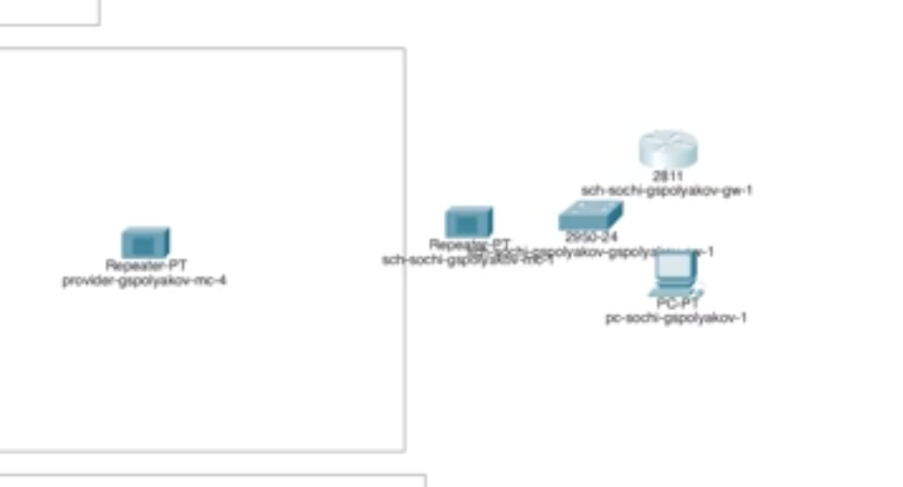
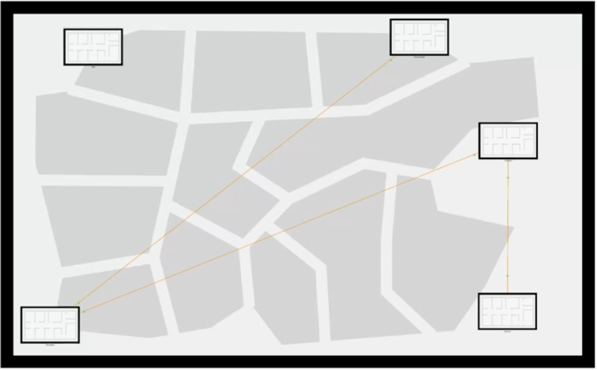
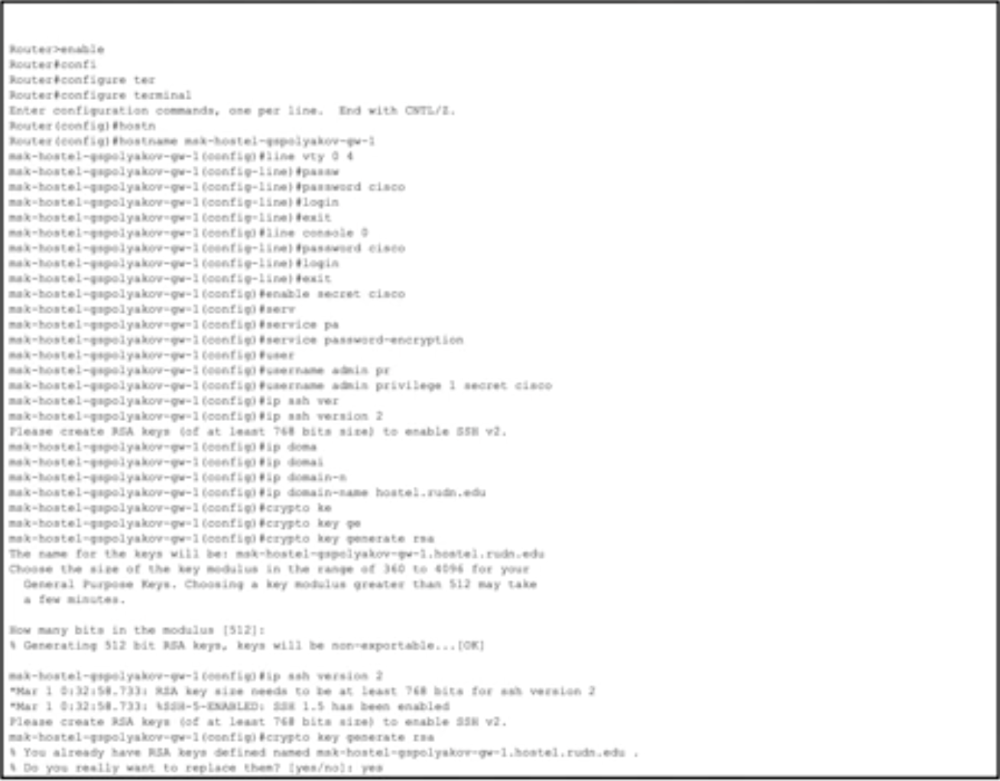

---
## Front matter
title: "Лабораторная работа №13"
subtitle: "Статическая маршрутизация в Интернете. Планирование"
author: "Поляков Глеб Сергеевич"

## Generic otions
lang: ru-RU
toc-title: "Содержание"

## Bibliography
bibliography: bib/cite.bib
csl: pandoc/csl/gost-r-7-0-5-2008-numeric.csl

## Pdf output format
toc: true # Table of contents
toc-depth: 2
lof: true # List of figures
lot: true # List of tables
fontsize: 12pt
linestretch: 1.5
papersize: a4
documentclass: scrreprt
## I18n polyglossia
polyglossia-lang:
  name: russian
  options:
	- spelling=modern
	- babelshorthands=true
polyglossia-otherlangs:
  name: english
## I18n babel
babel-lang: russian
babel-otherlangs: english
## Fonts
mainfont: IBM Plex Serif
romanfont: IBM Plex Serif
sansfont: IBM Plex Sans
monofont: IBM Plex Mono
mathfont: STIX Two Math
mainfontoptions: Ligatures=Common,Ligatures=TeX,Scale=0.94
romanfontoptions: Ligatures=Common,Ligatures=TeX,Scale=0.94
sansfontoptions: Ligatures=Common,Ligatures=TeX,Scale=MatchLowercase,Scale=0.94
monofontoptions: Scale=MatchLowercase,Scale=0.94,FakeStretch=0.9
mathfontoptions:
## Biblatex
biblatex: true
biblio-style: "gost-numeric"
biblatexoptions:
  - parentracker=true
  - backend=biber
  - hyperref=auto
  - language=auto
  - autolang=other*
  - citestyle=gost-numeric
## Pandoc-crossref LaTeX customization
figureTitle: "Рис."
tableTitle: "Таблица"
listingTitle: "Листинг"
lofTitle: "Список иллюстраций"
lotTitle: "Список таблиц"
lolTitle: "Листинги"
## Misc options
indent: true
header-includes:
  - \usepackage{indentfirst}
  - \usepackage{float} # keep figures where there are in the text
  - \floatplacement{figure}{H} # keep figures where there are in the text
---

# Цель работы

Провести подготовительные мероприятия по организации взаимодействия через сеть провайдера посредством статической маршрутизации локальной сети с сетью основного здания, расположенного в 42-м квартале в Москве, и сетью филиала, расположенного в г. Сочи.

# Задание

1. Внести изменения в схемы L1, L2 и L3 сети, добавив в них информацию о сети основной территории (42-й квартал в Москве) и сети филиала в г. Сочи.
2. Дополнить схему проекта, добавив подсеть основной территории организации 42-го квартала в Москве и подсеть филиала в г. Сочи.
3. Сделать первоначальную настройку добавленного в проект оборудования.
4. При выполнении работы необходимо учитывать соглашение об именовании.

# Выполнение лабораторной работы

### 13.4.1. Изменение схемы сети
1. Внесите изменения в схемы L1, L2 и L3 сети.
2. На схеме предыдущего вашего проекта разместите согласно рис. 13.2 необходимое оборудование: 4 медиаконвертера (Repeater-PT), 2 маршрутизатора типа Cisco 2811, 1 маршрутизирующий коммутатор типа Cisco 3560-24PS, 2 коммутатора типа Cisco 2950-24, коммутатор Cisco 2950-24T, 3 оконечных устройства типа PC-PT.
{#fig:001 width=70%}
3. Присвойте названия размещённым согласно рис. 13.2 объектам.
{#fig:002 width=70%}
4. На медиаконвертерах замените имеющиеся модули на PT-REPEATERNM-1FFE и PT-REPEATER-NM-1CFE для подключения витой пары по технологии Fast Ethernet и оптоволокна соответственно (рис. 13.3).
{#fig:003 width=70%}
5. На маршрутизаторе msk-q42-gw-1 добавьте дополнительный интерфейс NM-2FE2W (рис. 13.4).
6. В физической рабочей области Packet Tracer добавьте в г. Москва здание 42-го квартала (рис. 13.5), присвойте ему соответствующее название.
{#fig:004 width=70%}
7. В физической рабочей области Packet Tracer добавьте город Сочи (рис. 13.6) и в нём здание филиала, присвойте ему соответствующее название.
{#fig:005 width=70%}
8. Перенесите из сети «Донская» оборудование сети 42-го квартала и сети филиала в соответствующие здания (рис. 13.7, 13.8).
9. Проведите соединение объектов согласно скорректированной вами схеме L1.

## 13.4.2. Схема подключения подсети 42-го квартала
### 13.4.2.1. Первоначальная настройка маршрутизатора msk-q42-gw-1
msk−q42−gw −1(config −line)#transport input ssh
{#fig:006 width=70%}
### 13.4.2.2. Первоначальная настройка коммутатора msk-q42-sw-1
msk−q42−sw −1(config −line)#transport input ssh
{#fig:007 width=70%}
### 13.4.2.3. Первоначальная настройка маршрутизирующего коммутатора msk-hostel-gw-1
msk−hostel −gw −1(config −line)#transport input ssh
{#fig:008 width=70%}
### 13.4.2.4. Первоначальная настройка коммутатора msk-hostel-sw-1
msk−hostel −gw −1(config −line)#transport input ssh
{#fig:009 width=70%}
## 13.4.3. Схема подключения подсети филиала в г. Сочи
### 13.4.3.1. Первоначальная настройка коммутатора sch-sochi-sw-1
msk−sochi −sw −1(config −line)#transport input ssh
{#fig:010 width=70%}
### 13.4.3.2. Первоначальная настройка маршрутизатора sch-sochi-gw-1
msk−sochi −gw −1(config −line)#transport input ssh

{#fig:011 width=70%}

# Выводы

Провел подготовительные мероприятия по организации взаимодействия через сеть провайдера посредством статической маршрутизации локальной сети с сетью основного здания, расположенного в 42-м квартале в Москве, и сетью филиала, расположенного в г. Сочи.

# Контрольные вопросы

1. В каких случаях следует использовать статическую маршрутизацию? Приведите примеры.

Статическая маршрутизация используется в следующих случаях:

*	Малые сети, где количество маршрутов невелико, и их изменение происходит редко.
Пример: Офисная сеть с двумя-тремя сегментами.
*	Сети с высокой степенью безопасности, где важно точно контролировать маршруты и избежать автоматического изменения таблиц маршрутизации.
Пример: Сеть в военном или банковском учреждении.
*	Подключение к интернету через один шлюз, когда нет необходимости использовать динамическую маршрутизацию.
Пример: Домашняя или небольшая корпоративная сеть с одним маршрутом “по умолчанию”.
*	Резервное решение или временная настройка, например, для устранения проблем в динамической маршрутизации.
Пример: Временный маршрут для обхода неисправного участка сети.

2. Укажите основные принципы статической маршрутизации между VLANs.

Основные принципы статической маршрутизации между VLANs:

*	Использование маршрутизатора (Router-on-a-Stick) или трёхуровневого коммутатора (Layer 3 switch) для обработки трафика между VLAN.
*	Назначение IP-адресов интерфейсам SVI (Switch Virtual Interface) или субинтерфейсам маршрутизатора — по одному IP на каждую VLAN.
*	Настройка маршрутов вручную на маршрутизаторе или коммутаторе 3 уровня, если трафик должен передаваться в другие сети.
*	Обеспечение доступа между VLAN через правила ACL (Access Control List), если требуется ограничение доступа.
*	Подключение всех VLAN к маршрутизатору через trunk-порт, если используется Router-on-a-Stick.

Пример:
	
	VLAN 10 — 192.168.10.0/24
	VLAN 20 — 192.168.20.0/24
На маршрутизаторе создаются субинтерфейсы:
	
	Gig0/0.10 — IP 192.168.10.1 (VLAN 10)
	Gig0/0.20 — IP 192.168.20.1 (VLAN 20)

# Список литературы{.unnumbered}

::: {#refs}
:::
