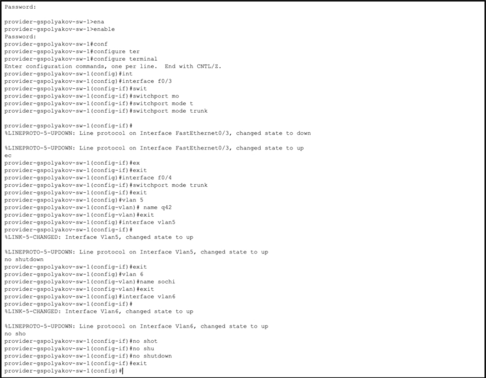
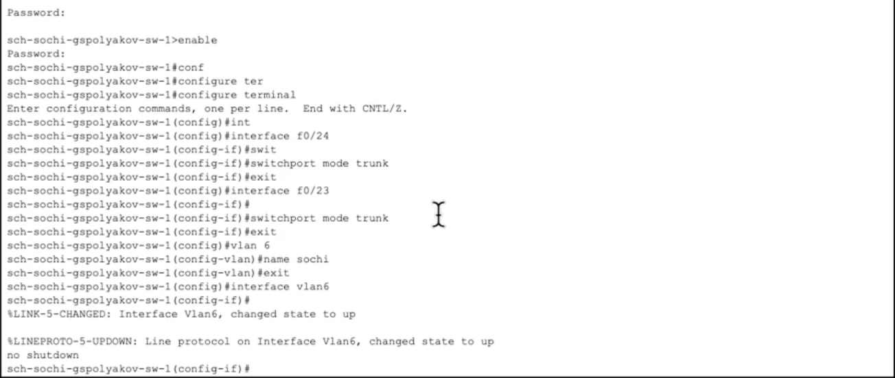
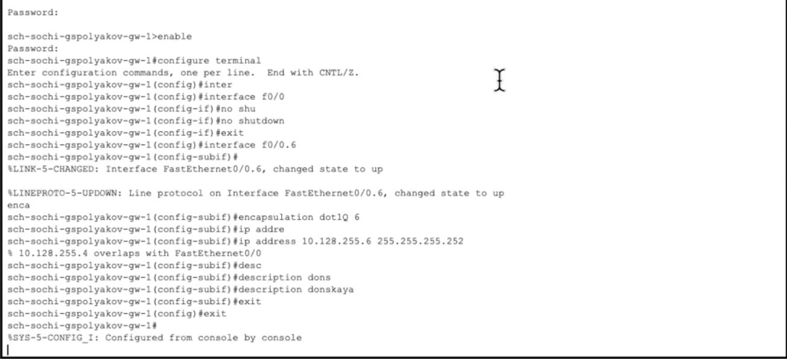
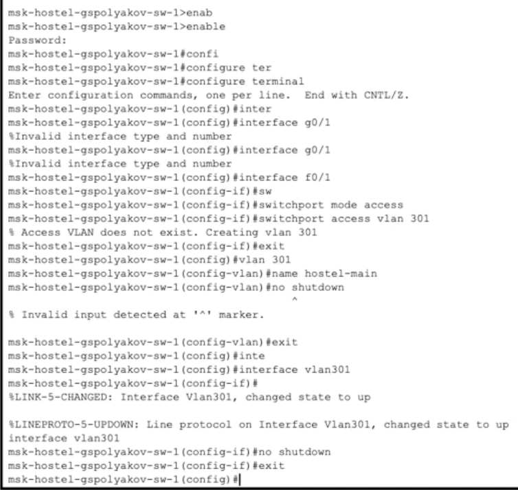
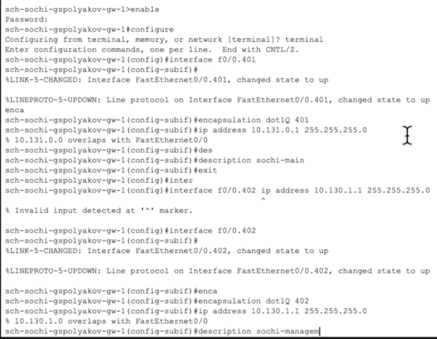
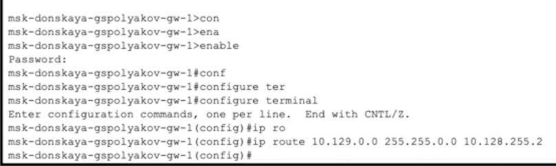
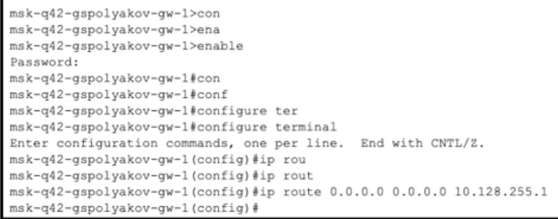
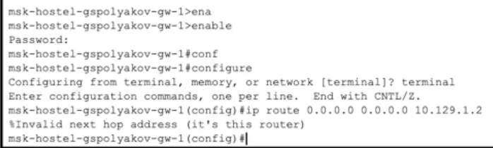
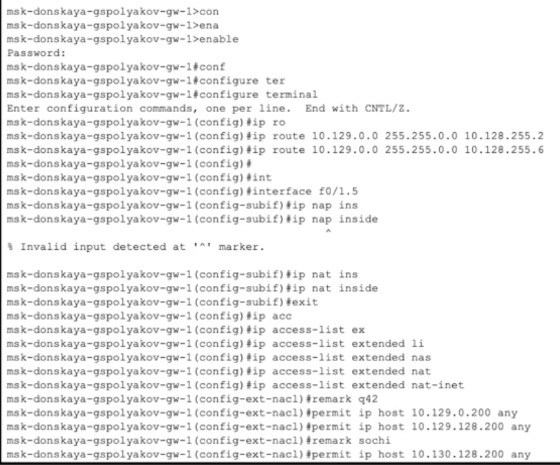

---
## Front matter
lang: ru-RU
title: Лабораторная работа № 14
subtitle: Статическая маршрутизация в Интернете. Настройка
author:
  - Поляков Глеб Сергеевич
institute:
  - Российский университет дружбы народов, Москва, Россия
date: 17 мая 2025

## i18n babel
babel-lang: russian
babel-otherlangs: english

## Formatting pdf
toc: false
toc-title: Содержание
slide_level: 2
aspectratio: 169
section-titles: true
theme: metropolis
header-includes:
 - \metroset{progressbar=frametitle,sectionpage=progressbar,numbering=fraction}
---

# Информация

## Докладчик

:::::::::::::: {.columns align=center}
::: {.column width="70%"}

  * Поляков Глеб Сергеевич
  * студент
  * Российский университет дружбы народов

:::
::: {.column width="30%"}

:::
:::::::::
# Последовательность выполнения работы

# Настройка линка между площадками
## Настройка интерфейсов коммутатора provider-sw-1

## Настройка интерфейсов маршрутизатора msk-donskaya-gw-1

## Настройка интерфейсов маршрутизатора msk-q42-gw-1

## Настройка интерфейсов коммутатора sch-sochi-sw-1

## Настройка интерфейсов маршрутизатора sch-sochi-gw-1

# Настройка площадки 42-го квартала
## Настройка интерфейсов маршрутизатора msk-q42-gw-1

## Настройка интерфейсов коммутатора msk-q42-sw-1

## Настройка интерфейсов маршрутизирующего коммутатора

## Настройка интерфейсов коммутатора msk-hostel-sw-1

# Настройка площадки в Сочи
## Настройка интерфейсов маршрутизатора sch-sochi-gw-1

## Настройка интерфейсов коммутатора sch-sochi-sw-1

## Настройка маршрутизации между площадками

## Настройка маршрутизатора msk-donskaya-gw-1

## Настройка маршрутизатора msk-q42-gw-1

## Настройка маршрутизатора sch-sochi-gw-1

# Настройка маршрутизации на 42 квартале
## Настройка маршрутизатора msk-q42-gw-1

## Настройка интерфейсов маршрутизирующего коммутатора

# Настройка NAT на маршрутизаторе msk-donskaya-gw-1
## Настройка NAT на маршрутизаторе msk-donskaya-gw-1

