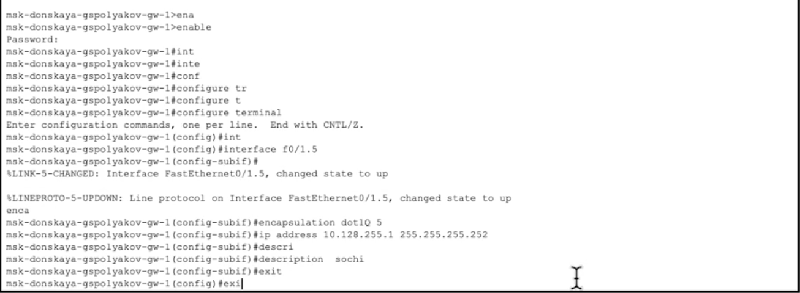
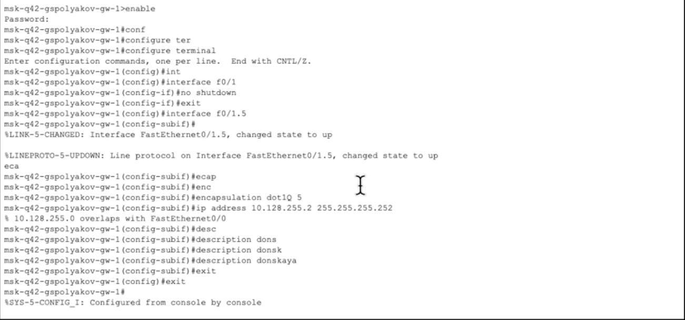
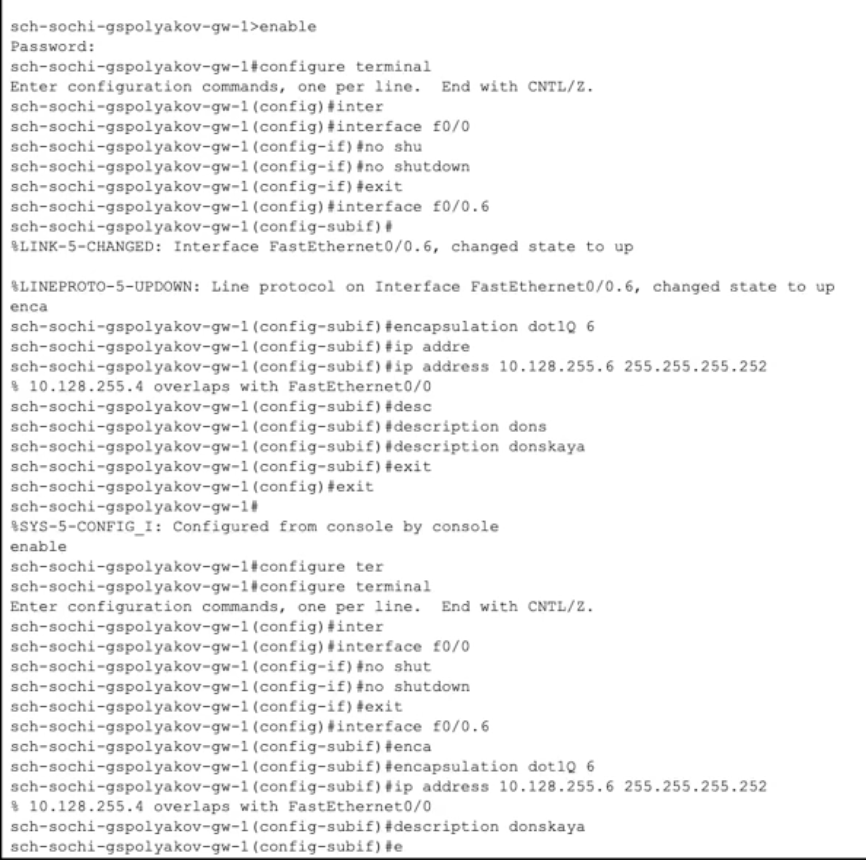
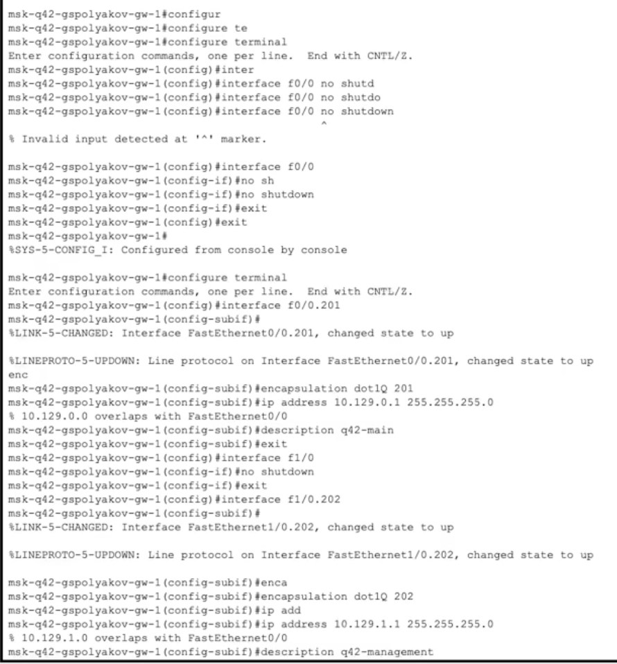
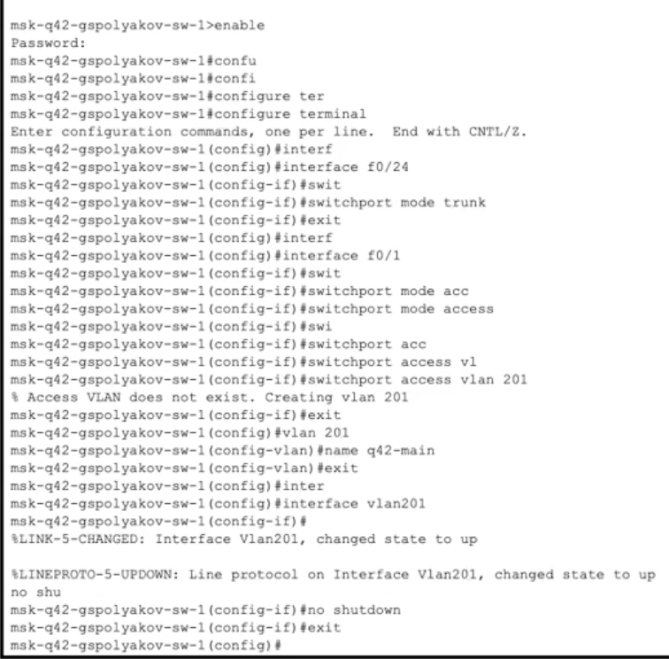
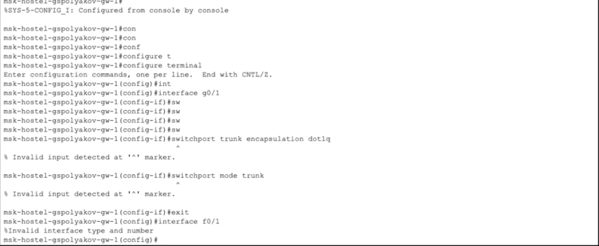
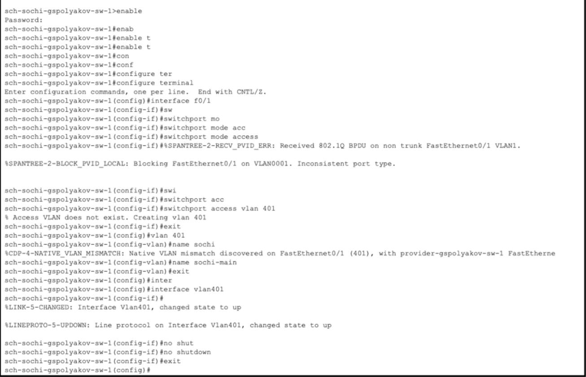
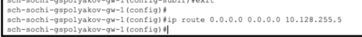

---
## Front matter
title: "Лабораторная работа №14"
subtitle: "Статическая маршрутизация в Интернете. Настройка"
author: "Поляков Глеб Сергеевич"

## Generic otions
lang: ru-RU
toc-title: "Содержание"

## Bibliography
bibliography: bib/cite.bib
csl: pandoc/csl/gost-r-7-0-5-2008-numeric.csl

## Pdf output format
toc: true # Table of contents
toc-depth: 2
lof: true # List of figures
lot: true # List of tables
fontsize: 12pt
linestretch: 1.5
papersize: a4
documentclass: scrreprt
## I18n polyglossia
polyglossia-lang:
  name: russian
  options:
	- spelling=modern
	- babelshorthands=true
polyglossia-otherlangs:
  name: english
## I18n babel
babel-lang: russian
babel-otherlangs: english
## Fonts
mainfont: IBM Plex Serif
romanfont: IBM Plex Serif
sansfont: IBM Plex Sans
monofont: IBM Plex Mono
mathfont: STIX Two Math
mainfontoptions: Ligatures=Common,Ligatures=TeX,Scale=0.94
romanfontoptions: Ligatures=Common,Ligatures=TeX,Scale=0.94
sansfontoptions: Ligatures=Common,Ligatures=TeX,Scale=MatchLowercase,Scale=0.94
monofontoptions: Scale=MatchLowercase,Scale=0.94,FakeStretch=0.9
mathfontoptions:
## Biblatex
biblatex: true
biblio-style: "gost-numeric"
biblatexoptions:
  - parentracker=true
  - backend=biber
  - hyperref=auto
  - language=auto
  - autolang=other*
  - citestyle=gost-numeric
## Pandoc-crossref LaTeX customization
figureTitle: "Рис."
tableTitle: "Таблица"
listingTitle: "Листинг"
lofTitle: "Список иллюстраций"
lotTitle: "Список таблиц"
lolTitle: "Листинги"
## Misc options
indent: true
header-includes:
  - \usepackage{indentfirst}
  - \usepackage{float} # keep figures where there are in the text
  - \floatplacement{figure}{H} # keep figures where there are in the text
---

# Цель работы

Настроить взаимодействие через сеть провайдера посредством статической маршрутизации локальной сети организации с сетью основного здания, расположенного в 42-м квартале в Москве, и сетью филиала, расположенного в г. Сочи.

# Задание

1. Настроить связь между территориями (см. раздел 14.3.1).
2. Настроить оборудование, расположенное в квартале 42 в Москве (см. раздел 14.3.2).
3. Настроить оборудование, расположенное в филиале в г. Сочи (см. раздел 14.3.3).
4. Настроить статическую маршрутизацию между территориями (см. раздел 14.3.4).
5. Настроить статическую маршрутизацию на территории квартала 42 в г. Москве (см. раздел 14.3.5).
6. Настроить NAT на маршрутизаторе msk-donskaya-gw-1 (см. раздел 14.3.6).
7. При выполнении работы необходимо учитывать соглашение об именовании (см. раздел 2.5).

# Выполнение лабораторной работы

## Настройка линка между площадками

### Настройка интерфейсов коммутатора provider-sw-1

provider −sw−1>enable
provider −sw −1#configure terminal
provider −sw −1(config)#interface f0/3
provider −sw −1(config −if)#switchport mode trunk
provider −sw −1(config −if)#exit
provider −sw −1(config)#interface f0/4
provider −sw −1(config −if)#switchport mode trunk
provider −sw −1(config −if)#exit
provider −sw −1(config)#vlan 5
provider −sw −1(config −vlan)#name q42
provider −sw −1(config −vlan)#exit
provider −sw −1(config)#interface vlan5
provider −sw −1(config −if)#no shutdown
provider −sw −1(config −if)#exit
provider −sw −1(config)#vlan 6
provider −sw −1(config −vlan)#name sochi
provider −sw −1(config −vlan)#exit
provider −sw −1(config)#interface vlan6
provider −sw −1(config −if)#no shutdown
provider −sw −1(config −if)#exit

{#fig:001 width=70%}

### Настройка интерфейсов маршрутизатора msk-donskaya-gw-1

msk−donskaya −gw−1>enable
msk−donskaya −gw −1#configure terminal
msk−donskaya −gw −1(config)#interface f0/1.5
msk−donskaya −gw −1(config −subif)#encapsulation dot1Q 5
msk−donskaya −gw −1(config −subif)#ip address 10.128.255.1 255.255.255.252
msk−donskaya −gw −1(config −subif)#description q42
msk−donskaya −gw −1(config −subif)#exit
msk−donskaya −gw −1(config)#interface f0/1.6
msk−donskaya −gw −1(config −subif)#encapsulation dot1Q 6
msk−donskaya −gw −1(config −subif)#ip address 10.128.255.5 255.255.255.252
msk−donskaya −gw −1(config −subif)#description sochi
msk−donskaya −gw −1(config −subif)#exit
msk−donskaya −gw −1(config)#exit

{#fig:002 width=70%}

### Настройка интерфейсов маршрутизатора msk-q42-gw-1

msk−q42−gw−1>enable
msk−q42−gw −1#configure terminal
msk−q42−gw −1(config)#interface f0/1
msk−q42−gw −1(config −if)#no shutdown
msk−q42−gw −1(config −if)#exit
msk−q42−gw −1(config)#interface f0/1.5
msk−q42−gw −1(config −subif)#encapsulation dot1Q 5
msk−q42−gw −1(config −subif)#ip address 10.128.255.2 255.255.255.252
msk−q42−gw −1(config −subif)#description donskaya
msk−q42−gw −1(config −subif)#exit
msk−q42−gw −1(config)#exit

{#fig:003 width=70%}

### Настройка интерфейсов коммутатора sch-sochi-sw-1

sch−sochi −sw−1>enable
sch−sochi −sw −1#configure terminal
sch−sochi −sw −1(config)#interface f0/23
sch−sochi −sw −1(config −if)#switchport mode trunk
sch−sochi −sw −1(config −if)#exit
sch−sochi −sw −1(config)#interface f0/24
sch−sochi −sw −1(config −if)#switchport mode trunk
sch−sochi −sw −1(config −if)#exit
sch−sochi −sw −1(config)#vlan 6
sch−sochi −sw −1(config −vlan)#name sochi
sch−sochi −sw −1(config −vlan)#exit
sch−sochi −sw −1(config)#interface vlan6
sch−sochi −sw −1(config −if)#no shutdown
sch−sochi −sw −1(config −if)#exit

{#fig:004 width=70%}

### Настройка интерфейсов маршрутизатора sch-sochi-gw-1

sch−sochi −gw−1>enable
sch−sochi −gw −1#configure terminal
sch−sochi −gw −1(config)#interface f0/0
sch−sochi −gw −1(config −if)#no shutdown
sch−sochi −gw −1(config −if)#exit
sch−sochi −gw −1(config)#interface f0/0.6
sch−sochi −gw −1(config −subif)#encapsulation dot1Q 6
sch−sochi −gw −1(config −subif)#ip address 10.128.255.6 255.255.255.252
sch−sochi −gw −1(config −subif)#description donskaya
sch−sochi −gw −1(config −subif)#exit
sch−sochi −gw −1(config)#exit

{#fig:005 width=70%}

## Настройка площадки 42-го квартала

### Настройка интерфейсов маршрутизатора msk-q42-gw-1

msk−q42−gw−1>enable
msk−q42−gw −1#configure terminal
msk−q42−gw −1(config)#interface f0/0
msk−q42−gw −1(config −if)#no shutdown
msk−q42−gw −1(config −if)#exit
msk−q42−gw −1(config)#interface f0/0.201
msk−q42−gw −1(config −subif)#encapsulation dot1Q 201
msk−q42−gw −1(config −subif)#ip address 10.129.0.1 255.255.255.0
msk−q42−gw −1(config −subif)#description q42−main
msk−q42−gw −1(config −subif)#exit
msk−q42−gw −1(config)#interface f1/0
msk−q42−gw −1(config −if)#no shutdown
msk−q42−gw −1(config −if)#exit
msk−q42−gw −1(config)#interface f1/0.202
msk−q42−gw −1(config −subif)#encapsulation dot1Q 202
msk−q42−gw −1(config −subif)#ip address 10.129.1.1 255.255.255.0
msk−q42−gw −1(config −subif)#description q42−management
msk−q42−gw −1(config −subif)#exit

{#fig:006 width=70%}

### Настройка интерфейсов коммутатора msk-q42-sw-1

msk−q42−sw−1>enable
msk−q42−sw −1#configure terminal
msk−q42−sw −1(config)#interface f0/24
msk−q42−sw −1(config −if)#switchport mode trunk
msk−q42−sw −1(config −if)#exit
msk−q42−sw −1(config)#interface f0/1
msk−q42−sw −1(config −if)#switchport mode access
msk−q42−sw −1(config −if)#switchport access vlan 201
msk−q42−sw −1(config −if)#exit
msk−q42−sw −1(config)#vlan 201
msk−q42−sw −1(config −vlan)#name q42−main
msk−q42−sw −1(config −vlan)#exit
msk−q42−sw −1(config)#interface vlan201
msk−q42−sw −1(config −if)#no shutdown
msk−q42−sw −1(config −if)#exit

{#fig:007 width=70%}

### Настройка интерфейсов маршрутизирующего коммутатора

msk-hostel-gw-1
msk−hostel −gw−1>enable
msk−hostel −gw −1#configure terminal
msk−hostel −gw −1(config)#interface g0/1
msk−hostel −gw −1(config −if)#switchport trunk encapsulation dot1q
msk−hostel −gw −1(config −if)#switchport mode trunk
msk−hostel −gw −1(config −if)#exit
msk−hostel −gw −1(config)#interface f0/1
msk−hostel −gw −1(config −if)#switchport trunk encapsulation dot1q
msk−hostel −gw −1(config −if)#switchport mode trunk
msk−hostel −gw −1(config −if)#exit
msk−hostel −gw −1(config)#vlan 202
msk−hostel −gw −1(config −vlan)#name q42−management
msk−hostel −gw −1(config −vlan)#exit
msk−hostel −gw −1(config)#interface vlan202
msk−hostel −gw −1(config −if)#no shutdown
msk−hostel −gw −1(config −if)#ip address 10.129.1.2 255.255.255.0
msk−hostel −gw −1(config −if)#exit
msk−hostel −gw −1(config)#vlan 301
msk−hostel −gw −1(config −vlan)#name hostel −main
msk−hostel −gw −1(config −vlan)#exit
msk−hostel −gw −1(config)#interface vlan301
msk−hostel −gw −1(config −if)#no shutdown
msk−hostel −gw −1(config −if)#ip address 10.129.128.1 255.255.255.0
msk−hostel −gw −1(config −if)#exit

{#fig:008 width=70%}

### Настройка интерфейсов коммутатора msk-hostel-sw-1

msk−hostel −sw−1>enable
msk−hostel −sw −1#configure terminal
msk−hostel −sw −1(config)#interface g0/1
msk−hostel −sw −1(config −if)#switchport mode trunk
msk−hostel −sw −1(config −if)#exit
msk−hostel −sw −1(config)#interface f0/1
msk−hostel −sw −1(config −if)#switchport mode access
msk−hostel −sw −1(config −if)#switchport access vlan 301
msk−hostel −sw −1(config −if)#exit
msk−hostel −sw −1(config)#vlan 301
msk−hostel −sw −1(config −vlan)#name hostel −main
msk−hostel −sw −1(config −vlan)#exit
msk−hostel −sw −1(config)#interface vlan301
msk−hostel −sw −1(config −if)#no shutdown
msk−hostel −sw −1(config −if)#exit

{#fig:009 width=70%}

## Настройка площадки в Сочи

### Настройка интерфейсов маршрутизатора sch-sochi-gw-1

sch−sochi −gw−1>enable
sch−sochi −gw −1#configure terminal
sch−sochi −gw −1(config)#interface f0/0.401
sch−sochi −gw −1(config −subif)#encapsulation dot1Q 401
sch−sochi −gw −1(config −subif)#ip address 10.130.0.1 255.255.255.0
sch−sochi −gw −1(config −subif)#description sochi −main
sch−sochi −gw −1(config −subif)#exit
sch−sochi −gw −1(config)#interface f0/0.402
sch−sochi −gw −1(config −subif)#encapsulation dot1Q 402
sch−sochi −gw −1(config −subif)#ip address 10.130.1.1 255.255.255.0
sch−sochi −gw −1(config −subif)#description sochi −management
sch−sochi −gw −1(config −subif)#exit

{#fig:010 width=70%}

### Настройка интерфейсов коммутатора sch-sochi-sw-1

sch−sochi −sw−1>enable
sch−sochi −sw −1#configure terminal
sch−sochi −sw −1(config)#interface f0/1
sch−sochi −sw −1(config −if)#switchport mode access
sch−sochi −sw −1(config −if)#switchport access vlan 401
sch−sochi −sw −1(config −if)#exit
sch−sochi −sw −1(config)#vlan 401
sch−sochi −sw −1(config −vlan)#name sochi −main
sch−sochi −sw −1(config −vlan)#exit
sch−sochi −sw −1(config)#interface vlan401
sch−sochi −sw −1(config −if)#no shutdown
sch−sochi −sw −1(config −if)#exit

{#fig:011 width=70%}

## Настройка маршрутизации между площадками

### Настройка маршрутизатора msk-donskaya-gw-1

msk−donskaya −gw−1>enable
msk−donskaya −gw −1#configure terminal
msk−donskaya −gw −1(config)#ip route 10.129.0.0 255.255.0.0 10.128.255.2
msk−donskaya −gw −1(config)#ip route 10.130.0.0 255.255.0.0 10.128.255.6

{#fig:012 width=70%}

### Настройка маршрутизатора msk-q42-gw-1

msk−q42−gw−1>enable
msk−q42−gw −1#configure terminal
msk−q42−gw −1(config)#ip route 0.0.0.0 0.0.0.0 10.128.255.1

{#fig:013 width=70%}

### Настройка маршрутизатора sch-sochi-gw-1

sch−sochi −gw−1>enable
sch−sochi −gw −1#configure terminal
sch−sochi −gw −1(config)#ip route 0.0.0.0 0.0.0.0 10.128.255.5

{#fig:014 width=70%}

## Настройка маршрутизации на 42 квартале
### Настройка маршрутизатора msk-q42-gw-1

msk−q42−gw−1>enable
msk−q42−gw −1#configure terminal
msk−q42−gw −1(config)#ip route 10.129.128.0 255.255.128.0 10.129.1.2

{#fig:015 width=70%}

### Настройка интерфейсов маршрутизирующего коммутатора

msk-hostel-gw-1
msk−hostel −gw−1>enable
msk−hostel −gw −1#configure terminal
msk−hostel −gw −1(config)#ip routing
msk−hostel −gw −1(config)#ip route 0.0.0.0 0.0.0.0 10.129.1.1

{#fig:016 width=70%}

## Настройка NAT на маршрутизаторе msk-donskaya-gw-1

msk−donskaya −gw−1>enable
msk−donskaya −gw −1#configure terminal
msk−donskaya −gw −1(config)#interface f0/1.5
msk−donskaya −gw −1(config −subif)#ip nat inside
msk−donskaya −gw −1(config −subif)#exit
msk−donskaya −gw −1(config)#interface f0/1.6
msk−donskaya −gw −1(config −subif)#ip nat inside
msk−donskaya −gw −1(config −subif)#exit
msk−donskaya −gw −1(config)#ip access −list extended nat−inet
msk−donskaya −gw −1(config −ext−nacl)#remark q42
msk−donskaya −gw −1(config −ext−nacl)#permit ip host 10.129.0.200 any
msk−donskaya −gw −1(config −ext−nacl)#permit ip host 10.129.128.200 any
msk−donskaya −gw −1(config −ext−nacl)#remark sochi
msk−donskaya −gw −1(config −ext−nacl)#permit ip host 10.130.0.200 any
msk−donskaya −gw −1(config −ext−nacl)#exit

{#fig:017 width=70%}

# Выводы

Настроил взаимодействие через сеть провайдера посредством статической маршрутизации локальной сети организации с сетью основного здания, расположенного в 42-м квартале в Москве, и сетью филиала, расположенного в г. Сочи.

# Вот ответы на контрольные вопросы из раздела 14.5:

1. Приведите пример настройки статической маршрутизации между двумя подсетями организации.

Предположим, у нас есть две подсети:

* Подсеть A: 192.168.1.0/24 (роутер R1)
* Подсеть B: 192.168.2.0/24 (роутер R2)

Роутеры соединены через интерфейсы:

* R1: 10.0.0.1/30
* R2: 10.0.0.2/30

Настройка на R1 (доступ к подсети B):

	ip route 192.168.2.0 255.255.255.0 10.0.0.2

Настройка на R2 (доступ к подсети A):

	ip route 192.168.1.0 255.255.255.0 10.0.0.1

2. Опишите процесс обращения устройства из одного VLAN к устройству из другого VLAN.

Устройства в разных VLAN не могут обмениваться данными напрямую. Для взаимодействия между VLAN используется маршрутизатор или коммутатор 3-го уровня (Layer 3 switch) с функцией межвлановой маршрутизации (Inter-VLAN Routing).

Пример:

* VLAN 10: 192.168.10.0/24
* VLAN 20: 192.168.20.0/24

На маршрутизаторе (или L3-коммутаторе) настраиваются подинтерфейсы или интерфейсы VLAN:

	interface Gig0/0.10
		encapsulation dot1Q 10
		ip address 192.168.10.1 255.255.255.0

	interface Gig0/0.20
		encapsulation dot1Q 20
		ip address 192.168.20.1 255.255.255.0

Хосты указывают шлюзом адрес соответствующего подинтерфейса, и маршрутизатор пересылает пакеты между VLAN.

3. Как проверить работоспособность маршрута?
* С помощью команды ping можно проверить доступность конечного узла:

		ping 192.168.2.1

* С помощью traceroute (или tracert в Windows) можно проверить путь следования пакета:

		traceroute 192.168.2.1

Также можно проверить, достиг ли пакет интерфейса маршрутизатора, используя show ip route и show interfaces.

4. Как посмотреть таблицу маршрутизации?

* На маршрутизаторах Cisco:

		show ip route

* В Linux:

		ip route show

* В Windows:

		route print

# Список литературы{.unnumbered}

::: {#refs}
:::
