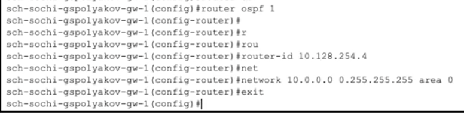
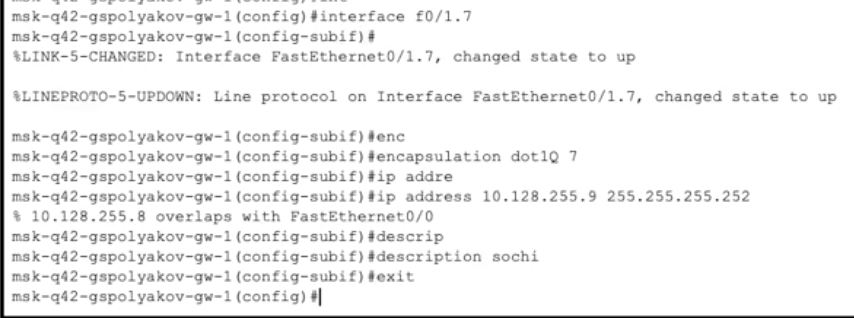

---
## Front matter
title: "Лабораторная работа №15"
subtitle: "Динамическая маршрутизация"
author: "Поляков Глеб Сергеевич"

## Generic otions
lang: ru-RU
toc-title: "Содержание"

## Bibliography
bibliography: bib/cite.bib
csl: pandoc/csl/gost-r-7-0-5-2008-numeric.csl

## Pdf output format
toc: true # Table of contents
toc-depth: 2
lof: true # List of figures
lot: true # List of tables
fontsize: 12pt
linestretch: 1.5
papersize: a4
documentclass: scrreprt
## I18n polyglossia
polyglossia-lang:
  name: russian
  options:
	- spelling=modern
	- babelshorthands=true
polyglossia-otherlangs:
  name: english
## I18n babel
babel-lang: russian
babel-otherlangs: english
## Fonts
mainfont: IBM Plex Serif
romanfont: IBM Plex Serif
sansfont: IBM Plex Sans
monofont: IBM Plex Mono
mathfont: STIX Two Math
mainfontoptions: Ligatures=Common,Ligatures=TeX,Scale=0.94
romanfontoptions: Ligatures=Common,Ligatures=TeX,Scale=0.94
sansfontoptions: Ligatures=Common,Ligatures=TeX,Scale=MatchLowercase,Scale=0.94
monofontoptions: Scale=MatchLowercase,Scale=0.94,FakeStretch=0.9
mathfontoptions:
## Biblatex
biblatex: true
biblio-style: "gost-numeric"
biblatexoptions:
  - parentracker=true
  - backend=biber
  - hyperref=auto
  - language=auto
  - autolang=other*
  - citestyle=gost-numeric
## Pandoc-crossref LaTeX customization
figureTitle: "Рис."
tableTitle: "Таблица"
listingTitle: "Листинг"
lofTitle: "Список иллюстраций"
lotTitle: "Список таблиц"
lolTitle: "Листинги"
## Misc options
indent: true
header-includes:
  - \usepackage{indentfirst}
  - \usepackage{float} # keep figures where there are in the text
  - \floatplacement{figure}{H} # keep figures where there are in the text
---

# Цель работы

Настроить динамическую маршрутизацию между территориями организации.

# Задание

1. Настроить динамическую маршрутизацию по протоколу OSPF на маршрутизаторах msk-donskaya-gw-1, msk-q42-gw-1, msk-hostel-gw-1, sch-sochi-gw-1 (см. раздел 15.4.1).
2. Настроить связь сети квартала 42 в Москве с сетью филиала в г. Сочи напрямую (см. раздел 15.4.2). 
3. В режиме симуляции отследить движение пакета ICMP с ноутбука администратора сети на Донской в Москве (Laptop-PT admin) до компьютера пользователя в филиале в г. Сочи pc-sochi-1.
4. На коммутаторе провайдера отключить временно vlan 6 и в режиме симуляции убедиться в изменении маршрута прохождения пакета ICMP с ноутбука администратора сети на Донской в Москве (Laptop-PT admin) до компьютера пользователя в филиале в г. Сочи pc-sochi-1.
5. На коммутаторе провайдера восстановить vlan 6 и в режиме симуляции убедиться в изменении маршрута прохождения пакета ICMP с ноутбука администратора сети на Донской в Москве (Laptop-PT admin) до компьютера
пользователя в филиале в г. Сочи pc-sochi-1.
6. При выполнении работы необходимо учитывать соглашение об именовании (см. раздел 2.5).

# Теоретическое введение

Протокол внутренней маршрутизации Open Shortest Path First (OSPF, RFC 2328) [7] используется на маршрутизаторах для распространения данных маршрутизации внутри одной автономной системы. Под автономной системой (autonomous system) в данном случае понимается группа маршрутизаторов, использующих общий протокол маршрутизации для обмена маршрутной информацией.
В основе работы OSPF лежит технология отслеживания состояния канала (link-state technology), которая использует алгоритм Дейкстры для нахождения кратчайшего пути.
Для обозначения области действия протокола OSPF внутри автономной
системы используется понятие зоны (area) — совокупность сетей и маршрутизаторов, имеющих один и тот же идентификатор зоны. Для определения маршрутизаторов внутри зоны используется уникальный идентификатор каждого маршрутизатора (router ID, RID).
В табл. 15.1 представлены IP-адреса, выделяемые в моделируемой нами сети для идентификации маршрутизаторов по протоколу OSPF.
Таблица 15.1
Идентификация маршрутизаторов

| IP-адреса | Примечание |
|-----------|----------------------------------------|
| 10.128.254.0/24 | Сеть для идентификации маршрутизаторов |
| 10.128.254.1 | msk-donskaya-gw-1 |
| 10.128.254.2 | msk-q42-gw-1 |
| 10.128.254.3 | msk-hostel-gw-1 |
| 10.128.254.4 | sch-sochi-gw-1 |

В табл. 15.2 представлены IP-адреса, выделяемые в моделируемой нами сети для организации прямого соединения между сетью квартала 42 в Москве и сетью филиала в г. Сочи.
Таблица 15.2
Таблица IP линка 42 квартал–Сочи
| IP-адреса | Примечание | VLAN |
|-----------|----------------------------------------|
| 10.128.255.8/30 | Линк между 42 кварталом и Сочи | 7 |
| 10.128.255.9 | msk-q42-gw-1 | |
| 10.128.255.10 | sch-sochi-gw-1 | |

# Выполнение лабораторной работы

1. Настроить динамическую маршрутизацию по протоколу OSPF на маршрутизаторах msk-donskaya-gw-1, msk-q42-gw-1, msk-hostel-gw-1, sch-sochi-gw-1 (см. раздел 15.4.1).

{#fig:001 width=70%}
{#fig:002 width=70%}
{#fig:003 width=70%}
{#fig:004 width=70%}

2. Настроить связь сети квартала 42 в Москве с сетью филиала в г. Сочи напрямую (см. раздел 15.4.2). 

{#fig:005 width=70%}
{#fig:006 width=70%}
{#fig:007 width=70%}

3. В режиме симуляции отследить движение пакета ICMP с ноутбука администратора сети на Донской в Москве (Laptop-PT admin) до компьютера пользователя в филиале в г. Сочи pc-sochi-1.

4. На коммутаторе провайдера отключить временно vlan 6 и в режиме симуляции убедиться в изменении маршрута прохождения пакета ICMP с ноутбука администратора сети на Донской в Москве (Laptop-PT admin) до компьютера пользователя в филиале в г. Сочи pc-sochi-1.

5. На коммутаторе провайдера восстановить vlan 6 и в режиме симуляции убедиться в изменении маршрута прохождения пакета ICMP с ноутбука администратора сети на Донской в Москве (Laptop-PT admin) до компьютера
пользователя в филиале в г. Сочи pc-sochi-1.

6. При выполнении работы необходимо учитывать соглашение об именовании (см. раздел 2.5).

{#fig:008 width=70%}

# Выводы

Настроил динамическую маршрутизацию между территориями организации.

# Контрольные вопросы

1. Какие протоколы относятся к протоколам динамической маршрутизации?

К протоколам динамической маршрутизации относятся:

*	RIP (Routing Information Protocol) – простой протокол, использующий количество переходов (hops) как метрику.
*	OSPF (Open Shortest Path First) – протокол с открытым стандартом, использующий алгоритм Dijkstra и метрику стоимости (cost).
*	EIGRP (Enhanced Interior Gateway Routing Protocol) – проприетарный протокол Cisco, использующий комбинированную метрику (задержку, пропускную способность и др.).
*	IS-IS (Intermediate System to Intermediate System) – протокол, похожий на OSPF, применяемый в крупных сетях.
*	BGP (Border Gateway Protocol) – протокол внешней маршрутизации, применяемый между автономными системами (в Интернете).

2. Охарактеризуйте принципы работы протоколов динамической маршрутизации.

Основные принципы:

*	Автоматическое обновление маршрутов: маршрутизаторы обмениваются информацией о сети без участия администратора.
*	Выбор оптимального маршрута: маршрутизатор находит лучший путь до сети на основе метрики.
*	Адаптивность: при изменении топологии (например, отказе линии связи) маршруты автоматически перестраиваются.
*	Типы протоколов:
*	Протоколы с вектором расстояния (например, RIP): передают информацию о расстоянии и направлении.
*	Протоколы состояния канала (например, OSPF): строят карту сети и рассчитывают маршруты на её основе.

3. Опишите процесс обращения устройства из одной подсети к устройству из другой подсети по протоколу динамической маршрутизации.
Процесс включает следующие шаги:
	1.	Устройство формирует IP-пакет, адресованный устройству из другой подсети.
	2.	Пакет отправляется на шлюз (маршрутизатор), заданный по умолчанию.
	3.	Маршрутизатор анализирует адрес назначения и ищет маршрут в своей таблице маршрутизации.
	4.	Если маршрут найден, используется интерфейс и следующий хоп (next hop) из таблицы.
	5.	Если сети назначения нет в таблице, маршрутизатор может:
		*	Передать пакет на маршрут по умолчанию (default route), если он настроен.
		*	Отбросить пакет, если путь неизвестен.
	6.	Протокол динамической маршрутизации обеспечивает актуальность таблицы маршрутизации, автоматически узнавая новые маршруты и удаляя недоступные.

4. Опишите выводимую информацию при просмотре таблицы маршрутизации.

При просмотре таблицы маршрутизации (например, командой show ip route на Cisco) можно увидеть:

*	Тип маршрута (указывается по префиксу):
*	C — directly connected (непосредственно подключённая сеть)
*	S — static (статический маршрут)
*	R, O, D и др. — динамические протоколы (RIP, OSPF, EIGRP)
*	Сетевой адрес назначения (напр. 192.168.1.0/24)
*	Метрика маршрута (зависит от протокола)
*	Административное расстояние (AD) — доверие к источнику маршрута
*	IP-адрес следующего хопа (next hop) — куда пересылать пакет
*	Интерфейс выхода — интерфейс, через который будет отправлен пакет
*	Время последнего обновления маршрута (для некоторых протоколов)

# Список литературы{.unnumbered}

::: {#refs}
:::
